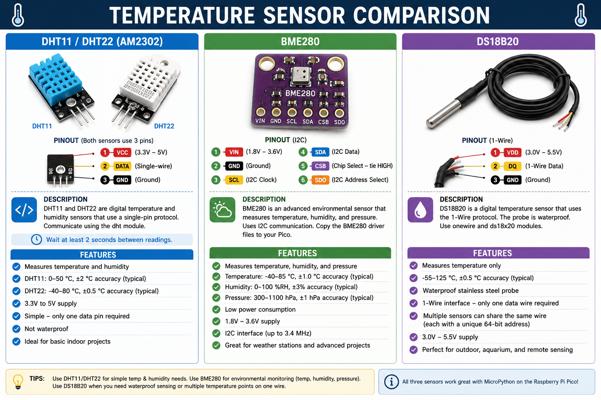
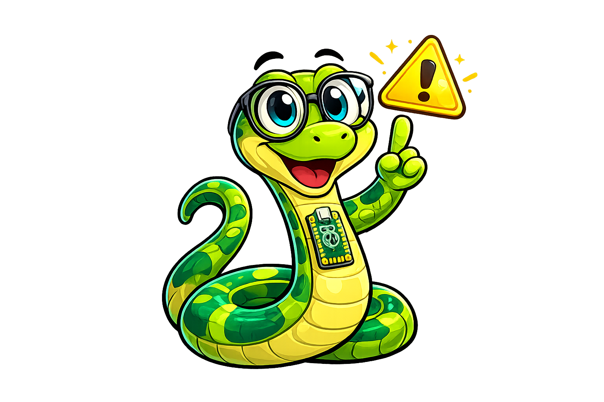
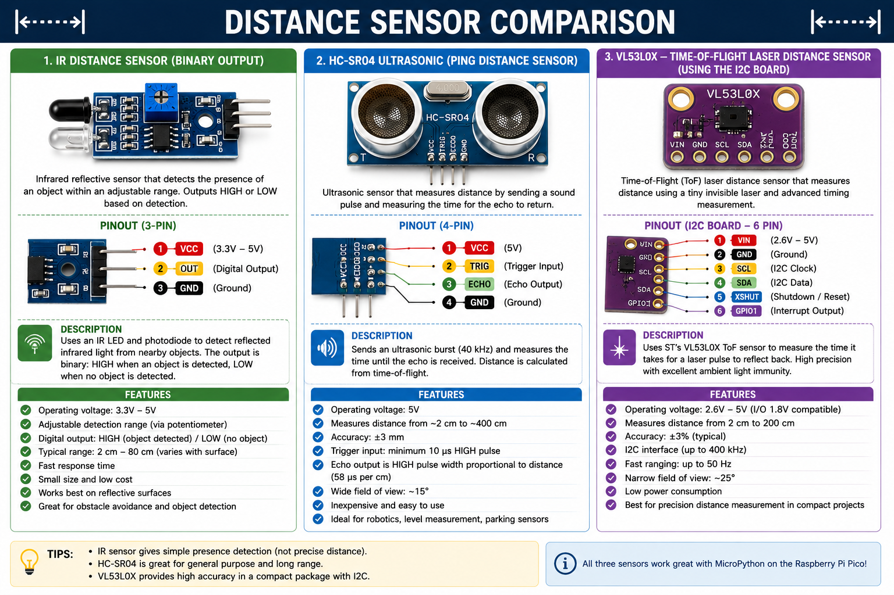

# Temperature, Humidity, and Distance Sensors

## Summary

This chapter connects real-world measurements to your Pico programs. You will read temperature and humidity from the popular DHT11, DHT22, and BME280 sensors (which also measures air pressure), and you will use the DS18B20 waterproof temperature sensor on the 1-Wire bus. For distance, you will learn two approaches: the HC-SR04 ultrasonic sensor that bounces sound waves off objects, and the more accurate VL53L0X time-of-flight sensor that uses laser light. You will finish by reading from a simple IR distance sensor — the same type used in line-following robots.

## Concepts Covered

This chapter covers the following 27 concepts from the learning graph:

1. DHT11 Sensor
2. DHT22 Sensor
3. dht Module in MicroPython
4. DHT.measure() Method
5. DHT.temperature() Method
6. DHT.humidity() Method
7. BME280 Sensor
8. BME280 Temperature Reading
9. BME280 Humidity Reading
10. BME280 Pressure Reading
11. BME280 I2C Driver
12. DS18B20 Temperature Sensor
13. DS18B20 1-Wire Interface
14. DS18B20 Multiple Sensors
15. onewire Module
16. ds18x20 Module
17. HC-SR04 Ultrasonic Sensor
18. HC-SR04 Trigger Pin
19. HC-SR04 Echo Pin
20. Speed of Sound Calculation
21. Ultrasonic Ranging Formula
22. VL53L0X Time-of-Flight Sensor
23. VL53L0X I2C Driver
24. VL53L0X.range Property
25. Time-of-Flight Measurement
26. IR Distance Sensor
27. IR Emitter and Detector

## Prerequisites

This chapter builds on concepts from:

- [Chapter 8: Communication Protocols: I2C, SPI, and UART](../08-communication-protocols/index.md)

---

!!! mascot-welcome "Welcome to Chapter 9"
    { class="mascot-admonition-img" }
    Your Pico is about to feel the world around it — temperature, humidity, air pressure, and distance. These are the sensors that make weather stations, robots, and smart devices. Each one has its own personality: DHT11 is the budget-friendly classic, BME280 is the precision all-rounder, HC-SR04 sounds its way through space. Let's meet them all!

## Temperature and Humidity Sensors



Temperature and humidity sensors are among the most common components in beginner projects. They tell your Pico how warm and how moist the surrounding air is.

### DHT11 and DHT22 Sensors

The **DHT11** is an inexpensive sensor that measures temperature (0–50 °C, ±2 °C accuracy) and relative humidity (20–80%, ±5%). It uses a simple single-wire protocol. The **DHT22** is the higher-accuracy version: temperature range −40 to 80 °C (±0.5 °C) and humidity 0–100% (±2%). Both look identical from the outside — four pins with the leftmost connecting to 3.3 V.

Wire the DHT data pin to any GPIO pin, for example GP22. Add a 10 kΩ pull-up resistor from the data pin to 3.3 V (many breakout boards include this).

MicroPython includes a built-in **`dht` module** for both sensors:

```python
import dht
from machine import Pin

sensor = dht.DHT22(Pin(22))   # or dht.DHT11(Pin(22)) for DHT11

sensor.measure()                      # trigger a measurement
temp = sensor.temperature()           # Celsius
humidity = sensor.humidity()          # percent

print(f"Temperature: {temp:.1f}°C  Humidity: {humidity:.1f}%")
```

Three methods do all the work:

- **`DHT.measure()`** — sends the trigger signal to start a reading. Wait at least 2 seconds between calls; the DHT sensor needs time to stabilize.
- **`DHT.temperature()`** — returns the last measured temperature in Celsius.
- **`DHT.humidity()`** — returns the last measured relative humidity in percent.

!!! mascot-warning "Wait Between DHT Readings!"
    { class="mascot-admonition-img" }
    The DHT11 and DHT22 need at least 1–2 seconds between measurements. Calling `measure()` faster than this returns stale or invalid data. Use `utime.sleep(2)` in your loop. Wrap the call in a try-except — a bad connection returns an `OSError`.

### BME280 — Temperature, Humidity, and Air Pressure

The **BME280** is a precision environmental sensor from Bosch that measures three things at once: temperature (−40 to 85 °C, ±1 °C), relative humidity (0–100%, ±3%), and atmospheric pressure (300–1,100 hPa, ±1 hPa). It uses I2C (address `0x76` or `0x77`) or SPI.

The BME280 is popular in weather stations because its pressure reading lets you calculate altitude above sea level.

```python
from machine import I2C, Pin
from bme280 import BME280   # driver library (copy bme280.py to Pico first)

i2c = I2C(0, scl=Pin(1), sda=Pin(0))
bme = BME280(i2c=i2c)

print(bme.temperature)   # e.g., "23.45 C"
print(bme.humidity)      # e.g., "62.50 %"
print(bme.pressure)      # e.g., "1013.25 hPa"
```

The **BME280 I2C driver** (`bme280.py`) is not built into MicroPython — you must copy the driver file to your Pico before using it. Driver files for the projects in this course are in the `src/drivers/` directory.

## DS18B20 — Waterproof 1-Wire Temperature Sensor

The **DS18B20** is a waterproof probe-style temperature sensor with ±0.5 °C accuracy over −55 to 125 °C. Because it is in a sealed metal tube, it can measure liquid temperatures — useful for pool monitoring, sous-vide cooking, or outdoor weather stations.

The DS18B20 uses the **1-Wire interface**: one data wire (plus GND), with a 4.7 kΩ pull-up resistor from data to 3.3 V.

MicroPython includes the **`onewire`** and **`ds18x20`** modules:

```python
import onewire, ds18x20
from machine import Pin
import utime

data_pin = Pin(22, Pin.IN, Pin.PULL_UP)
ow = onewire.OneWire(data_pin)     # create 1-Wire bus
ds = ds18x20.DS18X20(ow)          # create DS18B20 manager

roms = ds.scan()                   # find all DS18B20 sensors on bus
print("Found sensors:", len(roms))

ds.convert_temp()                  # start conversion (takes ~750 ms)
utime.sleep_ms(750)                # MUST wait for conversion to complete
for rom in roms:
    print(f"Temp: {ds.read_temp(rom):.2f} °C")
```

**DS18B20 multiple sensors**: Because each DS18B20 has a unique 64-bit ROM code, you can connect many sensors to the same wire. `ds.scan()` returns a list of ROM codes, and `ds.read_temp(rom)` reads from a specific sensor.

## Distance Sensors



### IR Distance Sensors

An **IR distance sensor** (infrared distance sensor) combines an **IR emitter** (an LED that shines invisible infrared light) and an **IR detector** (a phototransistor that detects reflections). When the sensor is close to a surface, more reflected light hits the detector; when far away, less light returns.

Most IR distance sensors return a simple **digital output**: HIGH when no obstacle is close, LOW when an obstacle is detected within range (typically 2–30 cm). Some analog IR sensors return a voltage that varies with distance.

```python
from machine import Pin

ir = Pin(16, Pin.IN)   # digital IR sensor output

while True:
    if ir.value() == 0:    # obstacle detected (active LOW output)
        print("Obstacle detected!")
    else:
        print("Clear")
    utime.sleep(0.1)
```

IR sensors are the most common sensor for **line-following robots**: a pair of IR sensors aimed at the floor detects the contrast between dark tape (low reflectance) and white floor (high reflectance), letting the robot follow a path.

### HC-SR04 — Ultrasonic Distance Sensor

The **HC-SR04** measures the distance to an object using sound waves — the same principle as bat echolocation and parking sensors.

It has two important pins:
- **Trigger pin** — sends a 10 µs HIGH pulse to tell the sensor to fire a burst of ultrasonic sound (40 kHz).
- **Echo pin** — goes HIGH when the sound burst is sent, then goes LOW when the echo returns.

The time between sending and receiving the echo tells you the distance: sound travels at approximately 343 m/s (at 20 °C). The formula is:

\[ \text{distance (cm)} = \frac{\text{echo time (µs)}}{58} \]

The denominator 58 comes from the round-trip: sound travels to the object and back, so you divide the speed of sound by 2, then convert units.

```python
from machine import Pin
import utime

trig = Pin(15, Pin.OUT)
echo = Pin(14, Pin.IN)

def read_distance():
    trig.value(0)
    utime.sleep_us(2)
    trig.value(1)             # fire trigger pulse
    utime.sleep_us(10)
    trig.value(0)

    while echo.value() == 0:  # wait for echo to start
        pass
    start = utime.ticks_us()

    while echo.value() == 1:  # wait for echo to end
        pass
    end = utime.ticks_us()

    duration = utime.ticks_diff(end, start)
    return duration / 58      # convert to centimeters

while True:
    dist = read_distance()
    print(f"Distance: {dist:.1f} cm")
    utime.sleep(0.5)
```

The HC-SR04 works well between 2 cm and 400 cm. Objects closer than 2 cm may be missed. Soft or angled surfaces absorb or deflect the sound, reducing accuracy.

#### Diagram: Ultrasonic Ranging Explorer

<iframe src="../../sims/ultrasonic-ranging/main.html" width="100%" height="452px" scrolling="no"></iframe>

<details markdown="1">
<summary>Ultrasonic Ranging Explorer MicroSim</summary>
Type: microsim
**sim-id:** ultrasonic-ranging<br/>
**Library:** p5.js<br/>
**Status:** Specified

Bloom Level: Apply (L3)
Bloom Verb: calculate
Learning Objective: Students can calculate the distance to an object from the echo duration using the speed-of-sound formula.

Canvas layout:
- Left: HC-SR04 sensor icon emitting a semicircular pulse wave animation
- Center: a sliding "wall" object that can be dragged closer or farther
- Right panel: displays echo duration in µs and calculated distance in cm; shows the formula

Visual elements:
- Pulse wave animation: concentric arcs traveling from the sensor, bouncing off the wall, returning
- Wall is a vertical rectangle that the student drags left/right on the canvas
- As the wall moves, echo duration updates and the return wave animates at the right speed

Interactive controls:
- Drag wall to change distance
- createSlider() for "Air temperature" (0–40 °C) — changes speed of sound
- Formula display: `distance = duration / 58` updates live with current values

Instructional Rationale: Animating the ultrasonic pulse as a traveling wave makes the timing concept physical rather than abstract, and the temperature slider hints at a real limitation.

Implementation: p5.js. Wall position → duration → animate wave at `343 + 0.6*(T-20)` m/s; arc animation using frameCount.
</details>

### VL53L0X — Time-of-Flight Laser Distance Sensor

The **VL53L0X** measures distance using a tiny infrared laser. It emits a laser pulse and measures the exact time for the light to bounce back — **time-of-flight measurement**. Because light travels at about 300,000 km/s, even a journey of 1 meter takes only about 6 nanoseconds. The VL53L0X's internal hardware handles this timing with picosecond precision.

The VL53L0X is more accurate than ultrasonic (±3%) and works on all surfaces, including glass and fabric that scatter sound. Range is 30–1,200 mm.

It uses I2C (default address `0x29`). The **VL53L0X I2C driver** is available in `src/drivers/VL53L0X.py`:

```python
from machine import I2C, Pin
import VL53L0X

i2c = I2C(0, scl=Pin(1), sda=Pin(0))
tof = VL53L0X.VL53L0X(i2c)

while True:
    distance_mm = tof.range   # read in millimeters
    print(f"Distance: {distance_mm} mm  ({distance_mm/10:.1f} cm)")
    utime.sleep(0.1)
```

The **`VL53L0X.range` property** returns the current distance in millimeters. If the reading is 8,190 or 65,535, it means no object was detected within range.


## Comparing Distance Sensors

Before wiring a distance sensor, choose the right one for your project:

| Sensor | Method | Range | Accuracy | Best for |
|--------|--------|-------|----------|---------|
| HC-SR04 | Ultrasonic | 2–400 cm | ±3 mm | Medium-range general use |
| VL53L0X | Laser (ToF) | 3–120 cm | ±3% | Precision, all surfaces |
| IR digital | Infrared | 2–30 cm | ON/OFF only | Obstacle detection, line following |

!!! mascot-thinking "When to Use Which Distance Sensor"
    { class="mascot-admonition-img" }
    Use the **HC-SR04** for most robot obstacle avoidance — it is inexpensive and has long range. Use the **VL53L0X** when you need millimeter accuracy or when your target surface absorbs sound (fabric, foam). Use the **IR sensor** when you only need to know "obstacle yes or no" within a few centimeters, like a line-following robot.

## Key Takeaways

- **DHT11/DHT22**: single-pin protocol via `dht` module; wait at least 2 s between readings.
- **BME280**: I2C sensor measuring temperature, humidity, and pressure; copy driver to Pico.
- **DS18B20**: 1-Wire waterproof probe; `onewire` + `ds18x20` modules; multiple sensors per wire.
- **HC-SR04**: trigger a pulse, time the echo; `distance = duration_µs / 58` in centimeters.
- **VL53L0X**: laser time-of-flight via I2C; read `tof.range` in millimeters.
- **IR sensor**: digital ON/OFF for obstacle or line detection; most common sensor in robot kits.

??? question "Quick Check: The HC-SR04 echo pin is HIGH for 1160 µs. How far is the object? (Click to reveal)"
    **20 cm** — `1160 / 58 = 20`. The formula `distance_cm = duration_µs / 58` combines the speed of sound and the round-trip distance.

!!! mascot-celebration "Sensors Connected — Data Flowing!"
    { class="mascot-admonition-img" }
    Your Pico can now feel temperature, humidity, pressure, and distance. That is a weather station plus a robot proximity sensor right there. Chapter 10 expands your sensor library further — motion detection, orientation from an accelerometer/gyroscope, and ambient light sensing. You are building real physical computing skills!

## References

[See the Annotated References for this chapter](references.md)
