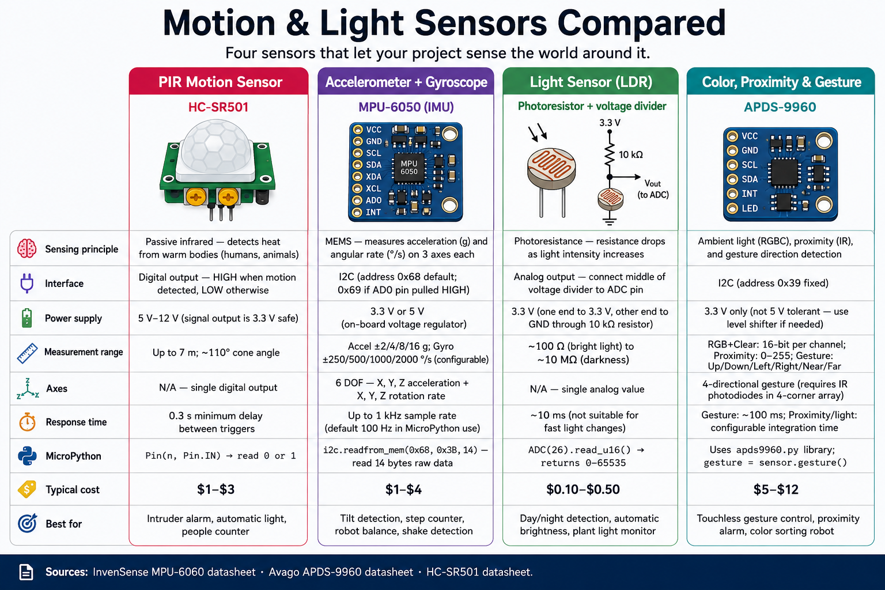

# Motion, Orientation, and Light Sensors

## Summary

This chapter explores sensors that detect how things move, which way they point, and how bright or colorful the light around them is. You will connect accelerometers (ADXL345, MPU6050) to detect tilt and motion across three axes, use the HMC5883L and QMC5883L compass sensors to calculate a magnetic heading, and combine an accelerometer with a gyroscope in an IMU. On the light side, you will read analog values from a photoresistor and use the APDS9960 sensor to detect proximity, color, and ambient light levels — all over the I2C bus.

## Concepts Covered

This chapter covers the following 18 concepts from the learning graph:

1. Photoresistor (LDR)
2. APDS9960 Gesture Sensor
3. APDS9960 Color Detection
4. APDS9960 Proximity Detection
5. APDS9960 I2C Driver
6. Color Sensing Principles
7. Ambient Light Sensing
8. Accelerometer
9. ADXL345 Accelerometer
10. MPU6050 Accelerometer/Gyroscope
11. Accelerometer X/Y/Z Axes
12. Tilt Detection
13. HMC5883L Compass Sensor
14. QMC5883L Compass Sensor
15. Compass Heading Calculation
16. Magnetic Field Sensing
17. Gyroscope
18. IMU (Inertial Measurement Unit)

## Prerequisites

This chapter builds on concepts from:

- [Chapter 7: Analog Signals, ADC, and PWM](../07-analog-adc-pwm/index.md)
- [Chapter 8: Communication Protocols: I2C, SPI, and UART](../08-communication-protocols/index.md)

---

!!! mascot-welcome "Welcome to Chapter 10"
    { class="mascot-admonition-img" }
    Motion, orientation, color — your Pico is about to gain almost human-like senses! An accelerometer feels tilt the way your inner ear does. A compass finds north like a migrating bird. The APDS9960 detects both color and the distance of your hand above it. Let's wire them in!



## Light Sensing with Photoresistors

You met the **photoresistor (LDR)** briefly in Chapter 7. To review: an LDR changes resistance based on light level. Wired as a voltage divider with a fixed resistor (10 kΩ) between 3.3 V and GND, it provides an analog voltage to the ADC. More light → lower LDR resistance → higher voltage → higher ADC reading.

**Ambient light sensing** from an LDR is approximate. For accurate light-level data, use a dedicated sensor like the APDS9960.

## The APDS9960 — Color, Proximity, and Gesture Sensor

The **APDS9960** is a multi-function sensor from Broadcom. It integrates four sensors in one tiny package:

- **Ambient light sensing** — measures total light intensity.
- **Color detection (RGB)** — measures red, green, and blue light separately.
- **Proximity detection** — uses an infrared LED and detector to measure how close an object is (0–255 arbitrary units).
- **Gesture detection** — detects swipe direction (up, down, left, right) using directional IR sensors.

It uses I2C at address `0x39`. The driver is in `src/drivers/APDS9960.py`.

```python
from machine import I2C, Pin
from apds9960 import APDS9960

i2c = I2C(0, scl=Pin(1), sda=Pin(0))
sensor = APDS9960(i2c)

sensor.enable_color = True
sensor.enable_proximity = True

r, g, b, c = sensor.color_data     # red, green, blue, clear channels
prox = sensor.proximity             # 0 = far, 255 = touching

print(f"R={r} G={g} B={b} Clear={c}  Proximity={prox}")
```

**Color sensing principles:** The APDS9960 contains four photodiodes with different color filters. The red channel measures mostly red wavelengths; green measures green; blue measures blue; clear measures all wavelengths. By comparing the three channels, you can identify colors or measure color temperature of a light source.

## Accelerometers — Sensing Motion and Tilt

An **accelerometer** is a sensor that measures acceleration forces along one or more axes. The familiar unit is **g** — the acceleration due to gravity (9.81 m/s²). When your board sits flat on a table, the accelerometer reads 1 g on the vertical axis (because it feels Earth's gravity pushing up).

Every accelerometer has **X, Y, and Z axes**:
- **X** — left/right acceleration.
- **Y** — forward/backward acceleration.
- **Z** — up/down acceleration (reads ~1 g when flat).

**Tilt detection** uses the X and Y axis readings. When you tilt the board, gravity's pull shifts between axes. For example, tilting 90° to the right moves the full 1 g reading from Z to X.

### ADXL345 Accelerometer

The **ADXL345** is a popular 3-axis accelerometer with I2C (address `0x53`) and SPI interfaces. It measures ±2 g to ±16 g and outputs raw 16-bit values.

```python
from machine import I2C, Pin
from adxl345 import ADXL345   # driver in src/drivers/

i2c = I2C(0, scl=Pin(1), sda=Pin(0))
accel = ADXL345(i2c)

x, y, z = accel.acceleration   # in g units
print(f"X={x:.2f}g  Y={y:.2f}g  Z={z:.2f}g")

# Simple tilt detection
if abs(x) > 0.5:
    print("Tilted left/right!")
if abs(y) > 0.5:
    print("Tilted forward/backward!")
```

### MPU6050 — Accelerometer Plus Gyroscope

The **MPU6050** combines a 3-axis accelerometer and a 3-axis **gyroscope** in one chip — making it an **IMU** (Inertial Measurement Unit). It uses I2C at address `0x68` (or `0x69`).

A **gyroscope** measures rotation rate (how fast the board is spinning around each axis), in degrees per second. The accelerometer tells you tilt; the gyroscope tells you spin rate. Together they give a complete picture of motion.

```python
from machine import I2C, Pin
from mpu6050 import MPU6050   # driver in src/drivers/

i2c = I2C(0, scl=Pin(1), sda=Pin(0))
mpu = MPU6050(i2c)

accel = mpu.accel              # (ax, ay, az) in g
gyro  = mpu.gyro               # (gx, gy, gz) in degrees/second
temp  = mpu.temperature        # die temperature in °C

print(f"Accel: {accel}  Gyro: {gyro}")
```

An **IMU** (Inertial Measurement Unit) is any device that combines accelerometer and gyroscope data. High-end IMUs also include a magnetometer (compass) for nine-axis sensing.

#### Diagram: Accelerometer Axes Explorer

<iframe src="../../sims/accelerometer-axes/main.html" width="100%" height="482px" scrolling="no"></iframe>

<details markdown="1">
<summary>Accelerometer Axes Explorer MicroSim</summary>
Type: diagram
**sim-id:** accelerometer-axes<br/>
**Library:** p5.js<br/>
**Status:** Specified

Bloom Level: Understand (L2)
Bloom Verb: explain
Learning Objective: Students can describe how gravity's 1 g vector distributes across X, Y, and Z axes as the board tilts, and use this to infer tilt angle.

Canvas layout:
- Left: a 3D-looking rectangle representing the PCB, with X/Y/Z axis arrows
- Right: three horizontal bar gauges showing X, Y, Z acceleration in g units
- Bottom: numeric readouts and a simple tilt-angle estimate

Visual elements:
- PCB rectangle tilts as the student drags the rotation sliders
- Axis arrows labeled (X=red, Y=green, Z=blue)
- Bar gauges fill proportionally; Z shows 1.0 when flat

Interactive controls:
- createSlider() for "Tilt forward/back" (−90 to 90°) and "Tilt left/right" (−90 to 90°)
- Live formula: `angle = atan2(X, Z)` displayed below gauges

Instructional Rationale: Visualizing how gravity distributes across axes as the board tilts replaces the abstract formula with a spatial mental model.

Implementation: p5.js. PCB drawn as a rotated parallelogram; axis gauges as filled rectangles; trig computed live from slider values.
</details>

## Compass Sensors — Finding Magnetic North

A **compass sensor** (magnetometer) measures the strength and direction of the Earth's magnetic field along three axes. From the X and Y field components, you can calculate the magnetic heading (angle from north).

**Magnetic field sensing** in the horizontal plane uses the two-argument arctangent:

\[ \text{heading} = \text{atan2}(Y_{\text{mag}}, X_{\text{mag}}) \times \frac{180}{\pi} \]

The result is in degrees (0–360), where 0° is north. Note that **magnetic north** differs slightly from true geographic north by an angle called magnetic declination, which depends on your location.

### HMC5883L and QMC5883L

The **HMC5883L** (discontinued) and **QMC5883L** (its common replacement) are 3-axis magnetometers. Both use I2C. The QMC5883L typically uses address `0x0D`; the HMC5883L uses `0x1E`.

```python
from machine import I2C, Pin
import hmc5883l   # driver in src/drivers/

i2c = I2C(0, scl=Pin(1), sda=Pin(0))
compass = hmc5883l.HMC5883L(i2c)

x, y, z = compass.read()    # raw field values (µT)

import math
heading = math.atan2(y, x) * (180 / math.pi)
if heading < 0:
    heading += 360

print(f"Heading: {heading:.1f}°")
```

!!! mascot-tip "Calibrate Your Compass"
    { class="mascot-admonition-img" }
    A compass sensor is sensitive to nearby metal and magnetic fields from motors and wires. For accurate readings, keep the compass away from motors and power supplies. Run a calibration routine that rotates the sensor in all directions and records the min/max values for each axis — this compensates for constant magnetic offsets (called "hard iron" errors).

## Comparing Motion and Orientation Sensors

| Sensor | What it measures | Interface | Typical use |
|--------|-----------------|-----------|------------|
| LDR | Light level (rough) | ADC (analog) | Day/night detection |
| APDS9960 | Color, proximity, gesture | I2C | Color detection, gesture UI |
| ADXL345 | Acceleration (3-axis) | I2C / SPI | Tilt, tap detection |
| MPU6050 | Acceleration + gyro (6-axis) | I2C | Robot IMU, balancing |
| HMC5883L / QMC5883L | Magnetic field (3-axis) | I2C | Compass heading |

## Key Takeaways

- An **LDR** gives a rough analog light level; the **APDS9960** adds color and proximity with I2C.
- An **accelerometer** measures X, Y, Z acceleration in g units; when flat, Z reads ≈1 g.
- **Tilt detection** uses X and Y gravity components; `atan2(x, z)` gives the tilt angle.
- The **MPU6050** combines accelerometer + gyroscope = an **IMU**.
- A **gyroscope** measures rotation rate (°/s), not position.
- The **HMC5883L/QMC5883L** compass uses `atan2(y, x)` on field readings to get heading.
- Compass accuracy requires calibration to remove hard-iron magnetic offsets.

??? question "Quick Check: A flat ADXL345 reads X=0g, Y=0g, Z=1g. What does Z=1g represent? (Click to reveal)"
    It represents **Earth's gravitational acceleration** (9.81 m/s² = 1 g) acting on the sensor in the upward direction. The sensor is perfectly level.

!!! mascot-celebration "Your Pico Can Feel the World!"
    { class="mascot-admonition-img" }
    Color, tilt, compass heading, proximity — your Pico now has motion and light senses that rival many smartphones. Chapter 11 adds rotary encoders, touch sensors, and audio input, rounding out your sensor toolkit before you dive into motors and displays. Keep going!

## References

[See the Annotated References for this chapter](references.md)
