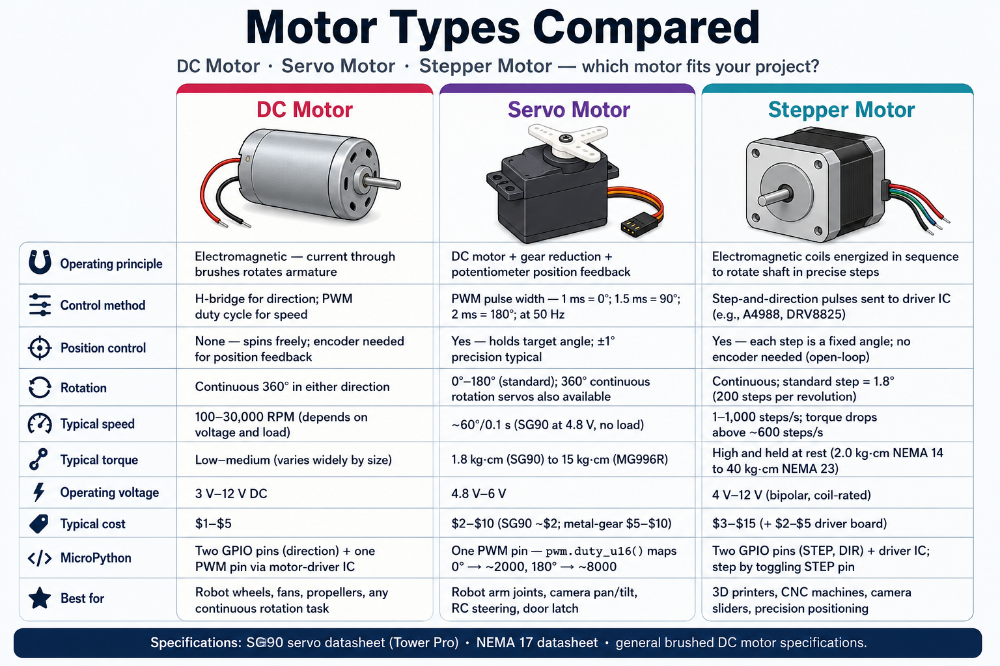

# Motors, Servos, and Stepper Motor Control

## Summary

Motors are the muscles of physical computing — they spin wheels, sweep arms, and move mechanisms. This chapter starts with DC motors and explains why you need a transistor or H-bridge IC (L293D, DRV8833) to safely drive them from the Pico's low-current GPIO pins. You will control motor speed with PWM and direction with an H-bridge. Then you will move to servo motors, which use a 50 Hz PWM signal to hold a precise angle, and finish with stepper motors — devices that move in exact, countable steps using the ULN2003 driver.

## Concepts Covered

This chapter covers the following 23 concepts from the learning graph:

1. DC Motor
2. Motor Direction Control
3. Motor Speed Control
4. H-Bridge Circuit
5. L293D Motor Driver IC
6. DRV8833 Motor Driver IC
7. L298N Motor Driver IC
8. Transistor Motor Control
9. Motor Stall Current
10. Motor Free-Run Current
11. Back-EMF Protection
12. Flyback Diode
13. Servo Motor
14. Servo Signal (50 Hz PWM)
15. Servo Angle Control
16. Servo Min/Max Pulse Width
17. machine.PWM for Servo
18. Continuous Rotation Servo
19. Stepper Motor
20. Stepper Motor Phases
21. Half-Step vs Full-Step
22. Stepper Driver (ULN2003)
23. Stepper Steps Per Revolution

## Prerequisites

This chapter builds on concepts from:

- [Chapter 7: Analog Signals, ADC, and PWM](../07-analog-adc-pwm/index.md)

---

!!! mascot-welcome "Welcome to Chapter 12"
    { class="mascot-admonition-img" }
    This is the chapter where your project starts moving! DC motors, servos, and steppers each have a different personality: DC motors spin freely at variable speed, servos lock to a precise angle, and steppers count their way through exact rotations. By the end you will have everything you need to drive a robot. Let's put the Pico to work!



## DC Motors — The Free Spinners

A **DC motor** converts electrical current into continuous rotation. Feed it positive voltage on one terminal and GND on the other, and it spins. Swap the wires, and it spins the other direction.

DC motors are fast and cheap, but they have two important electrical characteristics you must respect:

- **Motor free-run current** — the current drawn while spinning without load. A small hobby motor might draw 50–200 mA.
- **Motor stall current** — the current drawn when the shaft is blocked (stalled). This can be 5–10× the free-run current — easily 500 mA to 1 A or more.

The Pico's GPIO pins can only supply 12 mA. Connecting a motor directly to a GPIO pin will immediately damage the Pico. You need a **motor driver** between the Pico and the motor.

### Transistor Motor Control

A single **transistor** (NPN or MOSFET, from Chapter 5) works as a switch: a small current from the GPIO pin controls a much larger current through the motor. The transistor can handle the motor's full current draw.

```python
from machine import Pin, PWM

motor_pwm = PWM(Pin(17))
motor_pwm.freq(10000)         # 10 kHz avoids audible motor whine
motor_pwm.duty_u16(32768)    # 50% speed

# transistor drives motor; GPIO drives transistor base/gate
```

A transistor controls speed (via PWM) but not direction — the motor always spins the same way. For bidirectional control, you need an **H-bridge**.

### H-Bridge — Bidirectional Motor Control

An **H-bridge circuit** is named after its shape: four switches arranged in an "H" with the motor in the crossbar. By turning opposite pairs of switches ON, you can send current through the motor in either direction.

When the left switches are ON and right switches are OFF: current flows left-to-right through the motor → spins forward.
When the right switches are ON and left switches are OFF: current flows right-to-left → spins backward.

### L293D, DRV8833, and L298N Motor Driver ICs

Instead of building an H-bridge from individual transistors, use a dedicated **motor driver IC**:

| IC | Channels | Max current | Notes |
|----|---------|------------|-------|
| **L293D** | 2 motors | 0.6 A per channel | Built-in flyback diodes |
| **DRV8833** | 2 motors | 1.5 A per channel | More efficient, lower voltage drop |
| **L298N** | 2 motors | 2 A per channel | Older, needs external diodes |

A typical DRV8833 or L293D connection:

```
Pico GP17 → IN1  (direction bit 1)
Pico GP18 → IN2  (direction bit 2)
Pico GP19 → PWM  (speed control, if separate PWM input exists)
Motor terminal A → OUT1
Motor terminal B → OUT2
Motor power (5–12V) → VM
GND → GND (shared with Pico)
```

```python
from machine import Pin, PWM

in1 = Pin(17, Pin.OUT)
in2 = Pin(18, Pin.OUT)
speed = PWM(Pin(19))
speed.freq(10000)

def motor_forward(duty):
    in1.value(1)
    in2.value(0)
    speed.duty_u16(duty)

def motor_backward(duty):
    in1.value(0)
    in2.value(1)
    speed.duty_u16(duty)

def motor_stop():
    in1.value(0)
    in2.value(0)
    speed.duty_u16(0)
```

### Back-EMF and Flyback Diodes

When a DC motor stops spinning, the magnetic field in its coil collapses. This generates a voltage spike in the reverse direction — called **back-EMF** (back electromotive force). Without protection, this spike can damage the driver IC or even the Pico.

A **flyback diode** (placed across each motor terminal, oriented to block normal current but allow the spike to flow harmlessly away) absorbs this energy. The L293D and DRV8833 have flyback diodes built in; the L298N does not.

!!! mascot-warning "Motor Stall Kills Drivers!"
    { class="mascot-admonition-img" }
    Never block a spinning motor shaft with your hand or an obstacle while the motor is running at full speed. The stall current spike can exceed the motor driver's rating and destroy the IC instantly. If your project might stall (a robot hitting a wall), add current sensing or a current-limiting resistor, or use a driver IC rated well above the stall current.

## Servo Motors — Precise Angle Control

A **servo motor** is a DC motor with a built-in gearbox and a feedback circuit that holds a specific angle. You send a **servo signal** (a 50 Hz PWM signal), and the servo's internal electronics drive the motor until the shaft reaches the requested angle.

The servo reads the **pulse width** of the PWM signal:
- **1 ms pulse** (minimum) → 0° (full left)
- **1.5 ms pulse** (center) → 90° (center)
- **2 ms pulse** (maximum) → 180° (full right)

At 50 Hz, each cycle is 20 ms. A 1 ms pulse on a 20 ms cycle = 5% duty cycle.

```python
from machine import Pin, PWM
import utime

servo = PWM(Pin(16))
servo.freq(50)          # MUST be exactly 50 Hz for standard servos

def set_angle(degrees):
    # Map 0–180° to 1,000–2,000 µs pulse width
    min_duty = int(1000 / 20000 * 65535)    # 1 ms / 20 ms × 65535 = 3276
    max_duty = int(2000 / 20000 * 65535)    # 2 ms / 20 ms × 65535 = 6553
    duty = int(min_duty + (max_duty - min_duty) * degrees / 180)
    servo.duty_u16(duty)

set_angle(0)       # move to 0°
utime.sleep(1)
set_angle(90)      # move to center
utime.sleep(1)
set_angle(180)     # move to 180°
```

**Servo min/max pulse width** varies slightly between brands. A common range is 500–2,500 µs instead of 1,000–2,000 µs. If your servo does not reach full range, adjust `min_duty` and `max_duty`.

A **continuous rotation servo** has been modified to spin continuously instead of holding an angle. A 1.5 ms pulse (center) means stop; shorter pulses spin one direction; longer pulses spin the other. They are popular in simple wheeled robots because they have a built-in gearbox.

#### Diagram: Servo PWM Signal Explorer

<iframe src="../../sims/servo-pwm-explorer/main.html" width="100%" height="497px" scrolling="no"></iframe>

<details markdown="1">
<summary>Servo PWM Signal Explorer MicroSim</summary>
Type: microsim
**sim-id:** servo-pwm-explorer<br/>
**Library:** p5.js<br/>
**Status:** Specified

Bloom Level: Apply (L3)
Bloom Verb: calculate
Learning Objective: Students can convert a desired servo angle to the correct PWM duty cycle value for `servo.duty_u16()`.

Canvas layout:
- Left 40%: an animated servo arm graphic that rotates to the selected angle
- Center 30%: a PWM waveform showing the 20 ms period and the highlighted pulse width
- Right 30%: numeric display of angle, pulse width in µs, and duty_u16 value

Visual elements:
- Servo body drawn as a gray rectangle; arm as a line rotating from center
- PWM waveform: horizontal axis = time (0–20 ms), vertical = HIGH/LOW; pulse width highlighted in yellow
- Labels: "Period = 20 ms (50 Hz)", "Pulse = X µs", "duty_u16 = Y"

Interactive controls:
- createSlider() for "Angle" (0–180°) — updates everything live
- Two extra sliders: "Min pulse (µs)" and "Max pulse (µs)" for calibration practice

Instructional Rationale: Linking the physical arm rotation to the waveform pulse width and the code number gives students a complete mental model for servo control.

Implementation: p5.js. Servo arm rotates using `rotate()`; waveform drawn with line() calls; live formula recalculates on slider change.
</details>

## Stepper Motors — Exact Counted Steps

A **stepper motor** divides one full rotation into a fixed number of equal steps — typically 32–200 steps per revolution (before gearing). Instead of spinning freely like a DC motor, a stepper moves exactly one step at a time, making it perfect for precise positioning: 3D printers, CNC machines, camera sliders.

A stepper motor has multiple electromagnetic coils called **phases**. By energizing the coils in sequence, you pull the rotor through one step at a time.

### Half-Step vs Full-Step

**Full-step mode** energizes one or two phases at a time. The motor moves one full step per pulse — maximum speed, moderate torque.

**Half-step mode** alternates between energizing one phase and two phases at once. This doubles the number of positions (halves the step size), giving smoother motion at the cost of slightly lower torque.

A common 28BYJ-48 stepper with a ULN2003 driver board takes 2,048 steps for one full 360° rotation in half-step mode.

### Stepper Driver — ULN2003

The **ULN2003** is a transistor array that buffers the current for each stepper coil. Connect the four Pico output pins to IN1–IN4 on the ULN2003 board; the motor connects to the coil terminals.

```python
from machine import Pin
import utime

# Connect IN1–IN4 on ULN2003 to GP6–GP9
coil_pins = [Pin(6, Pin.OUT), Pin(7, Pin.OUT),
             Pin(8, Pin.OUT), Pin(9, Pin.OUT)]

# Half-step sequence for 28BYJ-48
HALF_STEP = [
    [1, 0, 0, 0],
    [1, 1, 0, 0],
    [0, 1, 0, 0],
    [0, 1, 1, 0],
    [0, 0, 1, 0],
    [0, 0, 1, 1],
    [0, 0, 0, 1],
    [1, 0, 0, 1],
]

def step(sequence, delay_ms=2):
    for pattern in sequence:
        for pin, val in zip(coil_pins, pattern):
            pin.value(val)
        utime.sleep_ms(delay_ms)

STEPS_PER_REV = 2048   # 28BYJ-48 in half-step mode

def rotate_degrees(degrees, clockwise=True):
    steps_needed = int(STEPS_PER_REV * degrees / 360)
    seq = HALF_STEP if clockwise else list(reversed(HALF_STEP))
    for _ in range(steps_needed):
        step(seq)

rotate_degrees(90)    # turn 90° clockwise
```

!!! mascot-tip "Always Power Off Stepper Coils When Not Moving"
    { class="mascot-admonition-img" }
    Unlike a servo that holds position using active control, a stepper holds position because its coils are energized. But energized coils waste power and heat up the motor. When the stepper is not moving, set all coil pins LOW to de-energize the coils. The motor will lose holding torque, but it saves power and extends the motor's life.

## Motor Type Comparison

| Motor type | Direction | Speed | Position | Best for |
|-----------|---------|-------|----------|---------|
| DC motor | H-bridge | PWM (0–100%) | Not tracked | Wheels, fans, pumps |
| Servo | Fixed by type | Controlled by angle | Precise (0–180°) | Steering, arms, doors |
| Stepper | Sequence direction | Step rate | Exact (counted steps) | 3D printer, CNC, camera |

## Key Takeaways

- DC motors need a **motor driver** (L293D, DRV8833) — GPIO pins cannot supply enough current.
- An **H-bridge** controls direction by reversing current through the motor.
- **Motor stall current** can be 5–10× free-run current — choose a driver rated above stall current.
- A **flyback diode** protects the circuit from back-EMF spikes when the motor stops.
- Servos require **50 Hz PWM** with pulse widths of 1–2 ms for 0°–180° rotation.
- Use `duty_u16 = pulse_us / 20000 × 65535` to calculate the duty cycle from pulse width in µs.
- A **stepper motor** moves in exact steps; the 28BYJ-48 + ULN2003 combo needs 2,048 half-steps per revolution.

??? question "Quick Check: What is the duty_u16 value for a 1.5 ms center servo pulse at 50 Hz? (Click to reveal)"
    **4,915** — `1500 µs / 20000 µs × 65535 ≈ 4915`. This is the center position (90°) for most standard servos.

!!! mascot-celebration "Your Pico Has Muscles!"
    { class="mascot-admonition-img" }
    Motors, servos, and steppers — your Pico can now move the physical world! Chapter 13 puts all of this together into a complete robot: wheels, sensors, and a brain that navigates autonomously. You are one chapter away from your first real robot!

## References

[See the Annotated References for this chapter](references.md)
