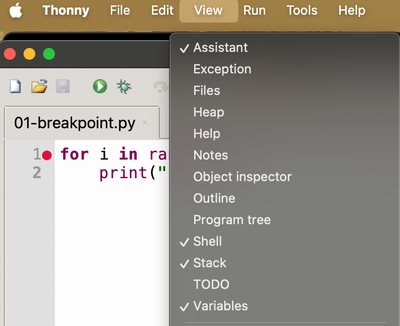
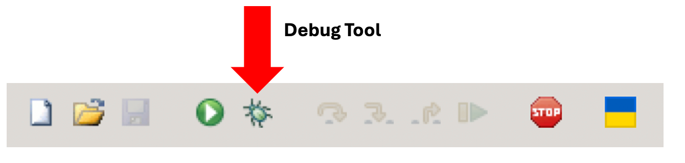
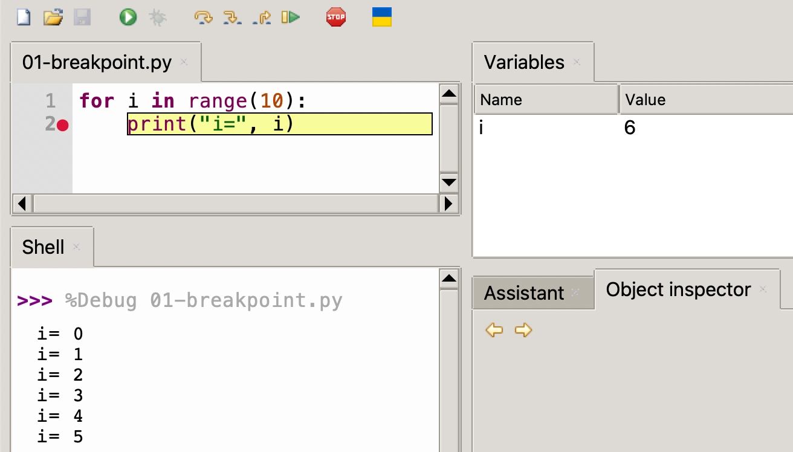
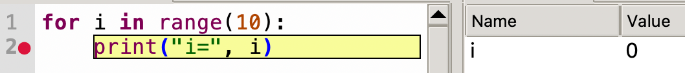
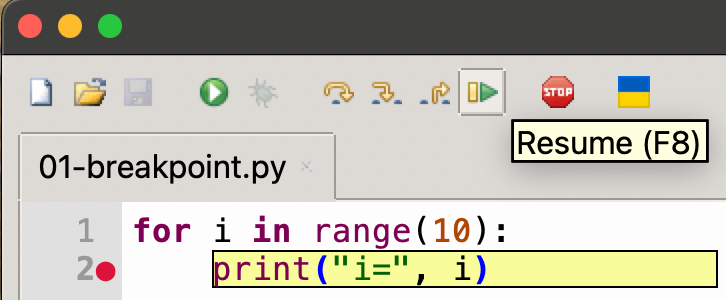
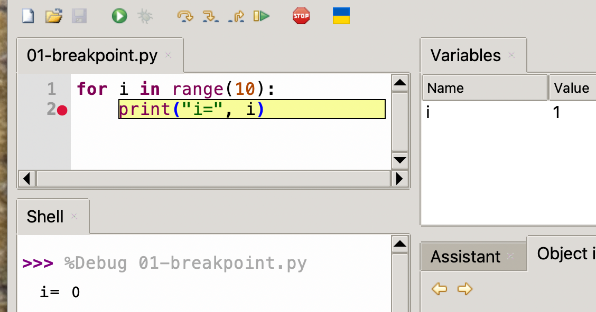
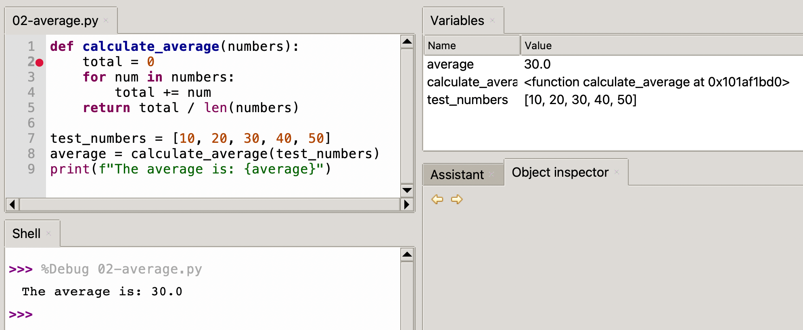
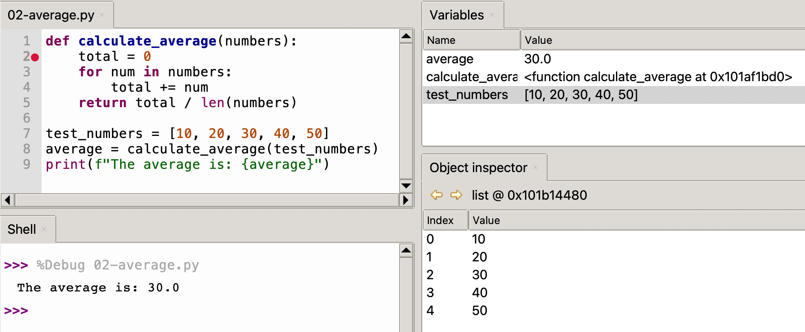

# Debugging with Thonny

Thonny is a lightweight Python IDE that's particularly powerful for learning and debugging Python code. This tutorial will walk you through using Thonny's debugging features to inspect variables and control program execution.

!!! Note:
    This tutorial is based on Thonny version 4.1.1. Some features or interface elements might vary slightly in different versions.*

## Setting Up Your Environment

Before we begin debugging, ensure you have:

1. Thonny IDE installed (available from thonny.org)
2. A simple Python file to practice with

## Thonny Views



Thonny has a "View" menu with many views that are related to debugging your code.  Make
sure you know the following views for this tutorial:

- Variables
- Object Inspector
- Stack

Don't worry about the Object Inspector and the Stack for now.  We will just focus
on the Variables for the first lesson.

## Using the Debug Mode

Right next to the green "Run" icon on the Thonny toolbar you will see an icon of a "bug"



This is called the "Debug Mode" of Thonny and we will be using this button
to help us find bugs in our code.

In our first example, we will just step through
a simple program that has a loop that prints the
value of I from 1 to 10.


## Understanding Breakpoints

Breakpoints are markers that tell the debugger where to pause program execution. This allows you to examine the program's state at that specific point.

```python
for i in range(10):
    print("i=", i)
```

Here is the normal output of this program:

```
i= 0
i= 1
i= 2
i= 3
i= 4
i= 5
i= 6
i= 7
i= 8
i= 9
```

### Setting Breakpoints

1. Click in the left margin (gray area) next to the line number 2, where you want to pause execution
2. A red dot will appear, indicating a breakpoint has been set on line number 2
3. You can toggle breakpoints by clicking again on the red dot



Now you can run the program step-by-step by doing the following:

**Step 1:** Hover over the debug icon - the text "Debug current script" will be displayed<br/>
**Step 2:** Press the debug icon once.  Carefully note that the code within the loop is
highlighted in yellow. This means that the program counter has stopped BEFORE the print
has been executed


**Step 3:** Press the "Resume (F8)" icon in the toolbar:



Note that after you press the Resume button the print will run and the value
of the ```i``` variable will change from `0` to `1`.

On the Mac, you can also press the Function key (fn) and F8 to resume execution.



**Step 4:** Continue to press the Resume icon 10 times until the program finishes.
Note that the print statements continues and the value of `i` gets incremented.
That is the basics of how we set breakpoints, resume the code running
and view the variables.

!!! Challenge
    Modify the program to do some calculations that use `i` as in input.  For example, try to calculate a new number `x` that is i*10.  Does the value of x also appear in the variables?

## Debug Step Controls

Thonny provides several step debug controls to navigate through your code if you are calling functions.

- **Step Over** (↷): Executes the current line and stops at the next line
- **Step Into** (↓): Steps into function calls to debug them line by line
- **Step Out** (↑): Completes the current function and stops at the calling line


## Practical Example

Let's walk through debugging a simple function:

```python
def calculate_average(numbers):
    total = 0
    for num in numbers:
        total += num
    return total / len(numbers)

test_numbers = [10, 20, 30, 40, 50]
average = calculate_average(test_numbers)
print(f"The average is: {average}")
```

### Debugging Steps


1. Set a breakpoint on the `total = 0` line
2. Click the "Debug current script" button
3. Use "Step Over" to execute line by line
4. Watch the Variables view to see how `total` changes
5. Use "Step Into" when calling `calculate_average()` to debug inside the function



## Advanced Features

### Object Inspection
Double-click any variable in the Variables view to see a detailed inspector window.



### Exception Debugging

Thonny automatically breaks on exceptions, showing you exactly where and why an error occurred.

## Tips and Best Practices

1. **Strategic Breakpoints**: Place breakpoints at:

- The beginning of functions
- Before complex calculations
- After major state changes
- Where you suspect problems

2. **Using the Shell During Debugging**:

- The shell remains interactive during debugging
- Test expressions using current variable values
- Call functions to verify behavior

## Watchpoints

Watchpoints are special types of breakpoints that pause execution when a variable's value changes. They're particularly useful when debugging complex programs where you need to track specific variable modifications.  Thonny 4.6.1 does not support watchpoints like other IDEs do.  However,
you can achieve the same effect by adding conditional expressions that do print statements.
You may also have to add additional prior value variables to only print variables when they
change.  You can then also store a history of the values in a list as the variables change.

## Common Issues and Solutions

### Breakpoints Not Working

- Ensure the file is saved
- Check if you're running in debug mode (not regular run)
- Verify the breakpoint is set (solid red dot)

### Variables Not Updating

- Make sure you're stepping through the code
- Check if you're in the correct scope
- Verify the code is actually executing (not skipped by conditionals)

## Keyboard Shortcuts

For efficient debugging, learn these essential shortcuts:

- F5: Start debugging
- F6: Step over
- F7: Step into
- F8: Step out
- Shift+F5: Stop debugging
- F9: Toggle breakpoint

## Conclusion

Thonny's debugging features make it an excellent tool for learning Python and troubleshooting code. Practice using these features with simple scripts before moving on to more complex programs. Remember that debugging is not just about finding bugs—it's also a great way to understand how your code works.

## References

[Damom73's Debugging with Turtle](https://damom73.github.io/turtle-introduction-to-python/debugging.html)

