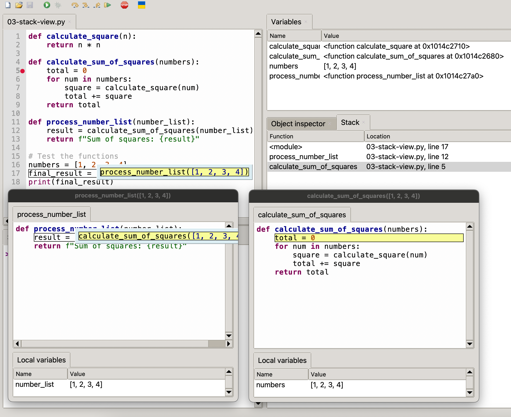

# Understanding the Stack View

The Stack view in Thonny is a powerful tool that shows you the current call stack during debugging - essentially showing you how your program got to its current point of execution. This is particularly useful when debugging functions that call other functions.
Opening the Stack View

Go to "View" in the menu bar
Select "Stack"
The Stack view will appear, typically docked on the right side with the Variables view

The Stack view is useful for showing details about how you got to a specific
point in your code.  For example you can see the call history
of what functional called other functions an their parameters when
you use the stack view.

## Sample Code

```python
def calculate_square(n):
    return n * n

def calculate_sum_of_squares(numbers):
    total = 0
    for num in numbers:
        square = calculate_square(num)
        total += square
    return total

def process_number_list(number_list):
    result = calculate_sum_of_squares(number_list)
    return f"Sum of squares: {result}"

# Test the functions
numbers = [1, 2, 3, 4]
final_result = process_number_list(numbers)
print(final_result)
```

Using the Stack View for Debugging

- Set a breakpoint inside calculate_square
- Run the program in debug mode
- When the breakpoint is hit, examine the Stack view



Note that separate windows appear for each function call.  Each window also displays the local variables for that function.  The stack view shows what function
was called, what file the function was in and the line number that the function
was called.

Although it is rare that you need to used the stack view, it does come in handy
when you are calling many function as the order that the functions are called
is reinvent to your results.
