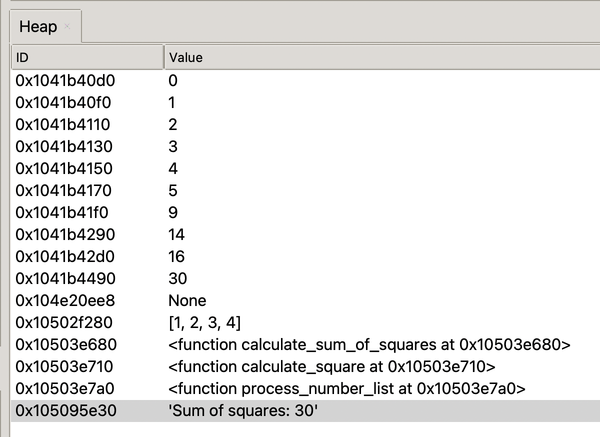
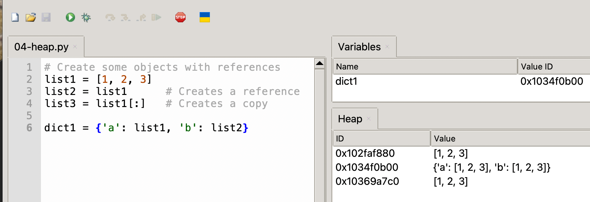

# Viewing the Heap in Thonny

In this lesson we will learn:

- What the Heap view shows and why it's useful
- How to access the Heap view in Thonny
- How to interpret the view
- A practical example showing object references
-  Common use cases
-  Best practices for using the Heap view effectively

## What is a Heap in Python?

In Python, the heap is like a giant storage space in your computer's memory where all your program's objects (like lists, dictionaries, custom objects, etc.) live. Think of it as a messy bedroom - objects are scattered around wherever there's space, rather than being neatly organized in a specific order. When you create a new variable or object in your program, Python automatically finds a spot in this heap to store it.  Python works
hard to tuck new objects into the best place in memory so that it does not waste memory.

The neat thing about the heap is that objects can be any size (like a small number or a huge list) and they don't need to be stored next to each other. Python keeps track of where everything is using special tags (called references or pointers) - kind of like having sticky notes that tell you where to find your stuff. When you don't need an object anymore (like when a variable goes out of scope or you delete it), Python has a helpful cleanup crew called the "garbage collector" that automatically removes these unused objects from the heap, freeing up space for new objects. This is why in Python, unlike some other programming languages, you don't have to manually manage memory - Python takes care of the cleanup for you!

## Heap Management in MicroPython

Heap management becomes crucial on microcontrollers because they have extremely limited RAM - often just a few hundred kilobytes or less. Unlike a desktop computer where you might have gigabytes of RAM and virtual memory, on a microcontroller like the Raspberry Pi Pico, you have to work within strict memory constraints.
Here's why heap management is critical in MicroPython on microcontrollers:

**Limited Memory:** The Raspberry Pi Pico has only 264KB of RAM total, and MicroPython itself needs a portion of this just to run. This leaves you with even less space for your own programs and data.

**No Virtual Memory:** Unlike desktop computers, microcontrollers can't use hard drive space as extra memory when they run out of RAM. When you're out of memory, you're really out of memory - your program will crash.

**Fragmentation:** As you create and delete objects, the heap can become fragmented - like having many small gaps between objects. Even if you have enough total free memory, if it's fragmented into small pieces, you might not be able to allocate a large object.

**Real-time Operations:** Many microcontroller applications need to respond in real-time (like reading sensors or controlling motors). Memory operations like garbage collection can cause unpredictable delays that might interfere with these time-sensitive tasks.

Some practical tips for managing heap memory in MicroPython:

**Preallocate:** When possible, create data structures at startup rather than dynamically during operation.
**Reuse:** Instead of creating new objects repeatedly, reuse existing ones.
**Avoid Memory-Heavy Operations:** String concatenation, large lists, and complex data structures can quickly consume memory.
**Monitor Memory:** Use tools like Thonny's Heap view to watch memory usage during development.
**Regular Cleanup:** Call gc.collect() at appropriate points to trigger garbage collection when timing is less critical.


## Accessing the Heap View in Thonny

Opening the Heap View

- Go to "View" in the menu bar
- Select "Heap"
- The Heap view will appear as a new panel on the right side of screen



Above is a sample heap view from our prior example.

The Heap view shows:

### Objects in Memory
Each MicroPython object is shown as a box. The box includes the object's:
-   Type
-   ID (memory address)
-   Value or content summary

### Object References
-   Arrows show how objects reference each other
-   Direction indicates which object holds the reference
-   Multiple references to the same object are visible

### Variable Bindings
-   Shows which variables point to which objects
-   Helps understand variable aliasing

## Example: Understanding Object References

One of the best ways to 

```python
# Create some objects with references
list1 = [1, 2, 3]
list2 = list1      # Creates a reference
list3 = list1[:]   # Creates a copy

dict1 = {'a': list1, 'b': list2}
```



Using the Heap view with this code shows:

-   `list1` and `list2` pointing to the same object
-   `list3` as a separate object with the same values
-   `dict1` containing references to the shared list object

### Common Uses for Heap View

1.  **Debugging Reference Issues**
    -   Tracking shared references
    -   Finding unexpected aliases
    -   Understanding copy vs. reference behavior
2.  **Memory Analysis**
    -   Identifying memory usage patterns
    -   Finding unused objects
    -   Understanding object lifecycle
3.  **Teaching and Learning**
    -   Visualizing Python's memory model
    -   Understanding object references
    -   Learning about variable assignment

### Heap View Best Practices

1.  **Regular Checking**
    -   Review the heap during key operations
    -   Watch for unexpected object creation
    -   Monitor reference patterns
2.  **Memory Management**
    -   Track object creation and deletion
    -   Identify potential memory leaks
    -   Understand cleanup behavior
3.  **Object Analysis**
    -   Examine object relationships
    -   Verify reference counting
    -   Check object persistence