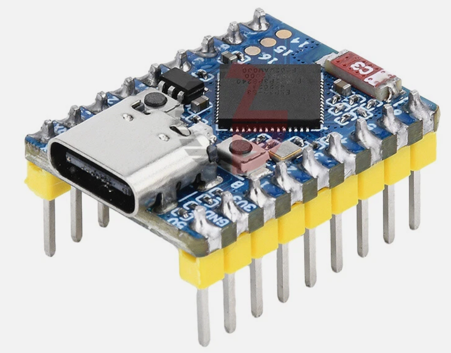

# ESP32-S3 Mini

!!! mascot-welcome "Welcome to the ESP32-S3 Mini"
    { class="mascot-admonition-img" }
    In this lab, you will learn about the ESP32-S3 Mini microcontroller. This tiny board packs a lot of power into a very small package! Let's build something amazing!

The ESP32-S3 Mini is a small, powerful microcontroller board. It fits in the palm of your hand. Yet it can connect to WiFi, run complex programs, and talk to many sensors at once.

This board is great for projects where space is tight. It uses a stamp-hole design. That means you can solder it directly onto your own custom circuit board.

## What Is Inside the ESP32-S3 Mini?

The brain of this board is the **ESP32-S3** chip made by Espressif. It has two processor cores. Both cores run at up to 240 MHz. That means it can do two things at the same time, very fast.

!!! mascot-thinking "Key Idea"
    { class="mascot-admonition-img" }
    Think of a dual-core processor like two brains working side by side. One brain can handle your sensor readings while the other runs your display — at the same time!

## Wireless Features

The ESP32-S3 Mini has built-in WiFi and Bluetooth. You do not need any extra parts to connect it to the internet or to other devices.

- **WiFi** — connects to your home or school network using the 2.4 GHz band (802.11 b/g/n standard)
- **Bluetooth 5 (LE)** — talks wirelessly to phones and other Bluetooth devices. LE stands for Low Energy, which helps save battery power.

The board has a small **ceramic antenna** built right in. An antenna is the part that sends and receives wireless signals. No extra antenna is needed.

## Memory

The ESP32-S3 Mini has several types of memory. Each type stores different kinds of information.

| Memory type | Amount | What it stores |
|-------------|--------|----------------|
| SRAM | 512 KB | Your running program and variables |
| ROM | 384 KB | Built-in startup code you cannot change |
| Flash | 4 MB | Your saved program files |
| PSRAM | 2 MB | Extra space for large data like images |

**SRAM** (Static Random-Access Memory) is fast memory your program uses while it runs. Think of it like your desk — it holds things you are working on right now.

**Flash** is where your program is saved when the board is turned off. Think of it like a notebook — the information stays there even when you close it.

!!! mascot-tip "Monty's Tip"
    { class="mascot-admonition-img" }
    The 2 MB of PSRAM is what makes the S3 great for image and audio projects. It gives you room to store large data that would not fit on a regular Pico.

## Input and Output Pins

The ESP32-S3 Mini has **34 General-Purpose Input/Output (GPIO) pins**. GPIO pins are the connectors you use to talk to sensors, LEDs, motors, and displays.

You can set up each pin to work in different ways. The board supports many communication standards:

- **SPI** (Serial Peripheral Interface) — a fast way to talk to displays and memory chips. The board has 4 SPI channels.
- **I2C** (Inter-Integrated Circuit) — a simple 2-wire connection for sensors. The board has 2 I2C channels.
- **UART** (Universal Asynchronous Receiver-Transmitter) — used for serial communication. The board has 3 UART channels.
- **I2S** (Inter-IC Sound) — used for playing and recording audio. The board has 2 I2S channels.
- **ADC** (Analog-to-Digital Converter) — reads analog sensors like potentiometers. The board has 2 ADC units.

## Physical Features

| Feature | Detail |
|---------|--------|
| Size | 23.5 mm × 18 mm |
| USB connector | USB Type-C |
| Maximum current draw | 800 mA |
| Built-in LED | WS2812 RGB LED (full color!) |
| BOOT button | Hold while pressing RESET to enter download mode |
| RESET button | Restarts the board |

!!! mascot-warning "Watch Out!"
    { class="mascot-admonition-img" }
    This board runs on 3.3V logic. Never connect a 5V signal directly to its GPIO pins — it can damage the chip permanently.

## Connecting to Your Computer

You connect the ESP32-S3 Mini to your computer using a **USB Type-C cable**. The board has a built-in USB serial controller. This means you do not need a separate adapter to program it or see its output.

To put the board into **download mode** so you can flash new firmware:

1. Hold down the **BOOT** button.
2. While holding BOOT, press and release the **RESET** button.
3. Release the BOOT button.
4. Your computer will now recognize the board as a programming device.

!!! mascot-celebration "Great Work!"
    { class="mascot-admonition-img" }
    You now know the key features of the ESP32-S3 Mini! Next, you will install MicroPython on it and write your first program.
