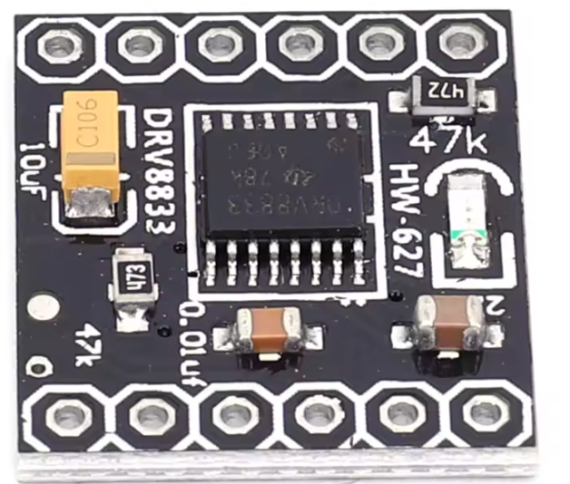
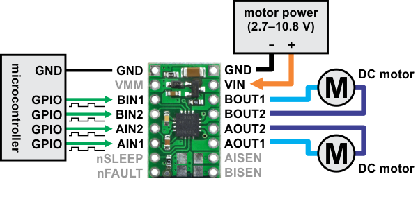

# DRV8833 2-Channel DC Motor Driver Module




!!! mascot-welcome "Welcome to the DRV8833 Lab"
    { class="mascot-admonition-img" }
    The DRV8833 is a tiny, powerful motor driver chip that works great with the Raspberry Pi Pico. It is one of the best choices for small robots and projects that need two motors. Let's explore it together!

## Overview

The **DRV8833** is a low-cost (about $2) compact dual H-bridge motor driver. It is based on Texas Instruments' DRV8833 integrated circuit (IC). An **IC** is a complete circuit packed into a tiny chip package.

The DRV8833 is designed to control **two DC motors independently** — or **one stepper motor** — in both forward and reverse directions. It is popular in robotics and hobby electronics because it works with low-voltage logic (as low as 2.7 V) and can supply moderate motor current without complex wiring.

You can find the DRV8833 module on [eBay](https://www.ebay.com/sch/i.html?_nkw=DRV8833+motor+driver) for under $2.

!!! mascot-thinking "Key Idea"
    { class="mascot-admonition-img" }
    The DRV8833 works directly with the Pico's 3.3 V signals — no level shifter needed. This makes wiring simple and reduces the number of parts in your project.

## Key Features

| Feature | Specification |
|---------|--------------|
| Motor channels | 2 (dual H-bridge) |
| Motor voltage | 2.7 V to 10.8 V (VM pin) |
| Logic voltage | 2.7 V to 7 V (works with 3.3 V and 5 V) |
| Continuous output current | about 1.2 A per channel |
| Peak output current | about 2 A per channel (short bursts) |
| Control interface | PWM and direction pins |
| Built-in protection | Over-current, short-circuit, under-voltage lockout, thermal shutdown |
| Dimensions | about 18 mm × 16 mm (varies by manufacturer) |

## How It Works

The DRV8833 contains **two full H-bridges**, each able to drive a motor forward or backward.

Each motor uses **two logic inputs**:

- `AIN1` and `AIN2` for Motor A
- `BIN1` and `BIN2` for Motor B

By setting one input HIGH and the other LOW, you set the motor direction. By applying **Pulse-Width Modulation (PWM)** to one input, you control both speed and direction at the same time. The chip also supports **brake** mode (motor stops quickly) and **coast** mode (motor slows down gradually).

## Typical Pinout

| Pin | Function |
|-----|---------|
| VM | Motor power supply (2.7 V to 10.8 V) — connect to your battery |
| GND | Ground |
| AIN1, AIN2 | Control inputs for Motor A |
| BIN1, BIN2 | Control inputs for Motor B |
| AO1, AO2 | Motor A output wires |
| BO1, BO2 | Motor B output wires |
| nSLEEP | Set LOW to put the chip to sleep; set HIGH to keep it running |

Some breakout boards connect the nSLEEP pin directly to VCC so the chip is always active. You do not need to control it in your code.

## Wiring Steps

Connect the DRV8833 module to the Pico and your motors like this:

1. Connect the module's **VM** pin to your battery pack positive wire (2.7 V to 10.8 V).
2. Connect the module's **GND** pin to the battery pack negative wire and to the Pico's GND.
3. Connect **AIN1** to Pico **GP0**.
4. Connect **AIN2** to Pico **GP1**.
5. Connect **BIN1** to Pico **GP2**.
6. Connect **BIN2** to Pico **GP3**.
7. Connect **AO1** and **AO2** to the two wires of Motor A.
8. Connect **BO1** and **BO2** to the two wires of Motor B.
9. If your board has a separate **nSLEEP** pin (not tied to power), connect it to Pico **GP4**.

!!! mascot-warning "Watch Out!"
    { class="mascot-admonition-img" }
    Keep the motor battery voltage at or below 10.8 V. Going over the maximum voltage can permanently damage the DRV8833 chip.

## Sample Code: Forward, Backward, and Stop

```python
from machine import Pin, PWM
import time

# Set up Motor A control pins
motor_a_in1 = PWM(Pin(0))  # AIN1 — controls speed and direction for Motor A
motor_a_in2 = PWM(Pin(1))  # AIN2 — works with AIN1 to set direction

# Set up Motor B control pins
motor_b_in1 = PWM(Pin(2))  # BIN1 — controls speed and direction for Motor B
motor_b_in2 = PWM(Pin(3))  # BIN2 — works with BIN1 to set direction

# Set all PWM frequencies to 1000 Hz (1 kHz)
motor_a_in1.freq(1000)  # 1000 cycles per second for smooth motor control
motor_a_in2.freq(1000)
motor_b_in1.freq(1000)
motor_b_in2.freq(1000)

def motor_a_forward(motor_speed):
    """Spin Motor A forward at the given speed (0 to 65535)."""
    motor_a_in1.duty_u16(motor_speed)  # AIN1 gets the PWM signal
    motor_a_in2.duty_u16(0)            # AIN2 stays LOW for forward direction

def motor_a_backward(motor_speed):
    """Spin Motor A backward at the given speed (0 to 65535)."""
    motor_a_in1.duty_u16(0)            # AIN1 stays LOW for backward direction
    motor_a_in2.duty_u16(motor_speed)  # AIN2 gets the PWM signal

def motor_a_stop():
    """Stop Motor A (coast mode — slows gradually)."""
    motor_a_in1.duty_u16(0)  # both LOW = coast to stop
    motor_a_in2.duty_u16(0)

def motor_a_brake():
    """Brake Motor A (stops quickly)."""
    motor_a_in1.duty_u16(65535)  # both HIGH = brake mode (stops fast)
    motor_a_in2.duty_u16(65535)

# Drive Motor A forward at 75% speed for 2 seconds
motor_a_forward(49152)   # 49152 is about 75% of 65535
time.sleep(2)

# Stop, then go backward
motor_a_stop()
time.sleep(0.5)

motor_a_backward(32768)  # 32768 is about 50% speed
time.sleep(2)

# Brake to a quick stop
motor_a_brake()
```

## What Each Line Does

| Line | Purpose |
|------|---------|
| `PWM(Pin(0))` | Creates a PWM output on GP0 to control speed |
| `motor_a_in1.freq(1000)` | Sets 1000 Hz PWM — fast enough for smooth motor control |
| `motor_a_in1.duty_u16(motor_speed)` | Sets the speed — higher value = faster |
| `motor_a_in2.duty_u16(0)` | Sets AIN2 to 0 — this determines the forward direction |
| `duty_u16(65535)` | Both at max (100%) = brake mode — motor stops quickly |
| `duty_u16(0)` for both | Both at 0% = coast mode — motor slows on its own |

## Advantages of the DRV8833

- Works directly with **3.3 V and 5 V logic** — no extra components needed.
- Compact and lightweight — great for small robots.
- Quiet operation with PWM up to about 250 kHz.
- Built-in fault protection reduces the risk of damage.
- Lower voltage loss than the L293D — motors get more power from the same battery.

## Common Uses

- Small robot cars with two DC motors
- Driving a single bipolar stepper motor
- Pan-tilt camera platforms
- Automated toys
- Small conveyor belts or mechanisms in DIY projects

!!! mascot-tip "Monty's Tip"
    { class="mascot-admonition-img" }
    The DRV8833 is a great upgrade from the L293D. It wastes less power, so your motors run stronger and your batteries last longer. For small robots, the DRV8833 is usually the better choice.

## References

1. [DRV8833 Datasheet (Texas Instruments)](https://www.ti.com/product/DRV8833)
2. [eBay — DRV8833 Motor Driver Modules](https://www.ebay.com/sch/i.html?_nkw=DRV8833+motor+driver)

!!! mascot-celebration "Outstanding Work!"
    { class="mascot-admonition-img" }
    You have learned how to use the DRV8833 — one of the best small motor drivers available. You can now control two motors, change direction, set speed with PWM, and even brake quickly. Your robot-building skills are growing fast!
