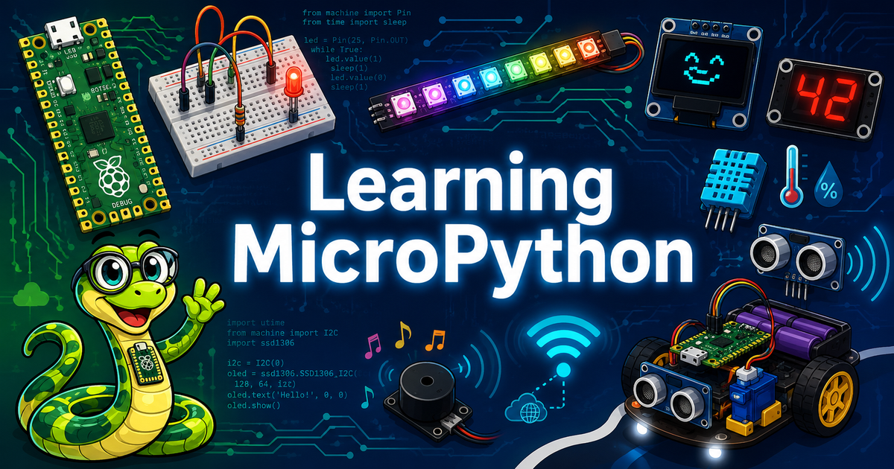

# Learning MicroPython



## Learning Map


!!! update
    We now have added support for using generative AI to teach MicroPython.
    See our [Prompts](./prompts/index.md) page for details.

This website and GitHub repository are resources for learning and teaching MicroPython.  Our initial audience was to students in 5th to 12th grades (10-18 years old).  However, we have found that people from around the world of all ages are interested in learning MicroPython.

The course assumes that either a mentor, teacher or students have access to at least one microcontroller such as the $4 Raspberry Pi Pico or a ESP32 microcontroller.  The MicroController must have 16K RAM to run the MicroPython Interpreter.

Students should also have access to some low-cost sensors (buttons, potentiometers, time-of-flight sensor) and displays such as LEDs or OLED displays.

If you are looking for a specific topic, please remember to use the search function in the upper right of the website.  The website is best displayed on a wide screen to see the navigation bar on the left although the website also works on the small screens of mobile phones and tablets.

## Course Outline

You can use the navigation area on the left side panel to navigate to different parts of the website.  Here is a high-level overview of the main sections of the site.

## Chapters

The book is organized into 23 chapters that build on one another, covering 485 concepts across Python programming, electronics, sensors, displays, motors, robots, wireless networking, and project design. Chapters 1–5 give you the Python and electronics foundation you need; from Chapter 6 onward, every chapter includes working MicroPython programs you can run on a Raspberry Pi Pico. Each chapter also has its own quiz and annotated references. See the [full chapter list](chapters/index.md) for details.

1. [Python Basics — Programs, Variables, Data Types, and Operators](chapters/01-python-basics/index.md) — The fundamental building blocks of every Python program: variables, data types, operators, syntax, and print statements.
2. [Collections, Control Flow, Functions, and Error Handling](chapters/02-control-flow-functions/index.md) — Lists, dictionaries, loops, conditionals, functions, modules, and how to handle errors gracefully.
3. [MicroPython Environment and Development Tools](chapters/03-micropython-environment/index.md) — Setting up Thonny, flashing firmware, using the REPL, transferring files, and the MicroPython standard library.
4. [Microcontrollers and Hardware Platforms](chapters/04-microcontrollers-hardware/index.md) — The Raspberry Pi Pico, RP2040, Pico W, ESP32, GPIO pins, power, logic levels, and onboard memory.
5. [Electronics Fundamentals](chapters/05-electronics-fundamentals/index.md) — Voltage, current, resistance, Ohm's law, LEDs, transistors, diodes, capacitors, breadboards, and wiring.
6. [Digital Input, Output, and Interrupts](chapters/06-digital-io-interrupts/index.md) — Controlling LEDs, reading buttons, debouncing, active-high/low logic, and interrupt service routines.
7. [Analog Signals, ADC, and Pulse-Width Modulation](chapters/07-analog-adc-pwm/index.md) — Analog signals, the ADC, potentiometers, light sensors, and PWM for fading LEDs and driving motors.
8. [Communication Protocols: I2C, SPI, and UART](chapters/08-communication-protocols/index.md) — The I2C, SPI, UART, 1-Wire, and I2S digital buses and MicroPython's machine classes for peripherals.
9. [Temperature, Humidity, and Distance Sensors](chapters/09-temp-distance-sensors/index.md) — DHT11, DHT22, BME280, DS18B20, HC-SR04 ultrasonic, VL53L0X time-of-flight, and IR distance sensors.
10. [Motion, Orientation, and Light Sensors](chapters/10-motion-light-sensors/index.md) — Accelerometers, gyroscopes, compass sensors, photoresistors, and gesture/color sensors using I2C.
11. [Rotary Encoders, Touch Sensors, and Audio Input](chapters/11-encoders-touch-audio/index.md) — Quadrature rotary encoders, capacitive touch sensors, digital microphones, and FFT concepts for audio.
12. [Motors, Servos, and Stepper Motor Control](chapters/12-motors-servos-steppers/index.md) — DC motors, H-bridge ICs, motor speed and direction with PWM, servo angle control, and stepper motors.
13. [Robots and Mobile Systems](chapters/13-robots-mobile-systems/index.md) — Differential-drive robots, line-following, collision avoidance, obstacle detection, and robot calibration.
14. [NeoPixels and Non-Graphical Displays](chapters/14-neopixels-displays/index.md) — WS2812B NeoPixel strips and matrices, RGB/HSV color models, 7-segment displays, LED arrays, and character LCDs.
15. [OLED Display Setup and Configuration](chapters/15-oled-setup/index.md) — OLED hardware, SSD1306 and SH1106 controllers, I2C/SPI interfaces, resolution options, and driver modules.
16. [OLED Drawing Methods, Framebuffer, and Animation](chapters/16-oled-drawing-animation/index.md) — OLED drawing APIs, the framebuf module, and animated projects like OLED Bounce and Pong.
17. [Color Displays and E-Paper Screens](chapters/17-color-epaper-displays/index.md) — Full-color TFT LCDs (ILI9341, ST7789V), color depth, custom drawing, and low-power e-paper displays.
18. [Sound, Music, and Audio Generation](chapters/18-sound-music-audio/index.md) — Buzzers, tone generation with PWM, musical note frequencies, melody playback, MIDI, DAC, and I2S audio.
19. [Wireless Connectivity and the Internet of Things](chapters/19-wireless-iot/index.md) — Wi-Fi, HTTP, web servers, REST APIs, JSON, weather data, NTP time sync, and OTA updates.
20. [Timers, Timing Functions, and Multi-Core Programming](chapters/20-timers-multicore/index.md) — machine.Timer, non-blocking programming with ticks, precise timing, and RP2040 dual-core with _thread.
21. [File Systems, Audio Files, and Debugging](chapters/21-file-systems-debugging/index.md) — MicroPython file I/O, SD cards, WAV playback, I2S audio output, and systematic debugging strategies.
22. [Advanced Hardware Topics and AI-Assisted Coding](chapters/22-advanced-hardware-ai/index.md) — PIO state machines, FFT algorithms, DMA, watchdog timers, RTC, sleep modes, and AI prompt engineering.
23. [Applied Learning and Capstone Projects](chapters/23-applied-learning-projects/index.md) — Complete kit projects, computational thinking pillars, project design methodology, and a student capstone project.

## Hands-on Labs

In addition to the structured chapters above, the site includes a large collection of original step-by-step lab tutorials grouped by topic. These labs are a great place to jump straight to a specific part or project.

### Section 1: Introduction to Physical Computing

This part is a high-level overview of what MicroPython is and why is has become the most popular way to do physical computing, program microcontrollers and build robots.  We also discuss the different types of microcontrollers available, their price and features and how to purchase them independently or in kits.

### Section 2: Getting Started with MicroPython

This part will help you get started programming MicroPython on your microcontroller and learn how to hook up parts on a solderless breadboard.  We discuss the need for a desktop Integrated Development Environment (IDE) and how to get started writing simple programs

### Section 3: Basic Examples

These ten lessons are the foundations for learning [MicroPython](misc/glossary#micropython).  They include learning how to blink one or more LEDs, monitor for button presses, fade LEDs in and out using PWM signals, read analog values from potentiometers, read light sensors, turn motors and servos and display rainbow patterns on a NeoPixel strip.  Many other labs are variations of these 10 labs.

[Introduction to Basic MicroPython Examples](intro/01-intro.md)

### Section 4: Sensors

This section will give you more examples of how to use different types of sensors such as heat sensors, current sensors, rotary encoders, accelerometers, gesture sensors, and magnetic field sensors.

[Reading Sensors with MicroPython](sensors/01-intro.md)

### Section 5: Motors and Robots

This is our student's favorite part of this site!  Once you can make a motor go forward and reverse, you are close to being able to make a robot move.  We walk you through the basics of using a simple transistor to control a motor, to using simple motor controllers like the L293D chips.

[Introduction to Motors and Robots with MicroPython](motors/01-intro.md)

Note that we have many other advanced labs that use our $11 [Cytron Maker Pi RP2040 Kits](kits/maker-pi-rp2040-robot/01-intro.md).  These incredible boards have everything integrated to build robots with lights and sounds.

### Section 6: Displays

This section shows you how to use many different types of displays, from simple 7-segment digital displays to complex OLED graphic displays.  On the old 2K Arduino controllers these graphics labs used to be hard, but now we have 264K of RAM on the Raspberry Pi RP2040 microcontrollers.  Now these labs are easy!

* [Simple Character Displays](displays/01-intro.md)
* [Graphical Displays](oled/01-intro.md)

### Section 7: Sound and Music

Having powerful microcontrollers allows us to generate complex sounds, play tones and even playback recoded sound effects.

[Introduction to Sound and Music with MicroPython](sound/01-intro.md)

### Section 8: Advanced Labs

We have now covered all the things you need to build hundreds of projects.  This section contains deeper dives into other topics
such as how to use the MicroPython Remote ```pmremote`````` tools to automate the loading of software onto your microcontroller.

[Advanced Topics](advanced-labs/01-intro.md)

### Section 9: Kits

This section contains detailed steps to use the popular educational kits that are now integrating MicroPython and the RP2040 microcontroller.  There are many kits and these lessons contain full working programs to build complex projects like a collision avoidance robot with OLED displays.

[MicroPython Kits](kits/01-intro.md)

## Related and Reference Material

Lastly, we have a large glossary of terms, contact information and references to other websites that might be useful in your projects.  Many of our more advanced projects have been moved into separate websites.
Here are a few of these sites:

1. [Moving Rainbow](https://dmccreary.github.io/moving-rainbow/) - focus on a full curriculum around using LED strips to make displays and costumes.
2. [Robot Faces](https://dmccreary.github.io/robot-faces/) and have been moved into their own repositories.
3. [Clocks and Watches](https://dmccreary.github.io/micropython-clocks-and-watches/) - dozens of examples that just focus on creating clock and watch projects.  These projects use the Pico "W" and the new low-cost SmartWatch displays.
4. [Robot Day](https://dmccreary.github.io/robot-day/) - details of building a single-day event to promote STEM at your school using
collision avoidance robots.
5. [Beginning Electronics](https://dmccreary.github.io/beginning-electronics/)
6. [AI Racing League](https://www.coderdojotc.org/ai-racing-league/) - this site moves from MicroPython on the Raspberry Pi Pico to full Python on Raspberry Pi single-board computers.  It is designed for students
who have mastered many of our programming labs and want more challenging projects involving data literacy, machine learning and computer vision.

### Glossary of Terms

[Glossary of MicroPython Terms](misc/glossary.md)

### FAQ

[Frequently Asked Questions](./faq.md)

### References

This is an annotated list of other on-line resources to help you learn MicroPython and use microcontrollers.
Each chapter includes detailed annotated references.  We also have a list of general references for the entire textbook.

[Micropython References](misc/references.md) - links to other useful sites.

If you have suggestions for additional references projects, please [let us know](mailto:info@codesavvy.org)!

### Contact
[Contact](misc/contact.md)


