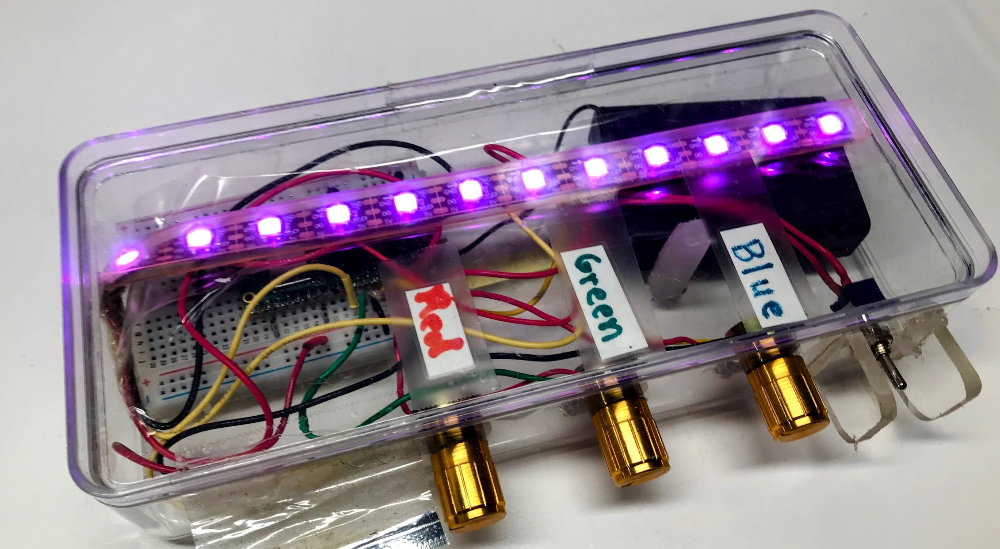

# Raspberry Pi RGB Box



<iframe width="560" height="315" src="https://www.youtube.com/embed/okl5uWhzmRg?si=GfIjjfPzxCO9Sn1U" title="YouTube video player" frameborder="0" allow="accelerometer; autoplay; clipboard-write; encrypted-media; gyroscope; picture-in-picture; web-share" referrerpolicy="strict-origin-when-cross-origin" allowfullscreen></iframe>

!!! mascot-welcome "Welcome, Maker!"
    { class="mascot-admonition-img" }
    In this project you will build a color-mixing box with three knobs and a strip
    of colorful lights. Turn the knobs to blend red, green, and blue into any color
    you can imagine. Let's build something amazing!

This project uses three potentiometers (turning knobs) and a strip of NeoPixel LEDs.
Each knob controls one color: red, green, or blue.
Turn a knob up and that color gets brighter.
Mix all three together and you can make millions of different colors!

We take this box to science fairs and let kids as young as three play with it.
When they turn the knobs and the lights change, we say "Hey, you're a programmer!"

## What You Will Learn

- How to read a potentiometer with an Analog-to-Digital Converter (ADC).
- How to control NeoPixel LED colors with RGB values.
- How to map a sensor reading to a color value.
- How to build a fun, interactive hardware project.

## Parts List

| Quantity | Part | Approximate Cost |
|----------|------|-----------------|
| 1 | Raspberry Pi Pico with headers | $4 |
| 1 | Half-size solderless breadboard | $2 |
| 3 | 10KΩ linear potentiometers | $2 |
| 1 | NeoPixel LED strip with 10 pixels | $2 |
| 1 | 3×AA battery case with on/off switch | $2 |
| 1 | Clear plastic project box | $4 |
| 1 roll | 22-gauge solid hookup wire | $3 |
| 1 | USB cable (Micro-B to USB-A) | — |

**Total cost:** about $15. If you buy parts in batches of ten, you can get this under $10 per kit.

## Required Tools

1. Solderless breadboard — to connect the components without any soldering.
2. Jumper wires — to run connections between the breadboard and the Pico.
3. USB cable (Micro-B to USB-A) — to power the Pico and upload your code.

## How It Works

### Potentiometers

A **potentiometer** (pot for short) is a turning knob that acts like an adjustable
resistor. It has three wires:

- One wire goes to **power** (3.3V on the Pico).
- One wire goes to **ground** (GND).
- The middle wire is the **signal wire** — its voltage changes as you turn the knob.

When the knob is all the way to the left, the signal wire reads 0 volts.
When the knob is all the way to the right, it reads 3.3 volts.
Anywhere in between gives a value in between.

The Pico's **Analog-to-Digital Converter (ADC)** reads that voltage and turns
it into a number between 0 and 65535.

### NeoPixels

A **NeoPixel** is a smart LED with a tiny chip inside.
You only need one wire to control it — a data wire from the Pico.
Each NeoPixel can show any color using an **RGB value**: three numbers, each
from 0 to 255, for red, green, and blue.

- `(255, 0, 0)` = full red.
- `(0, 255, 0)` = full green.
- `(0, 0, 255)` = full blue.
- `(255, 255, 255)` = white (all three at full brightness).
- `(0, 0, 0)` = off.

!!! mascot-thinking "Key Idea: Scaling Numbers"
    { class="mascot-admonition-img" }
    The ADC gives us numbers from 0 to 65535, but NeoPixels need numbers from
    0 to 255. We can scale down by shifting the bits right by 8 — that divides
    the number by 256. It is a fast way to shrink the range.

## Wiring

### Pico Pin Reference

| Pin Name | GPIO Number | What Connects Here |
|----------|-------------|-------------------|
| GP0 | GPIO 0 | NeoPixel data wire |
| GP26 | GPIO 26 (ADC0) | Red knob signal |
| GP27 | GPIO 27 (ADC1) | Green knob signal |
| GP28 | GPIO 28 (ADC2) | Blue knob signal |
| 3V3 | 3.3V power | All three pot power wires, NeoPixel VCC |
| GND | Ground | All three pot ground wires, NeoPixel GND |

### Step-by-Step Wiring

**Red potentiometer (left knob):**

1. Place the potentiometer across the center gap of the breadboard.
2. Connect the left pin to a **3.3V** pin on the Pico with a jumper wire.
3. Connect the right pin to a **GND** pin on the Pico with a jumper wire.
4. Connect the middle pin (the wiper) to **GP26** (ADC0) with a jumper wire.

**Green potentiometer (middle knob):**

1. Place it on the breadboard next to the red pot.
2. Left pin → **3.3V** on the Pico.
3. Right pin → **GND** on the Pico.
4. Middle pin → **GP27** (ADC1).

**Blue potentiometer (right knob):**

1. Place it on the breadboard next to the green pot.
2. Left pin → **3.3V** on the Pico.
3. Right pin → **GND** on the Pico.
4. Middle pin → **GP28** (ADC2).

**NeoPixel strip:**

1. Connect the **VCC** (power) wire on the strip to a **3.3V** pin on the Pico.
2. Connect the **GND** wire on the strip to a **GND** pin on the Pico.
3. Connect the **Data In** wire on the strip to **GP0** on the Pico.

!!! mascot-tip "Monty's Tip"
    { class="mascot-admonition-img" }
    NeoPixel strips have a direction arrow printed on them. Make sure the data
    wire connects to the **Data In** end (the arrow points away from the Pico),
    not the **Data Out** end.

## Lab 1: Test the NeoPixel

Before wiring all three knobs, check that your NeoPixel strip is connected correctly.
This short program blinks the last pixel on the strip red.
If you see it blinking, your strip is working!

Save this file as `01-blink.py` on your Pico and run it.

```python
from machine import Pin       # Pin lets us control GPIO pins
from neopixel import NeoPixel # NeoPixel controls the LED strip
from utime import sleep       # sleep pauses the program

NEOPIXEL_PIN = 0   # data wire is connected to GPIO 0
NUMBER_PIXELS = 10 # our strip has 10 LEDs

# create the strip object — one argument is the data pin, one is the count
strip = NeoPixel(Pin(NEOPIXEL_PIN), NUMBER_PIXELS)

while True:
    # set the last pixel to red: (red=255, green=0, blue=0)
    strip[NUMBER_PIXELS - 1] = (255, 0, 0)
    strip.write()   # send the color data to the strip
    sleep(0.25)     # wait 1/4 second

    # turn the last pixel off: (red=0, green=0, blue=0)
    strip[NUMBER_PIXELS - 1] = (0, 0, 0)
    strip.write()   # send the update to the strip
    sleep(0.25)     # wait 1/4 second
```

**What each line does:**

| Line | What it does |
|------|-------------|
| `from machine import Pin` | Loads the Pin class so we can use GPIO pins |
| `from neopixel import NeoPixel` | Loads the NeoPixel driver |
| `NEOPIXEL_PIN = 0` | Stores the GPIO number in a named variable |
| `strip = NeoPixel(Pin(0), 10)` | Creates a strip object for 10 pixels on pin 0 |
| `strip[9] = (255, 0, 0)` | Sets the color of pixel 9 (the last one) to red |
| `strip.write()` | Sends all color values to the strip over the data wire |

**Expected result:** The last LED on the strip blinks red on and off.
If nothing blinks, double-check that your Data In wire is on GP0 and that VCC and GND are correct.

## Lab 2: RGB Color Mixer

Now add the three potentiometers and run the main program.
Each knob controls one color channel — turn them to mix any color you like.

Save this file as `main.py` on your Pico.

```python
from machine import ADC, Pin  # ADC reads analog voltages; Pin controls GPIO
from utime import sleep
from neopixel import NeoPixel

NEOPIXEL_PIN = 0    # NeoPixel data wire on GPIO 0
NUMBER_PIXELS = 10  # our strip has 10 pixels

# create the NeoPixel strip
strip = NeoPixel(Pin(NEOPIXEL_PIN), NUMBER_PIXELS)

# set up the built-in LED (GPIO 25) — it blinks to show the loop is running
led = Pin(25, Pin.OUT)

# set up the three potentiometers on ADC pins
pot_red   = ADC(26)  # left knob  — controls red brightness
pot_green = ADC(27)  # middle knob — controls green brightness
pot_blue  = ADC(28)  # right knob  — controls blue brightness

# repeat forever
while True:
    # read each pot: returns 0–65535
    # shift right by 8 bits to get 0–255 (divides by 256)
    red   = pot_red.read_u16()   >> 8
    green = pot_green.read_u16() >> 8
    blue  = pot_blue.read_u16()  >> 8

    # print the values to the console so we can watch them change
    print("R:", red, "  G:", green, "  B:", blue)

    # set every pixel on the strip to the same color
    for i in range(NUMBER_PIXELS):
        strip[i] = (red, green, blue)
    strip.write()  # send the new colors to the hardware

    led.toggle()   # flip the onboard LED on/off each loop
    sleep(0.05)    # wait 1/20 second, then read again
```

**What each section does:**

| Section | What it does |
|---------|-------------|
| `pot_red = ADC(26)` | Creates an ADC reader on GPIO 26 for the red knob |
| `pot_red.read_u16()` | Reads a 16-bit value (0–65535) from the pot |
| `>> 8` | Shifts the bits right by 8, scaling 0–65535 down to 0–255 |
| `for i in range(NUMBER_PIXELS)` | Loops through every pixel index (0 through 9) |
| `strip[i] = (red, green, blue)` | Sets pixel `i` to the current color mix |
| `strip.write()` | Sends all the updated colors to the strip at once |
| `led.toggle()` | Flips the onboard LED — a quick heartbeat to show things are running |

## Try It Out

Once the program is running, open the Thonny Shell (or REPL).
You will see lines like this appearing every 1/20 second:

```
R: 0   G: 0   B: 0
R: 12  G: 0   B: 0
R: 87  G: 0   B: 0
R: 134 G: 0   B: 0
```

Try these experiments:

1. **Pure colors** — Turn the red knob all the way up and keep green and blue at zero. You should see bright red.
2. **Yellow** — Turn red and green all the way up, and blue all the way down. Red + green = yellow!
3. **White** — Turn all three knobs all the way up.
4. **Off** — Turn all three knobs all the way down.
5. **Your own color** — Find a color you like and write down the R, G, B numbers from the console.

## Challenges

1. **Fewer pixels** — Change `NUMBER_PIXELS` to 5. Only half the strip lights up. Can you explain why?
2. **Pattern mode** — Instead of setting every pixel the same color, make a gradient: set the first pixel brighter and the last pixel dimmer. Hint: multiply the color by `i / NUMBER_PIXELS`.
3. **Speed control** — Add a fourth potentiometer on GPIO 27 and use it to control `sleep()` time instead of green. Now you have a speed knob.
4. **Save a color** — Add a button. When you press it, print the current R, G, B values and save them to a list. At the end, print all your saved colors.

!!! mascot-celebration "You Built a Color Mixer!"
    { class="mascot-admonition-img" }
    You just built an interactive hardware project that reads three sensors and
    controls ten lights in real time. That is real embedded programming! Next,
    try adding a button to save your favorite colors, or explore the
    [NeoPixel patterns lab](neopixel/02-simple-patterns.md) to add animations.
