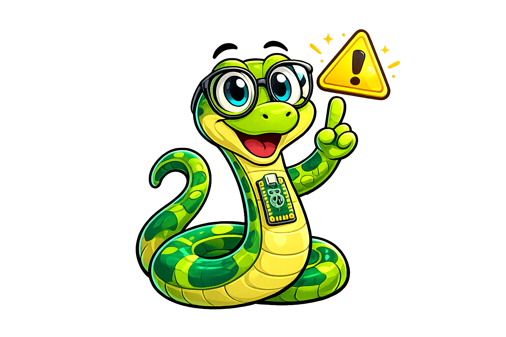
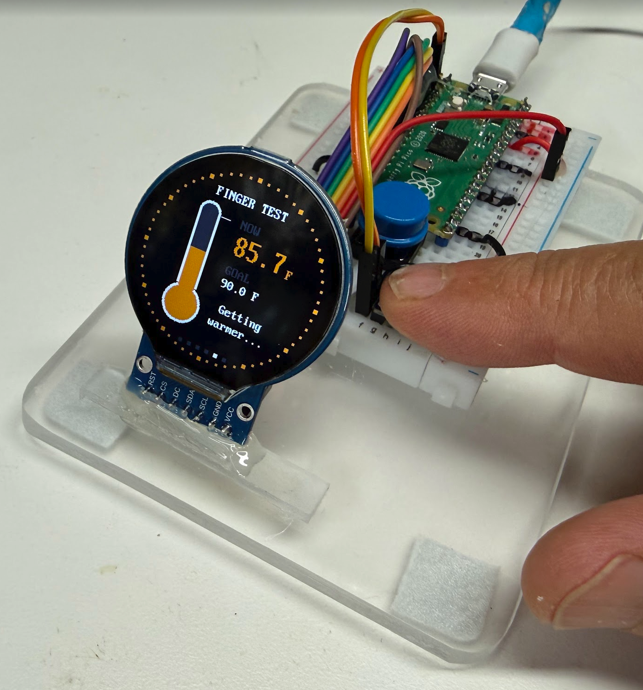
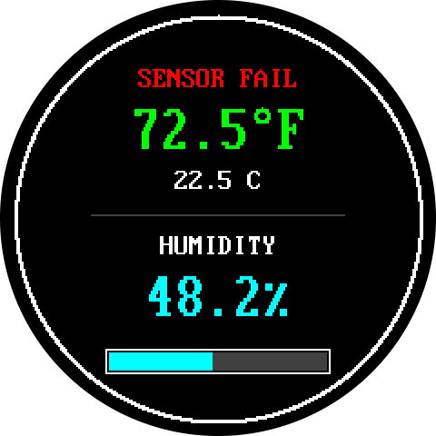

# Mood Ring Thermometer

*SHT40 Sensor Kit: Temperature and Humidity on a Colorful Smartwatch Display*

{ width="640" }

*The real kit. The star is the SHT40, the small purple sensor board. The round screen is a low-cost display, made for smartwatches, that lets you watch the sensor at work.*

{ width="360" }

*A round display is a great way to see a highly responsive and precise sensor that measures temperature and humidity. This second picture was drawn by a screen simulator, so your real screen may look a little different.*

!!! mascot-welcome "Welcome to the Mood Ring Thermometer"
    { class="mascot-admonition-img" }
    Today you will build a thermometer that changes color like a mood ring.
    You will wire a precise sensor and a round screen, test each part, and
    read the code one step at a time. Let's build something amazing!

## What You Will Learn

After this lesson you will be able to:

1. Wire a sensor and a round color screen to a Raspberry Pi Pico.
2. Test each part on its own before you put them together.
3. Explain what a pixel is and how x and y numbers find a spot on the screen.
4. Change a temperature from Celsius to Fahrenheit.
5. Read a short program and explain how it picks a color.
6. Change a setting and predict what the display will show.
7. Watch a precise, fast sensor react to your breath and your fingertip.
8. Add a push button and use it to switch the display between modes.

## Lesson at a Glance

| Item | Details |
|------|---------|
| Grade level | 6th grade (about age 11) |
| Time needed | About 90 minutes for Steps 1 to 10. Two 45-minute class periods works well. Step 11 adds about 45 more minutes |
| Difficulty | Beginner |
| The big idea | A very precise, very fast sensor is easy to understand when you can see it on a screen |
| You should already know | How to plug in a Pico and run a program in Thonny. See the [MicroPython Environment chapter](../../chapters/03-micropython-environment/index.md) |
| New ideas in this lesson | Screens made of dots, x and y positions, percent, choosing with `if`, and buttons |
| Help you need | A grown-up helper for Step 2 (about 5 minutes) |

Already built the [SHT40 lesson](../sht40-temp/index.md)? Great! Your sensor
is wired. You can skip ahead to Step 2.

## Meet Your Parts

| Part | What it does | Think of it like |
|------|--------------|------------------|
| Raspberry Pi Pico | A tiny computer called a **microcontroller**. It runs your program | The brain |
| SHT40 sensor | A **sensor** is a part that measures the world. This one measures temperature and humidity. It is the star of this lesson | Skin that feels the air |
| GC9A01 display | A low-cost round color screen, 240 dots wide and 240 dots tall. It was made for smartwatches | A window that shows what the sensor feels |
| Breadboard | A plastic board with lots of holes. Metal strips inside join the holes in short rows | A way to connect parts with no glue |
| Jumper wires | Wires with metal pins on the ends. They push into the breadboard holes | Roads between the parts |

### Why "Mood Ring"?

A **mood ring** changes color with your mood. Your thermometer changes color
with the air. It shows cool colors when the air is cold and warm colors when
the air is hot.

You will see it first in Step 6, when the temperature number changes color.
Then Step 11 adds a smooth slide of colors around the rim, on a cartoon face
named Buddy, and on a graph line. See [Mood-Ring Colors](#mood-ring-colors)
to learn how the program picks each color.

### Why a Smartwatch Display?

We are **not** building a smartwatch. This round screen is a low-cost part
made for smartwatches, and it costs about $5. We use it as a window on the
star of this lesson: the **SHT40** sensor.

The SHT40 is very precise. It measures temperature to within 0.2 degrees
Celsius. It is also very fast. It takes a reading in about 8 milliseconds. A
millisecond (ms) is one thousandth of a second.

A sensor cannot show you its numbers by itself. Put it on a screen, and you
can watch it react to your breath and your fingertip.

### What Is Humidity?

**Humidity** tells you how much water is floating in the air. The number on
your screen is **relative humidity**. It compares the water in the air to the
most water the air could hold.

Think of a sponge. A sponge that is 50 percent full is holding half of the
water it could hold. Air works the same way. Warm air is a bigger sponge
than cold air.

### What Is a Pixel?

A **pixel** is one tiny dot on a screen. Your round display has 240 rows of
240 dots. That is 57,600 dots in all! Each dot can glow any color. Your
program tells each dot what to do.

### How Do the Parts Talk?

Chips talk to each other over wires. Your two parts use two different
"languages":

- The sensor uses **I2C**, short for Inter-Integrated Circuit (say "eye-squared-see").
  It needs only two wires.
  One wire carries data. The other carries a clock that keeps both chips in
  step, like a drummer keeping a band together.
- The screen uses **SPI**, which is short for Serial Peripheral Interface.
  Pictures need lots of numbers, so SPI uses more wires. Think of it as a
  wide highway next to I2C's country road.

Want to learn more? Read the
[Communication Protocols chapter](../../chapters/08-communication-protocols/index.md).

## Parts You Need

| Part | Notes |
|------|-------|
| Raspberry Pi Pico | About $4. Any Pico or Pico W with MicroPython already installed |
| SHT40 sensor board | The small purple board. About $1.65 on eBay |
| GC9A01 round display | A low-cost display (about $5) made for smartwatches. 240 x 240 dots. It has 7 or 8 pins |
| Solderless breadboard | Half-size is plenty |
| About 13 jumper wires | 4 for the sensor, 7 for the display and 2 for the button. See the note below |
| USB (Universal Serial Bus) data cable | Some cheap cables only carry power, so they will not work |
| Push button | Any small push button. You only need it for Step 11 |
| A computer with Thonny | Thonny is the program you use to write and run MicroPython |

Which jumper wires? Use **male-to-male** wires for the sensor. Look at the
pins on your display. If they stick out like little nails, use
**female-to-male** wires. The socket end goes on the display pin. The metal
pin end goes into the breadboard.

## Step 1: Wire the Sensor

Find the pins first. Hold your Pico with the USB port at the top. Pin 1 is at
the top left. The numbers go down the left side to pin 20. Then they go up
the right side, from pin 21 at the bottom to pin 40 at the top.

The pins named **GP0**, **GP1**, **GP2** and so on are General-Purpose pins.
Your program can use them for anything.

!!! mascot-tip "Monty's Tip"
    { class="mascot-admonition-img" }
    Every pin has its name printed on the back of the Pico. Turn the Pico
    over and read the labels before you push in each wire. It is much faster
    than counting!

Now wire the sensor. Each Pico pin has its own short row of holes on the
breadboard. Push each wire into the row beside the pin you want.

1. Unplug the Pico from the USB cable. Never wire a board that has power.
2. Push the Pico into the breadboard with the USB port hanging off the edge.
3. Connect sensor **VIN** (power in) to Pico **pin 36 (3V3 OUT)** with a red wire.
4. Connect sensor **GND** (ground) to Pico **pin 38 (GND)** with a black wire.
5. Connect sensor **SCL** (Serial Clock) to Pico **pin 2 (GP1)**.
6. Connect sensor **SDA** (Serial Data) to Pico **pin 1 (GP0)**.
7. Check each wire twice. Do not plug in the USB cable yet.

| Sensor pin | Pico pin | Pico name | What it does |
|------------|----------|-----------|--------------|
| VIN | 36 | 3V3 OUT | Power in. "3V3" means 3.3 volts |
| GND | 38 | GND | Ground, the return path for power |
| SCL | 2 | GP1 | Serial Clock. It keeps both chips in step |
| SDA | 1 | GP0 | Serial Data. It carries the numbers |

!!! mascot-warning "Watch Out!"
    { class="mascot-admonition-img" }
    Never connect a wire to pin 40, which is labeled **VBUS**. It sends 5 volts
    straight from the USB cable, and your parts can only take 3.3 volts.
    Always use pin 36, labeled **3V3 OUT**, for power.

## Step 2: Put the Code on the Pico

Your program has to live on the Pico. Copying files from your computer to the
Pico is called **uploading**. A kit script does it all at once.

**Ask your grown-up helper to do this step with you.**

1. Close Thonny. Only one program can talk to the Pico at a time.
2. Plug the Pico into the computer with the USB data cable.
3. Open a Terminal window. That is a window where you type commands. Go to the kit folder, then run the script:

```bash
cd learning-micropython/src/kits/sht40-temp-display   # go to the kit folder
./upload-code.sh                                      # copy everything to the Pico
```

Your `learning-micropython` folder may be somewhere else on your computer. Ask
your helper for its path.

The script finds your Pico and copies these files onto it:

| File or folder | What it is |
|----------------|------------|
| `lib` | A folder of helper code (a **library**) that teaches the Pico how to draw on the round screen |
| `config.py` | The **configuration** file. Every pin number and setting lives here |
| `01` to `09` | The lab programs you will run in this lesson |
| `main.py` | A copy of program 09, the six-mode display. The Pico runs it by itself when it starts up |

When it finishes, it says `Uploaded 27 files` and lists what is on the Pico.

No Mac or Terminal? Ask your teacher. You can also copy the files with
Thonny's Files panel. Make a folder named `lib` on the Pico. Then upload each
file.

## Step 3: Test the Sensor

Test the sensor **before** you add the screen. Then, if something goes wrong
later, you know it was not the sensor.

1. Plug in the USB cable. Open Thonny.
2. In the bottom-right corner of Thonny, choose **MicroPython (Raspberry Pi Pico)**.
3. Choose **File**, then **Open**, then **This computer**.
4. Open `01-i2c-scanner.py` and click the green **Run** button.

The scanner asks the wires "Who is out there?" A working scan looks like this
in the Shell. The Shell is the box at the bottom of Thonny where messages
appear:

```
Scanning I2C bus 0 on SDA=GP0 and SCL=GP1...

Found 1 device(s):
  decimal: 68  hex: 0x44

SHT40 found at 0x44 - SHT40-AD1B (most common)

TEST PASS
```

The number `0x44` is the sensor's **address**. It works like a house number
on a street. The Pico uses it to find the sensor.

Now open `02-get-single-temp-reading.py` and run it. It takes one reading:

```
Reading the SHT40 at 0x44 ...

Temperature: 22.50 C
Temperature: 72.50 F
Humidity:    48.20 %

TEST PASS
```

Your numbers will be different. That is fine!

The letter **C** means Celsius and **F** means Fahrenheit. They are two ways
to measure temperature. The sensor speaks Celsius, and the program changes it
to Fahrenheit for you.

**Checkpoint 1:** Do both programs say `TEST PASS`? If yes, keep going. If
not, check the [Troubleshooting](#troubleshooting) table.

## Step 4: Wire the Display

The display has seven wires. Six of them go to Pico pins that sit in a row:
**pins 4, 5, 6, 7, 8 and 9**. The seventh brings power.

1. Unplug the Pico from the USB cable.
2. Connect display **SCL** (the clock) to Pico **pin 4 (GP2)**.
3. Connect display **SDA** (the data) to Pico **pin 5 (GP3)**.
4. Connect display **DC** (Data/Command) to Pico **pin 6 (GP4)**.
5. Connect display **CS** (Chip Select) to Pico **pin 7 (GP5)**.
6. Connect display **GND** (ground) to Pico **pin 8 (GND)**.
7. Connect display **RST** (Reset) to Pico **pin 9 (GP6)**.
8. Connect display **VCC** (power in) to Pico **pin 36 (3V3 OUT)**. Use the same
   row as the sensor's VIN wire. Two wires can share one row.
9. Check each wire twice, then plug in the USB cable.

| Display pin | Pico pin | Pico name | What it does |
|-------------|----------|-----------|--------------|
| SCL | 4 | GP2 | The clock. It ticks so the Pico and screen move together |
| SDA | 5 | GP3 | The data. It carries the picture, one dot after another |
| DC | 6 | GP4 | Short for Data/Command. It says whether the next bytes are dots or an order |
| CS | 7 | GP5 | Short for Chip Select. It is like raising your hand: "I am talking to you" |
| GND | 8 | GND | Ground |
| RST | 9 | GP6 | Short for Reset. It restarts the screen |
| VCC | 36 | 3V3 OUT | Power in |

**Do not mix up the two SCL and SDA pairs!** The screen's SCL and SDA go to
pins 4 and 5. The sensor's SCL and SDA go to pins 2 and 1. They look alike,
but they are different wires on the Pico.

Your display may also have a pin named **BL**, short for backlight. Most
boards keep the backlight on by themselves. If your screen stays dark even
though everything else is right, connect **BL** to **pin 36 (3V3 OUT)**.

Keep the sensor a few holes away from the Pico and the screen. Both make a
little heat, and heat can push the sensor's reading up.

## Step 5: Say Hello

Now test the screen on its own. Open `06-display-hello.py` and click **Run**.
It writes "Hello World!" in the middle of the screen. The Shell says:

```
Drew 'Hello World!' at x=24, y=104
Look at the display. Do you see Hello World?
TEST PASS
```

{ width="240" }

### How the Screen Finds a Spot

Every dot on the screen has two numbers: **x** and **y**. Together they are
called **coordinates**.

- **x** tells you how far to go from the left edge.
- **y** tells you how far to go from the top edge.
- The top-left dot is `(0, 0)`. The center of your screen is `(120, 120)`.

Here is the surprise: **y grows as you go DOWN**, not up. That is the
opposite of a math graph.

Here is the heart of the hello program:

```python
import config                                   # our pins and settings
import vga1_bold_16x32 as BIG_FONT              # a big font, 16 dots wide and 32 dots tall

display = config.init_display()                 # wake up the round screen
display.fill(config.BLACK)                      # paint every dot black

text = "Hello World!"                           # the words to show
x = config.CENTER_X - (len(text) * BIG_FONT.WIDTH) // 2   # left edge that centers the words
y = config.CENTER_Y - BIG_FONT.HEIGHT // 2                # top edge that centers the words

# Draw the words: font, words, x, y, letter color, background color
display.text(BIG_FONT, text, x, y, config.WHITE, config.BLACK)
```

### What Each Line Does

| Line | What it does |
|------|--------------|
| `display.fill(config.BLACK)` | Paints all 57,600 dots black, so we start with a clean screen |
| `len(text)` | Counts the letters. "Hello World!" has 12 |
| `BIG_FONT.WIDTH` | How wide one letter is: 16 dots |
| `// 2` | Divides by 2 and drops any leftover. We want half of the width |
| `display.text(...)` | Draws the words at the spot we worked out |

The sums for `x` and `y` are just number puzzles:

| Puzzle | Math | Answer |
|--------|------|--------|
| How wide are the words? | 12 letters × 16 dots | 192 dots |
| Half of that | 192 ÷ 2 | 96 dots |
| Where does the left edge go? | 120 − 96 | `x = 24` |
| Where does the top edge go? | 120 − (32 ÷ 2) | `y = 104` |

The answers match the Shell message. You just checked the computer's math!

**Checkpoint 2:** Can you read "Hello World!" on the screen? If yes, you are
ready for the full display. If the screen is dark, check the
[Troubleshooting](#troubleshooting) table.

## Step 6: Run the Sensor Display

Open `07-display-temp-humidity.py` and click **Run**. Look at the picture at
the top of this page. Your screen should look like it!

Here is what each part of the display means:

1. The **white ring** runs around the edge of the screen.
2. The **big number** is the temperature in Fahrenheit (F). Its color tells you how warm it is.
3. The **small number** is the same temperature in Celsius (C).
4. The **grey line** splits the temperature half from the humidity half.
5. The **big cyan number** is the humidity in percent.
6. The **bar** fills up as the air gets damper.

The Shell also prints each reading once a second:

```
72.50 F  22.50 C  48.20 %
```

### The Color Code

The temperature number changes color as the air gets warmer.

{ width="480" }

| Color | Temperature | What it means |
|-------|-------------|---------------|
| Cyan | Below 65 F | Cool |
| Green | 65 F up to 78 F | Comfy |
| Orange | 78 F up to 90 F | Warm |
| Red | 90 F and up | Hot |

Click the red **Stop** button when you are done.

**Checkpoint 3:** Do you see numbers that change when you breathe on the
sensor? Then your sensor display works. Well done!

## Step 7: Make It Stand Alone

Remember the file called `main.py`? A Pico looks for a file with that exact
name when it starts up, and it runs the file by itself. You do not need a
computer!

1. Click the red **Stop** button in Thonny.
2. Close Thonny.
3. Unplug the USB cable from the computer.
4. Plug it into a phone charger or a battery pack.
5. Watch the display start on its own!

`main.py` is a copy of program 09. It starts on the Classic face you built. In
Step 11 you will add a button to visit five more screens.

To make changes later, plug the Pico back into the computer, open Thonny,
and click **Stop**.

## Step 8: Science Time

You are a scientist now. Pick an experiment, **predict** what will happen,
then watch the screen. Write your answers in a science log like this one:

| Experiment | My prediction | What happened | Why I think it happened |
|------------|---------------|---------------|-------------------------|
| Breathe gently on the sensor | | | |
| Press a fingertip on the sensor | | | |
| Move the display from a sunny spot to a shady spot | | | |
| Hold a cold, dry water bottle close to the sensor | | | |

Here are some hints:

- Your breath is warm and full of water. Watch the bar jump, then slowly
  drain back down.
- A fingertip is warmer than the room. Which color does the number turn?
- Keep water away from the Pico and the screen. Only use a dry bottle.

## Step 9: How the Code Works

!!! mascot-encourage "You Can Do This!"
    { class="mascot-admonition-img" }
    Reading code feels like learning a new language, and that is completely
    normal. Take it one small piece at a time. You've got this, coder!

The full display program (program 07) is 273 lines long. Do not worry! We will look at four
small pieces. Each piece teaches one idea.

### Piece 1: Celsius to Fahrenheit

The sensor speaks Celsius. Your display also shows Fahrenheit. This line does
the change:

```python
temperature_f = temperature_c * 9.0 / 5.0 + 32.0   # times 9, divide by 5, then add 32
```

In math, it looks like this:

\[
F = C \times \frac{9}{5} + 32
\]

| Part | What it does |
|------|--------------|
| `temperature_c` | The Celsius reading from the sensor |
| `* 9.0 / 5.0` | Multiplies by 9, then divides by 5 |
| `+ 32.0` | Adds 32 |
| `temperature_f =` | Saves the answer with a new name |

Try it with the picture at the top: 22.5 × 9 = 202.5. Then 202.5 ÷ 5 = 40.5.
Then 40.5 + 32 = **72.5**. That matches the screen!

### Piece 2: Choosing a Color

This **function** is a named set of steps. Give it a temperature, and it
answers with a color:

```python
def temperature_color(temperature_f):
    if temperature_f < config.TEMP_COOL_F:    # is it colder than 65 F?
        return config.CYAN                    # yes, so the color is cyan
    if temperature_f < config.TEMP_WARM_F:    # is it colder than 78 F?
        return config.GREEN                   # yes, so the color is green
    if temperature_f < config.TEMP_HOT_F:     # is it colder than 90 F?
        return config.ORANGE                  # yes, so the color is orange
    return config.RED                         # no test passed, so it must be red
```

(The real file has fewer notes. We added extra ones for you.)

An `if` line asks a yes-or-no question. If the answer is yes, Python does the
lines indented under it. Each `return` hands back an answer and ends the
function, so Python stops at the first "yes."

Say the temperature is 72.5 F:

1. Is 72.5 less than 65? No, so skip.
2. Is 72.5 less than 78? **Yes!** Return green and stop.

Because Python stops at the first yes, the second question already knows the
temperature is 65 or more. The rest of the ladder never even runs.

### Piece 3: Numbers That Take the Same Room

The program draws a new temperature every second. Look at what `%5.1f` does:

```python
print("%5.1f" % 72.5)     # prints " 72.5"  (one space, then the number)
print("%5.1f" % 105.8)    # prints "105.8"  (no spaces at all)
print("%5.1f" % 9.9)      # prints "  9.9"  (two spaces, then the number)
```

`%5.1f` means: "Make the number 5 letters wide, with 1 digit after the dot."
Spaces fill any empty room on the left. So every number takes exactly the
same space on the screen, whether it is 9.9 or 105.8.

!!! mascot-thinking "Key Idea"
    { class="mascot-admonition-img" }
    The program never wipes the whole screen. It writes each new number right
    on top of the old one, with a black background behind the letters. The old
    digits vanish, and nothing flashes!

Why does that matter? Wiping the screen means repainting all 57,600 dots.
Doing that every second would flash like a strobe light. Writing the numbers
on top is like putting a fresh sticky note over an old one of the same size.

### Piece 4: Filling the Humidity Bar

The empty bar is 120 dots wide. The humidity is a percent, which is a part
out of 100. So the filled part of the bar is that percent of 120:

```python
BAR_WIDTH = 120                               # the whole bar is 120 dots wide
filled = int(BAR_WIDTH * humidity / 100.0)    # how many dots to fill
```

\[
\text{filled} = 120 \times \frac{\text{humidity}}{100}
\]

| Part | What it does |
|------|--------------|
| `BAR_WIDTH * humidity` | 120 times the humidity number |
| `/ 100.0` | Divides by 100, which turns a percent into a part |
| `int(...)` | Chops off the decimal part, because a dot cannot be cut in half |

Check it with the picture at the top. The humidity is 48.2 percent. So
120 × 48.2 ÷ 100 = 57.84. The `int()` drops the .84, and the bar gets **57**
filled dots.

The program then paints the bar with two rectangles side by side:

```python
# The full part of the bar, in cyan
display.fill_rect(BAR_X, BAR_Y, filled, BAR_HEIGHT, config.CYAN)
# The empty part of the bar, in grey
display.fill_rect(BAR_X + filled, BAR_Y, BAR_WIDTH - filled, BAR_HEIGHT, config.GREY)
```

`fill_rect` needs five things: the left edge, the top edge, the width, the
height and the color. Every dot in the bar gets painted every time, so there
is nothing to erase.

## Step 10: Change a Setting

You can change the places where the colors switch. They live in `config.py`.

1. In Thonny, choose **File**, then **Open**, then **Raspberry Pi Pico**.
2. Open `config.py`.
3. Find the line `TEMP_WARM_F = 78.0`.
4. Change `78.0` to `70.0`.
5. Press **Ctrl+S** to save it on the Pico.
6. Click the red **Stop** button, then run `07-display-temp-humidity.py` again.

**Predict first:** What color will 72.5 F be now? (Hint: it is now warmer
than 70.)

If you run `upload-code.sh` again, it copies the computer's `config.py` onto
the Pico and erases your change. That is a good way to reset everything!

## Step 11: Add a Button and Five More Modes

So far your display has one screen. Now you will add a **push button**. Each
tap switches the display to a new **mode**. A mode is a different way to show
the air.

### Wire the Button

The button has two legs. One leg goes to a pin. The other leg goes to ground.

1. Unplug the Pico from the USB cable.
2. Connect one leg of the button to Pico **pin 20 (GP15)**. It is the pin in
   the bottom left corner when the USB port is at the top.
3. Connect the other leg to Pico **pin 18 (GND)**.
4. Check both wires, then plug in the USB cable.

| Button | Pico pin | Pico name | What it does |
|--------|----------|-----------|--------------|
| One leg | 20 | GP15 | Reads 1 normally, and 0 while you press |
| Other leg | 18 | GND | Ground |

It does not matter which leg goes where.

You do not need a resistor. The program switches on a **pull-up resistor**
inside the Pico. Think of it as a tiny spring that holds the pin up at
3.3 volts. When you press the button, it connects the pin to ground and
pulls the pin down to 0. The program sees the change.

### Test the Button

Open `08-button-and-led-test.py` and click **Run**. The green LED (short for
light-emitting diode) on the Pico blinks once a second. Press the button three times. Try a quick tap, and try
holding it. A millisecond (ms) is one thousandth of a second.

```
Press 1: 120 ms, a tap (next mode)
Press 2: 1100 ms, a hold (switch F and C)
Press 3: 3300 ms, a long hold (clear the records in Hi/Lo)

The button works!
TEST PASS
```

A button does not switch cleanly. For a moment it flickers, like a light
switch that buzzes. The program waits 50 milliseconds for the flicker to
stop. That wait is called a **debounce**. It means a tap shorter than 50
milliseconds is ignored, and normal taps are much longer.

**Checkpoint 4:** Does the Shell say `TEST PASS`? If not, check the
[Troubleshooting](#troubleshooting) table.

### Meet the Six Modes

Open `09-smartwatch-modes.py` and click **Run**. Tap the button to visit each
mode. A row of dots at the bottom shows where you are. The bright dot is
the mode you are in.

{ width="720" }

*These pictures were drawn by a computer program that pretends to be the
screen, so your real screen may look a little different.*



Running the finger test by placing your finger firmly on the SHT40 temperature and humidity sensor.

| Mode | What you see |
|------|--------------|
| Classic | The display from Step 6 |
| Buddy | A cartoon face that feels the air. The whole face is a mood-ring color. Buddy shivers, smiles, sweats and blinks |
| Live | A graph of the last three minutes of temperature. The line changes color with the temperature |
| Ring | Two rainbow rings. The outer ring is temperature. The inner ring is humidity |
| Finger | Press a fingertip on the sensor. The thermometer fills up as the sensor warms to 90 F |
| Hi/Lo | The highest and lowest readings ever felt. They are saved, even when you unplug the Pico |

Here is what the button does:

| What you do | What happens |
|-------------|--------------|
| Tap | Go to the next mode |
| Hold for about a second | Switch between Fahrenheit (F) and Celsius (C) |
| Hold for 3 seconds in Hi/Lo | Clear the records |

Every mode is drawn with shapes: rectangles, circles and triangles. There
are no picture files! The water drop is a circle with a triangle on top. The
thermometer is a rectangle with two circles.

### The Blinking Heartbeat

The green LED on the Pico blinks once every time the sensor takes a reading.
That blink is a **heartbeat**. Try this:

- Switch to the Finger mode. The LED blinks faster. Why? The Finger mode reads
  the sensor about three times a second, so the thermometer feels quick.
- Two quick blinks mean a reading failed.
- If the LED stops blinking, the program has stopped.

### Mood-Ring Colors

A mood ring changes color with your mood. Your display changes color with the
temperature. It spreads colors along a line from blue (cold) to red (hot),
and every temperature gets its own color. You can see it in the dots around
the rim, Buddy's face, the graph line, the rings and the thermometer.

{ width="720" }

To pick a color, the program asks: how far along the line are we? The cold end
is 50 F and the hot end is 95 F. This line finds the answer:

```python
position = (temp_f - cold_f) / (hot_f - cold_f)   # 0.0 at the cold end, 1.0 at the hot end
```

| Part | What it does |
|------|--------------|
| `temp_f - cold_f` | How many degrees above the cold end we are |
| `hot_f - cold_f` | How many degrees long the whole line is |
| `/` | Divides, which turns "degrees" into "part of the way" |
| `position` | A number from 0.0 to 1.0. Halfway is 0.5 |

Try it with 72.5 F: (72.5 − 50) ÷ (95 − 50) = 22.5 ÷ 45 = **0.5**. That is
halfway along the line, so the color is green. You just found 50 percent of
the way from cold to hot!

### Try It

- Open `config.py` and change `MOOD_COLD_F` and `MOOD_HOT_F` to squeeze the
  rainbow into a smaller range. **Predict first:** what happens to the colors?
- Change `BUDDY_BLINK_MS` from 4000 to 1000. How fast does Buddy blink?
- In Hi/Lo, breathe on the sensor and set a new humidity record. Then hold
  the button for 3 seconds to clear it.

## Challenges

Try these in order. Each one is a little harder.

### Challenge 1: Change the Ring Color

Find the line with `shapes.ring` inside `draw_watch_face()`. Change
`config.WHITE` to `config.YELLOW`. Run the program. What colors can you use?
Look at the list in `config.py`.

### Challenge 2: Switch to Celsius

Make the **big** number show Celsius instead of Fahrenheit. Two lines need to
change: the one that builds the `digits` text, and the one that draws the
letter `"F"`. Which variable holds the Celsius number?

### Challenge 3: Mood Words

Replace the word `HUMIDITY` with a mood word:

- Below 30 percent: `DRY`
- 30 up to 60 percent: `COMFY`
- 60 percent and up: `DAMP`

Hint: put an `if` / `elif` / `else` ladder at the top of `draw_humidity()`.
Then draw the word at `x = 88` and `y = HUMIDITY_LABEL_Y`. Use `"%-8s" % word`
to pad the word to 8 letters, so it covers the old one.

### Challenge 4: A Ring That Changes Color (Stretch)

Make the ring change color along with the temperature. Draw the ring inside
`draw_temperature()`, using the `color` variable that is already there.

Careful! Drawing the ring takes about 900 little steps. If you draw it every
second, the screen slows down. Use a variable to remember the last ring color,
and only redraw the ring when the color changes. Here is a hint. A function
cannot change a variable that lives outside it, unless you write `global`
and the variable's name at the top of the function.

## Troubleshooting

| What you see | What to try |
|--------------|-------------|
| Scanner (program 01) finds nothing | Check that VIN goes to pin 36 (3V3 OUT), not pin 40 (VBUS). Check that GND is connected |
| Scanner finds nothing | Swap the sensor's SDA and SCL wires. They are easy to mix up |
| Scanner finds nothing | Push every wire all the way into the breadboard |
| Scanner finds a device, but not `0x44` | Your board may use `0x45` or `0x46`. Change `SHT40_ADDR` in `config.py` |
| The screen stays dark | Check VCC on pin 36 and GND on pin 8. Then check DC, CS and RST. Try connecting BL to pin 36 |
| The screen shows static or garbage | Check that the screen's SCL and SDA go to pins 4 and 5, and are not swapped with each other |
| `ImportError: no module named 'gc9a01'` | The `lib` folder is not on the Pico. Run `./upload-code.sh` again |
| Upload script says the port is busy | Close Thonny, or click its red **Stop** button |
| The program starts by itself and Thonny will not connect | That is `main.py` running. Click Thonny's red **Stop** button |
| The temperature looks a few degrees too high | Move the sensor away from the Pico and the screen. Both make heat |
| Program 08 says the button reads PRESSED, or never sees a press | Check that one button leg goes to pin 20 (GP15) and the other goes to pin 18 (GND). Push the wires all the way in |
| The green LED stops blinking | The program has stopped. Unplug the Pico and plug it back in |
| The top word says **SENSOR FAIL** in red | The sensor is not answering. Run program 01. If it passes, unplug the Pico and plug it back in |

This is what SENSOR FAIL looks like. The numbers stay frozen until the
sensor answers again:

{ width="240" }

## Check Your Understanding

??? question "1. Which pin should power your parts: pin 36 or pin 40? Why? (Click to reveal the answer)"
    Pin 36 (**3V3 OUT**). It gives 3.3 volts, which is safe. Pin 40 (**VBUS**)
    sends 5 volts from the USB cable, and that can damage the sensor and the
    screen.

??? question "2. Why did we test the sensor before wiring the display? (Click to reveal the answer)"
    So we only solve one problem at a time. If the sensor test passes and the
    display program fails later, we know the trouble is probably in the display.

??? question "3. Where is the dot at (0, 0)? Which way does y grow? (Click to reveal the answer)"
    The dot at (0, 0) is in the **top-left** corner. The y number grows as you
    go **down** the screen.

??? question "4. The sensor reads 30.0 C. What is that in Fahrenheit, and what color is the number? (Click to reveal the answer)"
    30.0 × 9 ÷ 5 = 54. Then 54 + 32 = **86 F**. That is 78 or more but below
    90, so the number is **orange**.

??? question "5. The humidity is 25 percent. How many dots of the 120-dot bar are filled? (Click to reveal the answer)"
    120 × 25 ÷ 100 = **30 dots**. One quarter of the bar is filled.

??? question "6. Why does the program not wipe the whole screen every second? (Click to reveal the answer)"
    Wiping means repainting all 57,600 dots, which would make the screen
    flash. Instead the program writes each new number on top of the old one,
    so only the numbers change.

??? question "7. Why does the button not need a resistor? (Click to reveal the answer)"
    The program turns on the Pico's own **pull-up resistor**. It holds the pin
    at 3.3 volts until you press the button. Pressing connects the pin to
    ground, and the pin reads 0.

??? question "8. The cold end of the mood-ring line is 50 F and the hot end is 95 F. How far along the line is 61.25 F? (Click to reveal the answer)"
    (61.25 − 50) ÷ (95 − 50) = 11.25 ÷ 45 = **0.25**. That is one quarter of
    the way from cold to hot, so the color is cyan.

## Words to Know

| Word | What it means |
|------|---------------|
| Microcontroller | A tiny computer on one chip. The Pico is one |
| Sensor | A part that measures something in the world |
| Pin | A metal contact on the Pico where you connect a wire |
| Breadboard | A board with holes for connecting parts without glue |
| Jumper wire | A wire with metal pins on its ends, used on a breadboard |
| Humidity | How much water is in the air |
| Pixel | One tiny dot on a screen |
| I2C | A two-wire way for chips to talk. The sensor uses it |
| SPI | A faster way for chips to talk, with more wires. The screen uses it |
| Library | A folder of helper code your program can borrow |
| Function | A named set of steps that you can use again and again |
| Coordinates | The x and y numbers that name one spot on the screen |
| Mode | One of the ways the display shows the air, such as Buddy or Live |
| Pull-up resistor | A part inside the Pico that holds a pin at 3.3 volts until a button pulls it down |
| Interrupt | A signal that makes the Pico stop for a moment and note a button press, so no press is missed |
| Debounce | Waiting for a button to stop flickering before you trust what it says |
| Heartbeat | The blink of the green LED each time the sensor is read |
| Gradient | A smooth slide from one color to another |

!!! mascot-celebration "Great Work, Maker!"
    { class="mascot-admonition-img" }
    You built a Mood Ring Thermometer that feels the air and shows it in
    color! You wired two parts, tested each one, and read the code that makes
    it work. Next, try the challenges, or add a pressure sensor and build a full
    weather station!

## For Teachers

### Two-Period Plan

| Period | Time | Activity |
|--------|------|----------|
| 1 | 5 min | Hook: breathe on a cold window. Where did the water come from? |
| 1 | 10 min | Meet the parts. Students wire the sensor (Step 1) |
| 1 | 10 min | Upload the code with the helper script (Step 2) |
| 1 | 10 min | Test the sensor (Step 3, Checkpoint 1) |
| 1 | 10 min | Wire the display (Step 4) |
| 2 | 10 min | Say hello and talk about x and y (Step 5, Checkpoint 2) |
| 2 | 10 min | Run the sensor display (Step 6, Checkpoint 3) |
| 2 | 15 min | Science Time (Step 8) and the science log |
| 2 | 10 min | Read the code together (Step 9) and check understanding |

Step 7 (the standalone display), Step 10 (change a setting), Step 11 (the button
and five more modes) and the Challenges do not fit in the two periods. Step 11
makes a good third period. Use the other steps for early finishers or homework.

### Before Class

1. Install `mpremote` on the teacher computer (`pip install mpremote`).
2. Run `./upload-code.sh` once on a test Pico. Then run programs 01, 06 and 07.
3. Pre-load the code on every Pico so Step 2 takes seconds.
4. Check that each display's pins are the kind your jumper wires fit.
5. For Step 11, check that each button has legs that fit the breadboard.

### Common Trouble Spots

- **The SCL and SDA mix-up.** The sensor and the display both have SCL and
  SDA pins, but they go to different Pico pins. Have students say the
  pin numbers aloud as they wire.
- **The y direction.** Many students expect y to grow upward. Draw a grid on
  the board with (0, 0) in the top-left corner.
- **What humidity means.** Students often think 50 percent means the air is
  half water. It means the air holds half of what it *could* hold at that
  temperature.
- **`main.py` seems to trap the Pico.** The program runs by itself, so Thonny
  can look stuck. Tell students to click **Stop** first.
- **Button wires.** A loose button wire can act like a press, and the modes
  change by themselves. Program 08 finds this problem quickly.
- **Setting records.** A warm finger or a breath sets new Hi/Lo records in
  every mode. Students can clear them by holding the button for 3 seconds.

### Check for Understanding

Ask students to explain why the sensor is tested before the screen is wired.
The answer you want: it separates a wiring problem from a code problem, so
you fix one thing at a time. The eight quiz questions above also make a good
exit ticket.

## Source Code

The whole kit lives in one folder,
[`src/kits/sht40-temp-display/`](https://github.com/dmccreary/learning-micropython/tree/main/src/kits/sht40-temp-display):

| File | What it does |
|------|--------------|
| `config.py` | Every pin number and setting, in one place |
| `lib/` | Helper code: the screen's drawing library, two fonts and a shapes file, plus the small files the six modes share (the sensor, the button, the LED, the records, colors and icons, and one file per mode) |
| `01-i2c-scanner.py` | Finds the sensor on the I2C bus |
| `02-get-single-temp-reading.py` | Takes one reading with a checksum test |
| `03-continuous-logging.py` | Logs a reading every 2 seconds |
| `04-plot-temp-and-humidity.py` | Prints two numbers for Thonny's Plotter |
| `05-plot-temperature.py` | Prints just the temperature, in Fahrenheit, for Thonny's Plotter |
| `06-display-hello.py` | Draws "Hello World!" to test the screen |
| `07-display-temp-humidity.py` | The display with temperature, humidity and a bar |
| `08-button-and-led-test.py` | Tests the button and the blinking LED |
| `09-smartwatch-modes.py` | The six-mode sensor display |
| `upload-code.sh` | Copies everything to the Pico. It also saves lab 09 as `main.py` |

## References

1. [SHT4x Datasheet](https://sensirion.com/resource/datasheet/sht4x) - Sensirion - the sensor's official numbers, formulas and wiring rules.
2. [machine.SPI](https://docs.micropython.org/en/latest/library/machine.SPI.html) - MicroPython Docs - how MicroPython talks to a screen over SPI.
3. [Serial Peripheral Interface](https://en.wikipedia.org/wiki/Serial_Peripheral_Interface) - Wikipedia - the story of the wires the screen uses.
4. [Pixel](https://en.wikipedia.org/wiki/Pixel) - Wikipedia - why screens are made of tiny dots.
5. [Relative Humidity](https://en.wikipedia.org/wiki/Relative_humidity) - Wikipedia - why warm air holds more water than cold air.
