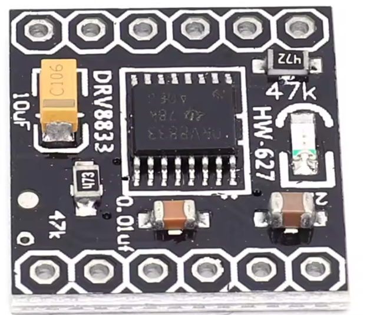

# DRV8833 2-Channel DC Motor Driver Module

## **Overview**

The **DRV8833** is a low cost (~$2) compact dual H-bridge motor driver module based on Texas Instruments’ **DRV8833 IC**. 
It’s designed to control **two DC motors independently** or **one stepper motor** in both forward and reverse directions. It’s popular in robotics and hobby electronics because it works with low-voltage logic (as low as 2.7 V) and can supply moderate motor currents without complex wiring.  

It is available on [ebay](https://www.ebay.com/sch/i.html?_nkw=DRV8833+motor+driver) for under $2 USD.

## **Key Features**

| Feature                       | Specification                                                        |
| ----------------------------- | -------------------------------------------------------------------- |
| **Motor channels**            | 2 (Dual H-bridge)                                                    |
| **Motor voltage**             | 2.7 V – 10.8 V (VM)                                                  |
| **Logic voltage**             | 2.7 V – 7 V (VL, typically tied to VM or 3.3/5 V logic)              |
| **Continuous output current** | \~1.2 A per channel                                                  |
| **Peak output current**       | \~2 A per channel (short bursts)                                     |
| **Control interface**         | PWM, Direction pins                                                  |
| **Built-in protection**       | Over-current, short-circuit, under-voltage lockout, thermal shutdown |
| **Dimensions**                | \~18 mm × 16 mm (varies by manufacturer)                             |

## How It Works

The DRV8833 contains **two full H-bridges**, each able to drive a motor forward or backward.

* **Inputs**: Each motor uses **two logic inputs**:

  * `AIN1` / `AIN2` for Motor A
  * `BIN1` / `BIN2` for Motor B
* By applying **PWM** to one input and setting the other high/low, you control **speed and direction**.
* It supports **brake** and **coast** modes.

## **Typical Pinout**

| Pin        | Function                                                          |
| ---------- | ----------------------------------------------------------------- |
| VM         | Motor power supply (2.7 – 10.8 V)                                 |
| GND        | Ground                                                            |
| AIN1, AIN2 | Control inputs for Motor A                                        |
| BIN1, BIN2 | Control inputs for Motor B                                        |
| AO1, AO2   | Motor A outputs                                                   |
| BO1, BO2   | Motor B outputs                                                   |
| nSLEEP     | Low to enter sleep mode, high to enable outputs (often tied high) |

*Note: Some breakout boards combine nSLEEP with VCC to keep it always active.*

## **Advantages**

* Works directly with **3.3 V and 5 V logic** without level shifters.
* Compact and lightweight for small robots.
* Quiet operation with PWM up to \~250 kHz.
* Built-in fault protection reduces risk of damage.

## **Common Applications**

* Small robot cars with two DC motors
* Driving a single bipolar stepper motor
* Pan-tilt camera platforms
* Automated toys
* Small conveyor belts or mechanisms in DIY projects

