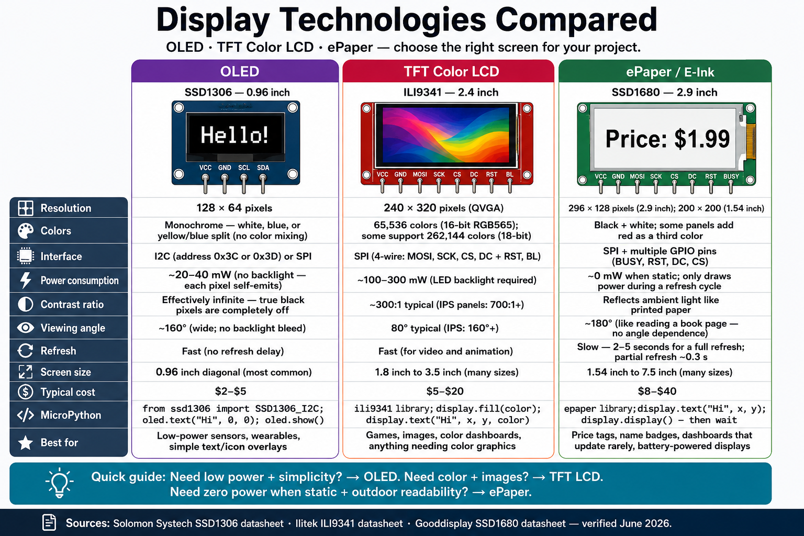

# Display Technologies Compared

Audience: students choosing a display for their MicroPython project.
Chapters: 15 — OLED Setup · 16 — OLED Drawing · 17 — Color & ePaper Displays

## Image Prompt

!!! prompt
    Please generate a wide-landscape infographic.

    Render all text exactly verbatim. Do not substitute any numbers, paraphrase labels, or invent extra rows/columns/stats. Where a cell says "None" or "N/A", render that exactly.

    A clean, modern, flat-design educational comparison infographic poster, landscape 16:9, titled at the top in large bold sans-serif: "Display Technologies Compared", subtitle beneath: "OLED · TFT Color LCD · ePaper — choose the right screen for your project."

    Layout: a three-column comparison table on a light off-white background (#F7F9FC). Each column is a rounded-corner card with a distinct accent color on its top edge and an illustration of the display module at the top. A vertical row-label strip on the far left lists the eleven attributes. Generous white space, thin divider lines, friendly textbook feel.

    Column 1 (deep purple #6A3FB5): Header "OLED"; Module name "SSD1306 — 0.96 inch"; Illustration: small rectangular module (blue-on-black or white-on-black screen showing "Hello!" text), I2C pins at bottom (VCC, GND, SCL, SDA). Rows:
    · Resolution: 128 × 64 pixels
    · Colors: Monochrome — white, blue, or yellow/blue split (no color mixing)
    · Interface: I2C (address 0x3C or 0x3D) or SPI
    · Power consumption: ~20–40 mW (no backlight — each pixel self-emits)
    · Contrast ratio: Effectively infinite — true black pixels are completely off
    · Viewing angle: ~160° (wide; no backlight bleed)
    · Refresh: Fast (no refresh delay)
    · Screen size: 0.96 inch diagonal (most common)
    · Typical cost: $2–$5
    · MicroPython: from ssd1306 import SSD1306_I2C; oled.text("Hi", 0, 0); oled.show()
    · Best for: Low-power sensors, wearables, simple text/icon overlays

    Column 2 (raspberry red #C7164E): Header "TFT Color LCD"; Module name "ILI9341 — 2.4 inch"; Illustration: rectangular color display module showing a colorful image or rainbow gradient; SPI pins at bottom (VCC, GND, MOSI, SCK, CS, DC, RST, BL). Rows:
    · Resolution: 240 × 320 pixels (QVGA)
    · Colors: 65,536 colors (16-bit RGB565); some support 262,144 colors (18-bit)
    · Interface: SPI (4-wire: MOSI, SCK, CS, DC + RST, BL)
    · Power consumption: ~100–300 mW (LED backlight required)
    · Contrast ratio: ~300:1 typical (IPS panels: 700:1+)
    · Viewing angle: 80° typical (IPS: 160°+)
    · Refresh: Fast (for video and animation)
    · Screen size: 1.8 inch to 3.5 inch (many sizes)
    · Typical cost: $5–$20
    · MicroPython: ili9341 library; display.fill(color); display.text("Hi", x, y, color)
    · Best for: Games, images, color dashboards, anything needing color graphics

    Column 3 (forest green #2D8A4E): Header "ePaper / E-Ink"; Module name "SSD1680 — 2.9 inch"; Illustration: rectangular white-ish display module showing black text "Price: $1.99" on a white background like paper; SPI and extra GPIO pins at bottom. Rows:
    · Resolution: 296 × 128 pixels (2.9 inch); 200 × 200 (1.54 inch)
    · Colors: Black + white; some panels add red as a third color
    · Interface: SPI + multiple GPIO pins (BUSY, RST, DC, CS)
    · Power consumption: ~0 mW when static; only draws power during a refresh cycle
    · Contrast ratio: Reflects ambient light like printed paper
    · Viewing angle: ~180° (like reading a book page — no angle dependence)
    · Refresh: Slow — 2–5 seconds for a full refresh; partial refresh ~0.3 s
    · Screen size: 1.54 inch to 7.5 inch (many sizes)
    · Typical cost: $8–$40
    · MicroPython: epaper library; display.text("Hi", x, y); display.display() — then wait
    · Best for: Price tags, name badges, dashboards that update rarely, battery-powered displays

    Below the three columns, a selection-guide row spanning all columns (teal blue #1389A6 background, white text): "Quick guide: Need low power + simplicity? → OLED. Need color + images? → TFT LCD. Need zero power when static + outdoor readability? → ePaper."

    Typography: one clean geometric sans-serif (Inter/Roboto style), bold column headers, monospace for MicroPython snippets, numbers bold so specs pop. Footer bar: "Sources: Solomon Systech SSD1306 datasheet · Ilitek ILI9341 datasheet · Gooddisplay SSD1680 datasheet — verified June 2026." Overall: tidy vector flat-design infographic poster, three-column grid with display module illustrations, suitable for a textbook or classroom screen.
