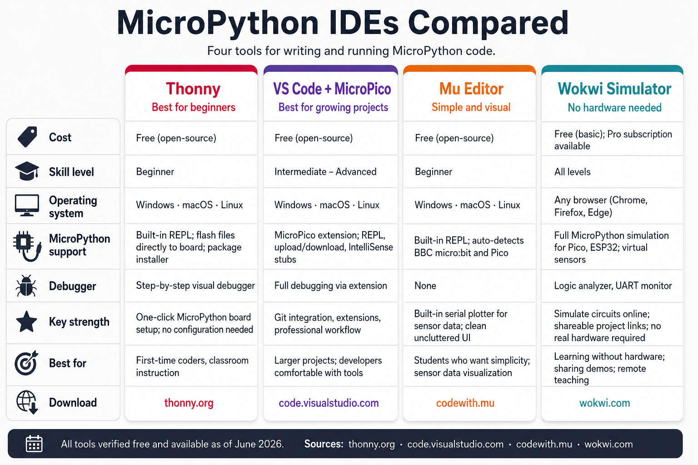

# MicroPython IDEs Compared

Audience: beginners choosing a coding environment for the first time.
Chapter: 3 — MicroPython Environment

## Image Prompt

!!! prompt
    Please generate a wide-landscape infographic.

    Render all text exactly verbatim. Do not substitute any numbers, paraphrase labels, or invent extra rows/columns/stats. Where a cell says "None," render "None" — do not invent a feature to fill it.

    A clean, modern, flat-design educational comparison infographic poster, landscape 16:9, titled at the top in large bold sans-serif: "MicroPython IDEs Compared", subtitle beneath: "Four tools for writing and running MicroPython code."

    Layout: a four-column comparison table on a light off-white background (#F7F9FC). Each column is a rounded-corner card with a subtle drop shadow and a distinct accent color on its top edge. A vertical row-label strip on the far left lists the eight attributes. Generous white space, thin divider lines, friendly textbook feel.

    Column 1 (raspberry red #C7164E): Name "Thonny"; tagline "Best for beginners". Rows:
    · Cost: Free (open-source)
    · Skill level: Beginner
    · Operating system: Windows · macOS · Linux
    · MicroPython support: Built-in REPL; flash files directly to board; package installer
    · Debugger: Step-by-step visual debugger
    · Key strength: One-click MicroPython board setup; no configuration needed
    · Best for: First-time coders, classroom instruction
    · Download: thonny.org

    Column 2 (deep purple #6A3FB5): Name "VS Code + MicroPico"; tagline "Best for growing projects". Rows:
    · Cost: Free (open-source)
    · Skill level: Intermediate – Advanced
    · Operating system: Windows · macOS · Linux
    · MicroPython support: MicroPico extension; REPL, upload/download, IntelliSense stubs
    · Debugger: Full debugging via extension
    · Key strength: Git integration, extensions, professional workflow
    · Best for: Larger projects; developers comfortable with tools
    · Download: code.visualstudio.com

    Column 3 (warm orange #E07B39): Name "Mu Editor"; tagline "Simple and visual". Rows:
    · Cost: Free (open-source)
    · Skill level: Beginner
    · Operating system: Windows · macOS · Linux
    · MicroPython support: Built-in REPL; auto-detects BBC micro:bit and Pico
    · Debugger: None
    · Key strength: Built-in serial plotter for sensor data; clean uncluttered UI
    · Best for: Students who want simplicity; sensor data visualization
    · Download: codewith.mu

    Column 4 (teal blue #1389A6): Name "Wokwi Simulator"; tagline "No hardware needed". Rows:
    · Cost: Free (basic); Pro subscription available
    · Skill level: All levels
    · Operating system: Any browser (Chrome, Firefox, Edge)
    · MicroPython support: Full MicroPython simulation for Pico, ESP32; virtual sensors
    · Debugger: Logic analyzer, UART monitor
    · Key strength: Simulate circuits online; shareable project links; no real hardware required
    · Best for: Learning without hardware; sharing demos; remote teaching
    · Download: wokwi.com

    Row labels down the left strip (bold dark slate #2A2E3A), each with a small monochrome icon: Cost (price tag), Skill level (graduation cap), OS (computer), MicroPython support (chip+cable), Debugger (bug), Key strength (star), Best for (target), Download (arrow-down globe).

    Typography: one clean geometric sans-serif (Inter/Roboto style), bold column headers, text slightly smaller in data cells so everything fits cleanly. Footer bar: "All tools verified free and available as of June 2026. Sources: thonny.org · code.visualstudio.com · codewith.mu · wokwi.com." Overall: tidy vector flat-design infographic poster, balanced four-column grid, lots of breathing room, no photographic clutter, suitable for a textbook or classroom screen.
