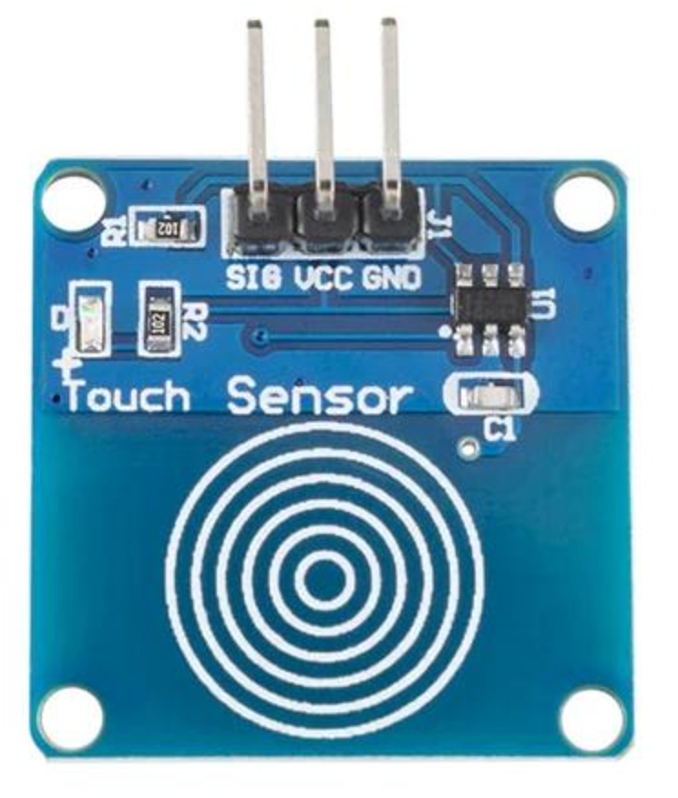

# TTP223 Touch Sensor



The **TTP223 digital touch sensor** is a small, inexpensive capacitive touch switch module commonly used in Arduino, Raspberry Pi, and other microcontroller projects as a modern alternative to mechanical push buttons.  You can find it on [eBay](https://www.ebay.com/sch/i.html?_nkw=TTP223+touch+sensor) for under $1 USD.

Here’s a breakdown of its key features and how it works:

## Overview

* **Core IC:** TTP223 (from Tontek) — a capacitive touch sensing controller.
* **Form factor:** Small PCB (\~24 mm × 24 mm) with a copper pad (sensor area), a TTP223 IC, and a few passive components.
* **Function:** Detects when a finger (or other conductive object) is near the pad by measuring changes in capacitance, then outputs a **digital HIGH or LOW** signal.


## Main Features

1. **Operating Voltage:**

   * Typically **2.0 V – 5.5 V**, so it works directly with both **3.3 V** and **5 V** logic systems.

2. **Output Signal:**

   * **Digital** — HIGH (active) or LOW (inactive).
   * By default, the output is LOW when untouched and HIGH when touched, but some versions allow reversing this.

3. **Touch Sensitivity:**

   * Triggered by direct finger contact or by touching through thin non-metallic materials (e.g., plastic, glass, acrylic).
   * Typical sensing distance: **\~5 mm** (adjustable by changing PCB pad size or circuit values).

4. **Modes of Operation:**
   (Controlled by solder jumper pads marked **A** and **B** on the PCB)

   * **Momentary (default):** Output stays HIGH only while touching.
   * **Toggle:** Output changes state each time you touch (touch-on, touch-off).
   * **Active High / Active Low:** Selectable logic polarity.

5. **Low Power Consumption:**

   * Two modes: **Low-power mode** (\~1 µA standby) or **Fast mode** for faster response (\~3 mA standby).
   * Response time typically **\~60 ms** in low-power mode, **\~6 ms** in fast mode.

6. **Durability & Reliability:**

   * No moving parts → longer lifespan than mechanical switches.
   * Resistant to dust, moisture, and vibration.


## Pinout

| Pin | Label   | Description            |
| --- | ------- | ---------------------- |
| 1   | **GND** | Ground                 |
| 2   | **VCC** | Power supply (2–5.5 V) |
| 3   | **OUT** | Digital output signal  |

## **Typical Uses**

* Replacing mechanical buttons in projects.
* Hidden switches under a non-metallic surface.
* Lamp touch controls.
* Interactive exhibits or kiosks.
* Wearable electronics.

## Example MicroPython Code

```python
# MicroPython: TTP223 touch -> onboard LED
from machine import Pin
from time import sleep_ms

TOUCH_PIN = 2            # TTP223 OUT wired to GP2 (change if needed)
led = Pin("LED", Pin.OUT)  # Pico's onboard LED
touch = Pin(TOUCH_PIN, Pin.IN)  # TTP223 provides a digital HIGH on touch

while True:
    led.value(touch.value())   # LED ON when touched, OFF otherwise
    sleep_ms(5)                # tiny delay to reduce CPU use

```

Any MicroPython board with an external LED

```python
# MicroPython: TTP223 touch -> external LED
from machine import Pin
from time import sleep_ms

TOUCH_PIN = 2   # TTP223 OUT
LED_PIN   = 15  # Your LED’s GPIO (through a resistor to GND)

touch = Pin(TOUCH_PIN, Pin.IN)      # TTP223 OUT is push-pull; no pull needed
led   = Pin(LED_PIN,   Pin.OUT)

while True:
    led.value(touch.value())
    sleep_ms(5)
```

## Notes

TTP223 output is typically HIGH when touched (default board config). If your board is configured “active-low,” just invert: led.value(1 - touch.value()).

No debouncing is necessary—TTP223 already conditions the signal. If you need extra smoothing, increase the delay or add a simple moving average.

## How It Works

The TTP223 chip periodically charges and discharges the touch pad and measures the time constant. When a finger is nearby, the capacitance increases slightly, slowing the charge/discharge cycle. The chip detects this change and drives the **OUT** pin accordingly.

## References


