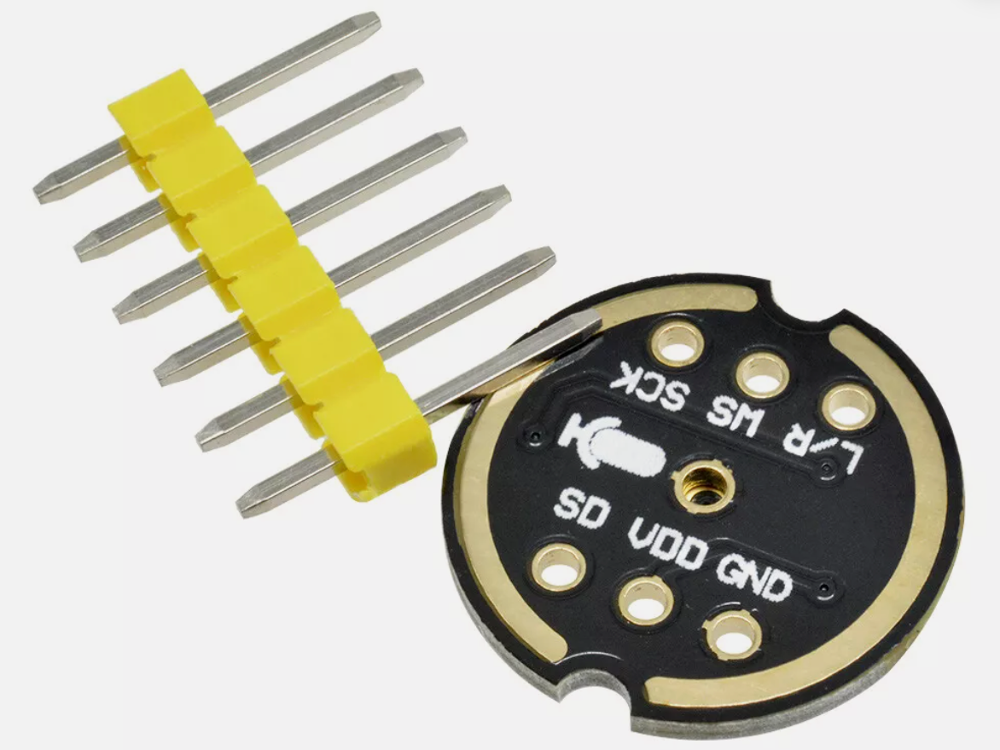
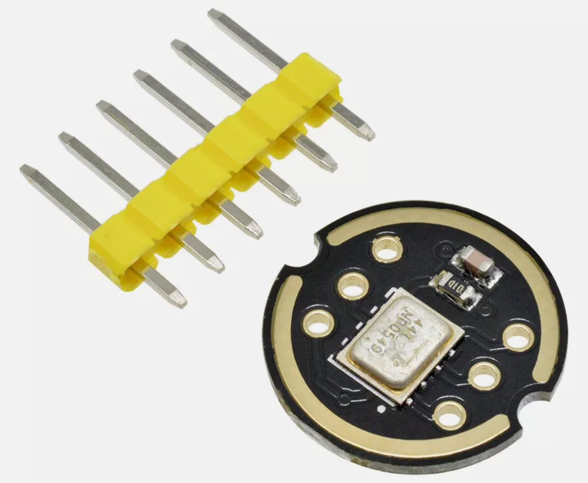
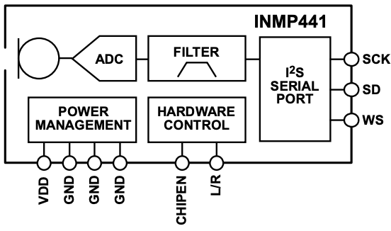

# INMP441 Microphone



The INMP441 is a low-cost ($3) high-performance, low power, digital-output,
omnidirectional MEMS microphone with a bottom port. The
complete INMP441 solution consists of a MEMS sensor, signal
conditioning, an analog-to-digital converter, anti-aliasing filters,
power management, and an industry-standard 24-bit I²S interface.
The I²S interface allows the INMP441 to connect directly to digital
processors, such as DSPs and microcontrollers, without the need
for an audio codec in the system.

The INMP441 uses a digital MEMS (Micro-Electro-Mechanical System) microphone with an I2S interface. According to its specifications:

The INMP441 has a relatively flat frequency response across the audible spectrum:
- Frequency response range: 20 Hz to 20 kHz
- Sensitivity: -26 dBFS (decibels relative to full scale)
- Signal-to-Noise Ratio (SNR): 61 dBA
- Omnidirectional pickup pattern

The microphone has a relatively flat response in the mid-range frequencies, with some slight roll-off at the very low end (below 100 Hz) and high end (above 10 kHz). The flatness of the response in the crucial speech range (approximately 300 Hz to 3 kHz) makes it well-suited for voice applications.

The INMP441 is popular for use with microcontrollers like the Raspberry Pi Pico (as seen in your code) because:

1. It has a digital I2S output that can be directly connected to microcontrollers
2. It has good noise performance for its size and cost
3. It requires minimal external components to operate

This is why it's a good choice for your sound spectrum analyzer project, as it provides reliable audio input across the frequency range you're visualizing (0-2500 Hz). The microphone should capture the frequencies in your target range with reasonable accuracy.

## Connections

!!! Warning
    The voltage is 1.62 MIN to 3.63 (MAX).  Do not use 5 volts!  Use the 3.3 volt power rail.




eBay listing for under $3 (USD).

## Connections

|Pin|Label|Description|
|---|-----|-----------|
|1|SCK|Serial-Data Clock for I²S Interface|
|2|SD|Serial-Data Output for I²S Interface. This pin tri-states when not actively driving the appropriate output channel. The SD trace should have a 100 kΩ pulldown resistor to discharge the line during the time that all microphones on the bus have tri-stated their outputs.|
|3|WS|Serial Data-Word Select for I²S Interface|
|4|L/R|Left/Right Channel Select. When set low, the microphone outputs its signal in the left channel of the I²S frame. When set high, the microphone outputs its signal in the right channel.|
|5|VDD|Power, 1.8 V to 3.3 V. This pin should be decoupled to Pin 6 with a 0.1 μF capacitor.|



## I²S DATA INTERFACE

The slave serial-data port’s format is I²S, 24-bit, twos complement. There must be 64 SCK cycles in each WS stereo frame, or 32 SCK cycles per data-word.

## Display Sound on Thonny


```py
# INMP441 I2S Microphone Example for Raspberry Pi Pico
# Based on Mike Teachman's micropython-i2s-examples
# https://github.com/miketeachman/micropython-i2s-examples/tree/master

from machine import I2S
from machine import Pin
import math
import struct
import time

# I2S configuration for INMP441 microphone
SCK_PIN = 10  # Serial Clock
WS_PIN = 11   # Word Select
SD_PIN = 12   # Serial Data

# I2S configuration parameters
I2S_ID = 0
SAMPLE_SIZE_IN_BITS = 32
FORMAT = I2S.MONO
SAMPLE_RATE = 16000
BUFFER_LENGTH_IN_BYTES = 40000  # Based on Mike's example

# Initialize I2S for microphone
audio_in = I2S(
    I2S_ID,
    sck=Pin(SCK_PIN),
    ws=Pin(WS_PIN),
    sd=Pin(SD_PIN),
    mode=I2S.RX,
    bits=SAMPLE_SIZE_IN_BITS,
    format=FORMAT,
    rate=SAMPLE_RATE,
    ibuf=BUFFER_LENGTH_IN_BYTES,
)

def sound_level():
    """Capture audio and calculate sound level
    
    Based on Mike Teachman's example but simplified for sound level monitoring.
    """
    # Number of samples to read each time
    NUM_SAMPLE_BYTES = 2048
    
    # Raw samples will be stored in this buffer (signed 32-bit integers)
    samples_raw = bytearray(NUM_SAMPLE_BYTES)
    
    # Read samples from I2S microphone
    num_bytes_read = audio_in.readinto(samples_raw)
    
    if num_bytes_read == 0:
        return 0
    
    # Process raw samples
    format_str = "<{}i".format(num_bytes_read // 4)  # '<' for little-endian, 'i' for 32-bit signed integer
    samples = struct.unpack(format_str, samples_raw[:num_bytes_read])
    
    # Calculate RMS (Root Mean Square) which represents sound level
    sum_squares = 0
    for sample in samples:
        # Need to shift right by 8 bits for INMP441 (24-bit samples in 32-bit words)
        adjusted_sample = sample >> 8
        sum_squares += adjusted_sample * adjusted_sample
    
    # Calculate RMS
    rms = math.sqrt(sum_squares / len(samples))
    
    # Scale to 0-100 range
    # The maximum value for a 24-bit sample is 2^23 = 8388608
    MAX_VALUE = 8388608
    level = min(100, (rms / MAX_VALUE) * 1000)  # Multiply by 1000 for better scaling
    
    return level

print("# INMP441 Sound Level Monitor")
print("# Based on Mike Teachman's I2S implementation")
print("# Make sounds to see the levels change")

try:
    # Moving average window for smoothing
    window_size = 3
    values = [0] * window_size
    
    while True:
        # Get current sound level
        level = sound_level()
        
        # Apply simple moving average
        values.pop(0)
        values.append(level)
        smoothed_level = int(sum(values) / window_size)
        
        # Output for Thonny plotter
        print(smoothed_level)
        
        # Small delay
        time.sleep(0.1)

except KeyboardInterrupt:
    print("# Monitoring stopped")
finally:
    # Clean up I2S
    audio_in.deinit()
    print("# Program terminated")

```

Let me explain the 03-connect-test.py script in detail so you can understand how it works. This script is designed to read sound levels from a microphone connected to a Raspberry Pi Pico microcontroller.

## What This Code Does

This program connects to a digital microphone (specifically an INMP441 I2S microphone) and continuously measures the sound level in your environment. Think of it like a sound meter that shows you how loud the sounds around you are.

## Breaking Code Down Step by Step

### 1. Importing Libraries

```python
from machine import I2S
from machine import Pin
import math
import struct
import time
```

These are like tool kits the program needs:
- `machine.I2S` and `machine.Pin` connect with the microphone hardware
- `math` helps with calculations like square roots
- `struct` helps convert data between different formats
- `time` allows adding pauses in the program

### 2. Setting Up the Microphone Connection

```python
SCK_PIN = 10  # Serial Clock
WS_PIN = 11   # Word Select
SD_PIN = 12   # Serial Data
```

This tells the program which pins on the Pico to use for connecting the microphone. It's like specifying which socket to plug each wire into.

### 3. Configuration Settings

```python
I2S_ID = 0
SAMPLE_SIZE_IN_BITS = 32
FORMAT = I2S.MONO
SAMPLE_RATE = 16000
BUFFER_LENGTH_IN_BYTES = 40000
```

These settings control how the program talks to the microphone:
- `SAMPLE_SIZE_IN_BITS = 32`: Each sound measurement uses 32 bits of data
- `FORMAT = I2S.MONO`: We're recording in mono (one channel), not stereo
- `SAMPLE_RATE = 16000`: We take 16,000 measurements per second
- `BUFFER_LENGTH_IN_BYTES = 40000`: How much memory to set aside for sound data

### 4. Initializing the Microphone

```python
audio_in = I2S(
    I2S_ID,
    sck=Pin(SCK_PIN),
    ws=Pin(WS_PIN),
    sd=Pin(SD_PIN),
    mode=I2S.RX,
    bits=SAMPLE_SIZE_IN_BITS,
    format=FORMAT,
    rate=SAMPLE_RATE,
    ibuf=BUFFER_LENGTH_IN_BYTES,
)
```

This creates a connection to the microphone using all the settings we defined.

### 5. The Sound Level Function

```python
def sound_level():
    # Number of samples to read each time
    NUM_SAMPLE_BYTES = 2048
    
    # Raw samples will be stored in this buffer
    samples_raw = bytearray(NUM_SAMPLE_BYTES)
    
    # Read samples from I2S microphone
    num_bytes_read = audio_in.readinto(samples_raw)
```

This function:

1. Creates a container to hold 2048 bytes of sound data
2. Fills that container with data from the microphone
3. Processes that data to calculate how loud the sound is

The most important part happens here:

```python
    # Calculate RMS (Root Mean Square) which represents sound level
    sum_squares = 0
    for sample in samples:
        # Need to shift right by 8 bits for INMP441
        adjusted_sample = sample >> 8
        sum_squares += adjusted_sample * adjusted_sample
    
    # Calculate RMS
    rms = math.sqrt(sum_squares / len(samples))
```

This uses the Root Mean Square (RMS) method to calculate sound level:

1. For each sound sample, it squares the value
2. It adds up all these squared values
3. Divides by the number of samples
4. Takes the square root of the result

This gives a good representation of the sound energy or volume.

### 6. The Main Program

```python
try:
    # Moving average window for smoothing
    window_size = 3
    values = [0] * window_size
    
    while True:
        # Get current sound level
        level = sound_level()
        
        # Apply simple moving average
        values.pop(0)
        values.append(level)
        smoothed_level = int(sum(values) / window_size)
        
        # Output for Thonny plotter
        print(smoothed_level)
        
        # Small delay
        time.sleep(0.1)
```

This is the main loop that:

1. Uses a "moving average" to smooth out the readings (averages the last 3 readings)
2. Gets a new sound level every 0.1 seconds
3. Prints the level so you can see it in the Thonny plotter (a graph in the Thonny IDE)

This technique makes the readings less jumpy and easier to read.

### 7. Cleanup

```python
except KeyboardInterrupt:
    print("# Monitoring stopped")
finally:
    # Clean up I2S
    audio_in.deinit()
    print("# Program terminated")
```

This makes sure the program exits cleanly if you stop it with Ctrl+C, properly disconnecting from the microphone.

## Real-World Example

Imagine you're using this in a classroom to monitor noise levels:

- When it's quiet, you might see values like 1-5
- Normal talking might show values of 20-40
- A loud shout might spike to 70-90

The program could help you visualize when the room gets too noisy!

## To Run This Program

You would:

1. Connect the INMP441 microphone to your Raspberry Pi Pico using the specified pins
2. Upload this code to your Pico using Thonny or another MicroPython tool
3. Run the program and watch the numbers change as you make different sounds
4. In Thonny, you can use the plotter view to see a graph of sound levels over time

## References

* [MicroPython I2S Driver Documentation](https://docs.micropython.org/en/latest/library/machine.I2S.html)

* [INMP441 Datasheet](https://invensense.tdk.com/wp-content/uploads/2015/02/INMP441.pdf)

* [Mike Teachman GitHub Repository](https://github.com/miketeachman/micropython-i2s-examples/blob/master/examples/record_mic_to_sdcard_non_blocking.py)