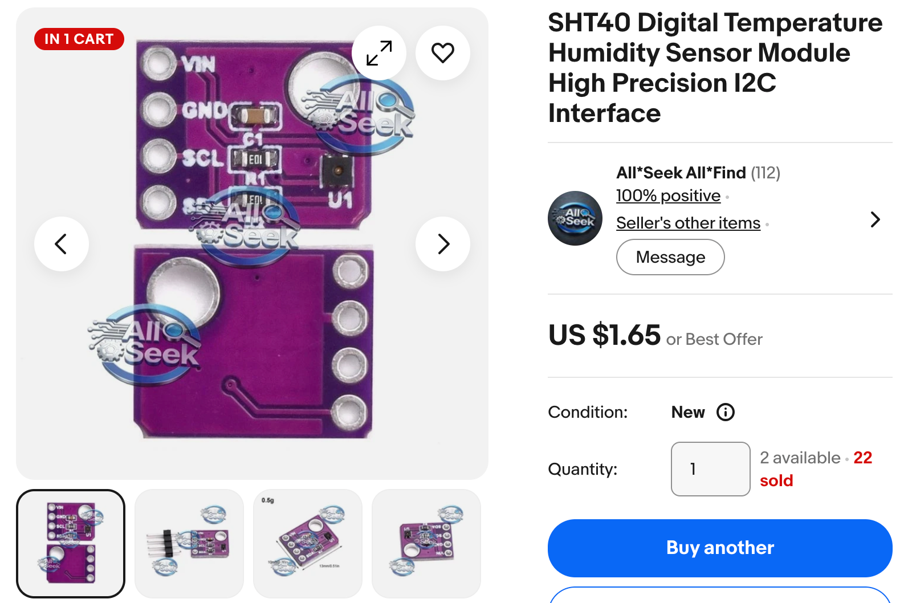

# SHT40 Temperature and Humidity Sensor

!!! mascot-welcome "Welcome to the SHT40 Lab"
    { class="mascot-admonition-img" }
    The SHT40 measures how warm the air is and how much water is hiding in
    it. By the end of this lab you will watch both numbers move on a live
    graph. Let's build something amazing!

## What You Will Learn

After this lesson you will be able to:

1. Wire an I2C sensor to a Raspberry Pi Pico.
2. Use an I2C scanner to prove your wiring works before you write code.
3. Read temperature and humidity from an SHT40.
4. Explain what a checksum is and why sensors send one.
5. Log data as CSV and draw a live graph in Thonny.

## Lesson at a Glance

| Item | Details |
|------|---------|
| Time needed | 45–60 minutes |
| Difficulty | Beginner (after the LED and button labs) |
| You should already know | How to run a program in Thonny |
| New idea in this lab | I2C, the two-wire language chips use to talk |
| Cost of the sensor | $1.65 on eBay, or about $7 from Adafruit |

## What Is the SHT40?

The SHT40 is a sensor made by a company called Sensirion. It is smaller than
a grain of rice. Inside are two tiny detectors. One measures temperature. The
other measures **relative humidity**, which is how full the air is with water
compared to how much it could hold.

Warm air can hold more water than cold air. That is why a cold day feels dry
and a summer day can feel sticky.

The SHT40 talks to your Pico using **I2C**, said "eye-squared-see". I2C is a
system that lets chips share numbers over just two wires. One wire carries
the data. The other wire carries a clock that keeps both chips in step, like
a drummer keeping a band together.

!!! mascot-thinking "Key Idea"
    { class="mascot-admonition-img" }
    Every I2C device has an **address**, like a house number on a street.
    The SHT40 lives at address 0x44 on most boards. That is how the Pico
    knows which chip it is talking to.

## Why the SHT40 Is So Accurate

People mix up three different ideas when they talk about a good sensor.
Picture throwing darts at a dartboard.

- **Accuracy** is how close your darts land to the bullseye. A sensor that
  always reads 3 degrees too warm is not accurate.
- **Repeatability** is how tightly your darts group together. Measure the
  same air twice and a repeatable sensor gives you almost the same number.
- **Drift** is the dartboard slowly sliding across the wall over the years.
  A sensor that was right when you bought it can be wrong three years later.

A cheap sensor can fail at all three. The SHT40 is strong at all three.

### How It Compares

| Sensor | Temperature | Humidity | Smallest step it reports |
|--------|-------------|----------|--------------------------|
| DHT11 | Plus or minus 2 C | Plus or minus 5 % | 1 C and 1 % |
| DHT22 | Plus or minus 0.5 C | Plus or minus 2 % | 0.1 C and 0.1 % |
| BME280 | Plus or minus 1 C | Plus or minus 3 % | 0.01 C |
| DS18B20 | Plus or minus 0.5 C | No humidity | 0.06 C |
| **SHT40** | **Plus or minus 0.2 C** | **Plus or minus 1.8 %** | **0.01 C and 0.01 %** |

On temperature, the SHT40 is about ten times more accurate than a DHT11 and
about five times more accurate than a BME280. On humidity the gap is
smaller but still real: about three times better than a DHT11.

### Four Reasons It Wins

**1. Every chip is tested on its own.** Sensirion measures each individual
SHT40 in the factory against a reference instrument, then stores the
correction numbers inside that exact chip. Those references trace back to
NIST, the United States national measurement lab. Cheaper sensors are
calibrated one batch at a time, so your particular chip may sit at the edge
of the batch and no one ever checked.

**2. It barely drifts.** The SHT40 changes by less than 0.03 C and less than
0.25 % humidity per year. A DHT11 datasheet only promises about 1 % humidity
per year, which is four times more drift, and damp rooms make it worse. If
you log your bedroom for a whole school year, the SHT40 readings from June
can still be trusted against the ones from September.

**3. It gives the same answer twice.** Ask an SHT40 the same question twice
in a row and the two answers differ by only about 0.04 C. That number is
called repeatability, and it is why the plot in Step 4 draws a smooth line
instead of a jagged one.

**4. It checks its own work.** Every reading arrives with a checksum, so a
scrambled number turns into an error message instead of a wrong answer. A
DHT11 sends its bits with careful timing and no clock line, so if your
program is busy at the wrong moment the reading can be silently wrong.

### One Honest Warning

A great sensor does not guarantee a great reading. The SHT40 reports the
temperature of the air touching *it*, and your Pico makes heat. If you push
the sensor right up against the board, an expensive sensor will confidently
report a wrong room temperature.

Accuracy comes from the sensor **and** from where you put it.

### The Heater Trick

The SHT40 hides a tiny heater inside. If the sensor gets damp enough for
water to form on it, you can switch the heater on for a moment to dry it
out. That is why the datasheet says the SHT40 is "fully functional in
condensing environment". Most hobby sensors just read 99 % and stay stuck
there until they dry on their own.

## Parts You Need

| Part | Notes |
|------|-------|
| Raspberry Pi Pico | Any Pico or Pico W with MicroPython installed |
| SHT40 breakout board | About $1.65 on eBay. Adafruit #4885 and SparkFun SEN-18652 cost more but ship faster |
| Solderless breadboard | Half-size is plenty |
| 4 jumper wires | Male-to-male |
| USB data cable | Some cheap cables only carry power |

Low-cost eBay boards work well, but they are not always labelled honestly.
Some are really an SHT30 or SHT31, which use the same wiring and the same
commands but are less accurate. A few use address 0x45 instead of 0x44. The
scanner in Step 1 will tell you exactly what you received, which is another
good reason to run it first.



The purple board above is the common eBay version. Look closely at the pin
labels: the order is **VIN, GND, SCL, SDA**. Many other sensors put SDA
before SCL, so it is easy to wire this one backwards out of habit. Always
read the labels printed on your own board.

## Wiring Steps

The SHT40 runs on 3.3 volts. Follow these steps in order.

1. Unplug the Pico from USB. Never wire a live board.
2. Push the Pico into the breadboard with the USB port hanging off the edge.
3. Connect SHT40 **VIN** to Pico **pin 36 (3V3 OUT)** with a red wire.
4. Connect SHT40 **GND** to Pico **pin 38 (GND)** with a black wire.
5. Connect SHT40 **SCL** to Pico **pin 2 (GP1)** with a yellow wire.
6. Connect SHT40 **SDA** to Pico **pin 1 (GP0)** with a blue wire.
7. Check each wire twice, then plug the USB cable back in.

Working down the board from the top pin:

| SHT40 pin | Pico pin | Pico name | Wire colour | What it does |
|-----------|----------|-----------|-------------|--------------|
| VIN | 36 | 3V3 OUT | Red | Power in |
| GND | 38 | GND | Black | Ground |
| SCL | 2 | GP1 | Yellow | Serial Clock — keeps both chips in step |
| SDA | 1 | GP0 | Blue | Serial Data — carries the numbers |

!!! mascot-warning "Watch Out!"
    { class="mascot-admonition-img" }
    Do not connect VIN to pin 40, which is labelled **VBUS**. That pin
    carries 5 volts straight from the USB cable, and the SHT40 can only take
    3.6 volts. Always use pin 36, labelled **3V3 OUT**.

## Step 1: Find the Sensor

Never guess at your wiring. Ask the Pico what it can see first.

```python
from machine import Pin, I2C

# Set up I2C bus 0 using GP0 for data and GP1 for the clock
i2c = I2C(0, sda=Pin(0), scl=Pin(1), freq=400000)

# Ask the bus which devices answer, then print their addresses
devices = i2c.scan()
print("Found", len(devices), "device(s)")
for device in devices:
    print("  decimal:", device, " hex:", hex(device))
```

### What Each Line Does

| Line | What it does |
|------|--------------|
| `from machine import Pin, I2C` | Brings in the tools for pins and I2C |
| `I2C(0, sda=..., scl=...)` | Sets up I2C bus number 0 on GP0 and GP1 |
| `freq=400000` | Runs the bus at 400,000 clock ticks per second |
| `i2c.scan()` | Returns a list of every address that answered |
| `hex(device)` | Shows the address the way datasheets write it |

A working scan prints this:

```
Found 1 device(s)
  decimal: 68  hex: 0x44
```

If the list is empty, stop here and fix the wiring. Nothing else will work
until the scanner finds the sensor.

## Step 2: Take One Reading

The SHT40 does not answer until you ask. You send it a one-byte command,
wait while it works, then read six bytes back.

```python
from machine import Pin, I2C
import time

i2c = I2C(0, sda=Pin(0), scl=Pin(1), freq=400000)

# 0xFD means "measure temperature and humidity at high precision"
i2c.writeto(0x44, bytes([0xFD]))

# The sensor needs about 8.3 milliseconds, so we wait 15 to be safe
time.sleep_ms(15)

# Read 6 bytes: 2 for temperature, 1 check, 2 for humidity, 1 check
data = i2c.readfrom(0x44, 6)

# Glue each pair of bytes into one number between 0 and 65535
temp_ticks = (data[0] << 8) | data[1]
humidity_ticks = (data[3] << 8) | data[4]

# Turn those raw counts into real units using the datasheet formulas
temperature_c = -45.0 + 175.0 * temp_ticks / 65535.0
humidity = -6.0 + 125.0 * humidity_ticks / 65535.0

print("Temperature: {:.2f} C".format(temperature_c))
print("Humidity:    {:.2f} %".format(humidity))
```

### Why Two Bytes Become One Number

One byte can only count from 0 to 255. That is far too rough for
temperature. So the sensor sends two bytes and you join them together.

The `<<` symbol shifts a number left, which is a fast way to multiply by
256. The `|` symbol then drops the second byte into the empty space. The
result is a number between 0 and 65535, which the datasheet calls **ticks**.

The formula then spreads those ticks across the sensor's real range. For
temperature that range is -45 C to 130 C.

!!! mascot-tip "Monty's Tip"
    { class="mascot-admonition-img" }
    Your reading may be a degree or two above room temperature. The Pico
    and the sensor both make a little heat. Move the sensor to the far end
    of the breadboard and the reading will settle down.

## Step 3: Check the Sensor's Math

Bytes can get scrambled on a long wire. To catch that, the SHT40 sends a
**checksum** after each pair of bytes. A checksum is a small number the
sensor works out from the data. Your Pico does the same math. If both
answers match, the data arrived safely.

```python
def crc8(data):
    crc = 0xFF                      # start value from the datasheet
    for byte in data:
        crc = crc ^ byte            # mix the new byte in
        for _ in range(8):          # then stir all 8 bits
            if crc & 0x80:
                crc = ((crc << 1) ^ 0x31) & 0xFF
            else:
                crc = (crc << 1) & 0xFF
    return crc

# data[2] is the checksum the sensor sent for the temperature bytes
if crc8(data[0:2]) != data[2]:
    print("Temperature checksum failed")
```

You do not need to understand every step of the stirring. You only need to
know why it is there: it turns a wrong number into an error message instead
of a wrong answer.

## Step 4: Draw a Live Graph

Thonny can turn printed numbers into a moving line graph.

1. Open `04-plot-temp-and-humidity.py` in Thonny.
2. Choose **View > Plotter** from the menu bar.
3. Click the green **Run** button.
4. Breathe gently on the sensor and watch both lines jump.
5. Press the red **Stop** button when you are done.

The program prints only two numbers per line and nothing else:

```
26.94 50.32
26.96 50.28
```

That is on purpose. The Plotter graphs every number it finds, so a heading
row or a "Done!" message would draw junk on your graph.

## Challenges

Try these in order. Each one builds on the last.

### Challenge 1: Change the Speed

Open `03-continuous-logging.py` and change `SAMPLE_SECONDS` from 2 to 10.
Log your classroom for five minutes. Does the temperature hold steady?

### Challenge 2: Fahrenheit Only

Change the logging program so it prints Fahrenheit instead of Celsius. The
formula is:

\[
F = C \times \frac{9}{5} + 32
\]

### Challenge 3: Build a Comfort Meter

Print a word next to each reading instead of just numbers:

- Below 18 C, print `COLD`
- From 18 C to 24 C, print `JUST RIGHT`
- Above 24 C, print `WARM`

Use `if`, `elif` and `else`.

### Challenge 4: Find the Record

Track the highest and lowest temperature your sensor has seen since the
program started. Print a message only when a new record is set. Start your
record variables at `None` so the first reading always counts.

### Challenge 5: Work Out the Dew Point

The dew point is the temperature at which water starts to form on a cold
glass. Weather reporters use it to explain why a day feels sticky. Use the
Magnus formula, where \( T \) is temperature in Celsius and \( RH \) is
relative humidity:

\[
\gamma = \ln\left(\frac{RH}{100}\right) + \frac{17.62 \times T}{243.12 + T}
\]

\[
T_{dew} = \frac{243.12 \times \gamma}{17.62 - \gamma}
\]

You will need `from math import log` for the natural logarithm.

### Challenge 6: Add an Alarm

Turn the Pico's onboard LED on whenever the humidity climbs above 60 percent.
Turn it off again when the humidity drops back down.

```python
led = Pin("LED", Pin.OUT)   # the green LED built into the Pico
```

### Challenge 7: Save to the Pico

Write your readings to a file on the Pico's own flash memory so they survive
being unplugged. Open the file with `open("log.csv", "a")` and remember to
call `.flush()` after each write.

### Challenge 8: Compare Two Rooms

Log the kitchen for ten minutes, then the bathroom right after someone
showers. Graph both in a spreadsheet. Which room changes faster, and why?

## Troubleshooting

| What you see | What to try |
|--------------|-------------|
| Scanner finds nothing | Check VIN goes to pin 36 (3V3 OUT), not pin 40 (VBUS) |
| Scanner finds nothing | Swap the SDA and SCL wires — they are easy to mix up |
| Scanner finds nothing | Push each jumper wire fully into the breadboard |
| Found a device, but not 0x44 | Your board may use 0x45 or 0x46. Change `SHT40_ADDR` |
| "Checksum failed" | Use shorter wires, or change `freq=400000` to `freq=100000` |
| Reading is a few degrees high | Normal. Move the sensor away from the Pico |
| Thonny says the port is busy | Only one program can use the Pico at a time. Close the other one |

## For Teachers

| Phase | Time | Activity |
|-------|------|----------|
| Hook | 5 min | Breathe on a cold window. Where did the water come from? |
| Wiring | 10 min | Students wire the sensor and run the I2C scanner |
| Guided | 15 min | Walk through the single reading and the tick formula |
| Independent | 20 min | Challenges 1 through 4 |
| Share | 10 min | Compare graphs from different spots in the room |

**Check for understanding.** Ask students to explain why the program runs the
scanner first. The answer you want: it separates a wiring problem from a code
problem, so you only debug one thing at a time.

**Common misconception.** Students often think 50 percent humidity means the
air is half water. It actually means the air holds half of what it *could*
hold at that temperature. Warm the same air and the percentage drops, even
though no water left the room.

## Sensor Facts

| Item | Value |
|------|-------|
| Temperature range | -40 C to 125 C |
| Temperature accuracy | Plus or minus 0.2 C |
| Humidity range | 0 % to 100 % |
| Humidity accuracy | Plus or minus 1.8 % |
| I2C address | 0x44, 0x45 or 0x46 |
| Supply voltage | 1.08 V to 3.6 V |
| Measurement time | About 8.3 ms at high precision |

!!! mascot-celebration "Great Work!"
    { class="mascot-admonition-img" }
    You just read a professional-grade sensor and graphed real data from
    the air around you. Next, put those readings on an OLED screen and
    build a weather station you can carry anywhere!

## Source Code

All four programs live in
[`src/sensors/sht40-temp/`](https://github.com/dmccreary/learning-micropython/tree/main/src/sensors/sht40-temp):

| File | What it does |
|------|--------------|
| `01-i2c-scanner.py` | Finds the sensor on the I2C bus |
| `02-get-single-temp-reading.py` | Takes one reading with checksum checks |
| `03-continuous-logging.py` | Logs CSV every 2 seconds with a summary |
| `04-plot-temp-and-humidity.py` | Prints two numbers for Thonny's Plotter |

To copy all four onto your Pico at once, run
[`upload-code.sh`](https://github.com/dmccreary/learning-micropython/tree/main/src/kits/sht40-temp)
from the kit folder.

## References

1. [SHT4x Datasheet](https://sensirion.com/resource/datasheet/sht4x) - Sensirion - the source of every accuracy, repeatability and drift number in this lab.
2. [Adafruit SHT40 Guide](https://learn.adafruit.com/adafruit-sht40-temperature-humidity-sensor) - Adafruit - wiring photos and a CircuitPython comparison.
3. [I2C on the Raspberry Pi Pico](https://docs.micropython.org/en/latest/library/machine.I2C.html) - MicroPython Docs - every method the `I2C` class offers.
4. [Relative Humidity](https://en.wikipedia.org/wiki/Relative_humidity) - Wikipedia - why warm air holds more water than cold air.
5. [Dew Point](https://en.wikipedia.org/wiki/Dew_point) - Wikipedia - the background for Challenge 5.
