# Simulators for Learning MicroPython

This book includes **27 interactive MicroSims** — self-contained, browser-based visualizations you can explore directly. Click any thumbnail to open the MicroSim.

<!-- This gallery is generated by generate-sims-index.py — edits here will be overwritten. -->

  <a href="accelerometer-axes/" title="Accelerometer Axes Explorer" style="display:block;border:1px solid #e3e7ec;border-radius:8px;overflow:hidden;text-decoration:none;color:inherit;box-shadow:0 1px 3px rgba(0,0,0,0.08);">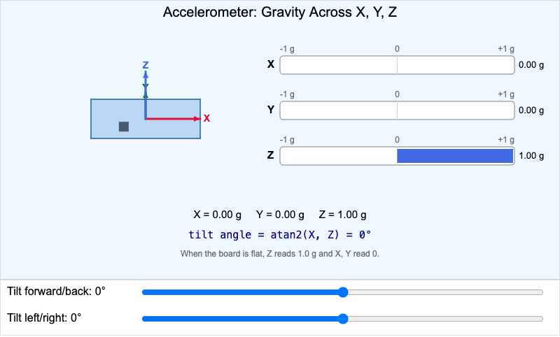Accelerometer Axes Explorer</a>
  <a href="adc-potentiometer-explorer/" title="ADC and Potentiometer Explorer" style="display:block;border:1px solid #e3e7ec;border-radius:8px;overflow:hidden;text-decoration:none;color:inherit;box-shadow:0 1px 3px rgba(0,0,0,0.08);">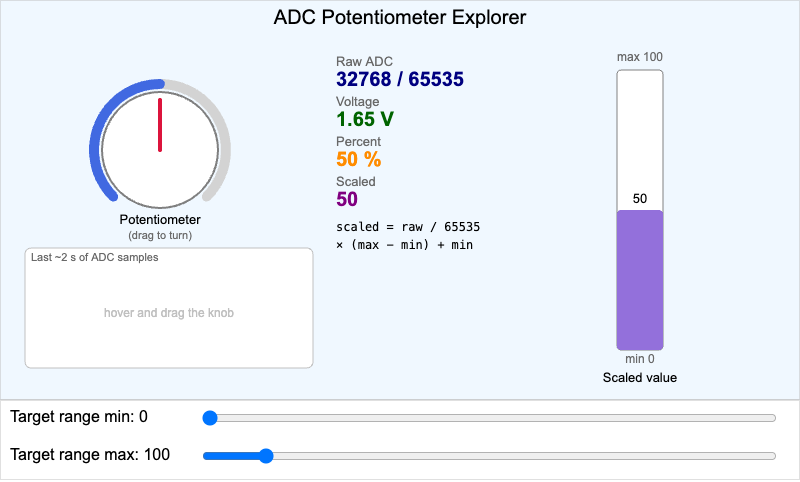ADC and Potentiometer Explorer</a>
  <a href="arithmetic-operator-explorer/" title="Arithmetic Operator Explorer" style="display:block;border:1px solid #e3e7ec;border-radius:8px;overflow:hidden;text-decoration:none;color:inherit;box-shadow:0 1px 3px rgba(0,0,0,0.08);">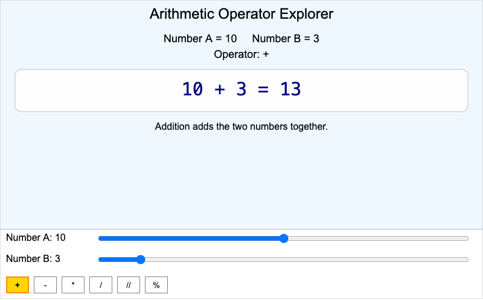Arithmetic Operator Explorer</a>
  <a href="blocking-vs-nonblocking/" title="Blocking vs Non-Blocking Timeline" style="display:block;border:1px solid #e3e7ec;border-radius:8px;overflow:hidden;text-decoration:none;color:inherit;box-shadow:0 1px 3px rgba(0,0,0,0.08);">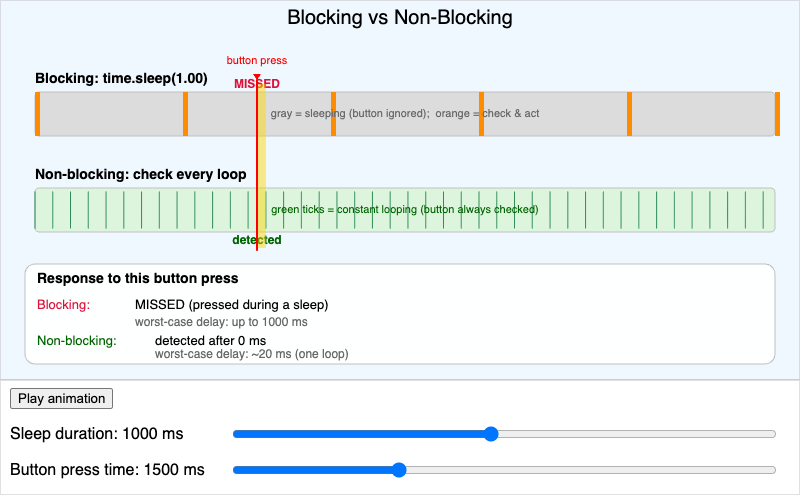Blocking vs Non-Blocking Timeline</a>
  <a href="breadboard/" title="Breadboard Simulator" style="display:block;border:1px solid #e3e7ec;border-radius:8px;overflow:hidden;text-decoration:none;color:inherit;box-shadow:0 1px 3px rgba(0,0,0,0.08);">no previewBreadboard Simulator</a>
  <a href="collision-avoidance-flowchart/" title="Collision Avoidance Logic Flowchart" style="display:block;border:1px solid #e3e7ec;border-radius:8px;overflow:hidden;text-decoration:none;color:inherit;box-shadow:0 1px 3px rgba(0,0,0,0.08);">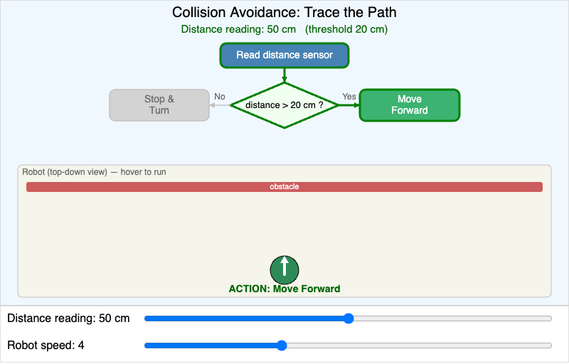Collision Avoidance Logic Flowchart</a>
  <a href="concept-importance/" title="Concept Importance" style="display:block;border:1px solid #e3e7ec;border-radius:8px;overflow:hidden;text-decoration:none;color:inherit;box-shadow:0 1px 3px rgba(0,0,0,0.08);">no previewConcept Importance</a>
  <a href="digital-io-explorer/" title="Digital I/O Explorer" style="display:block;border:1px solid #e3e7ec;border-radius:8px;overflow:hidden;text-decoration:none;color:inherit;box-shadow:0 1px 3px rgba(0,0,0,0.08);">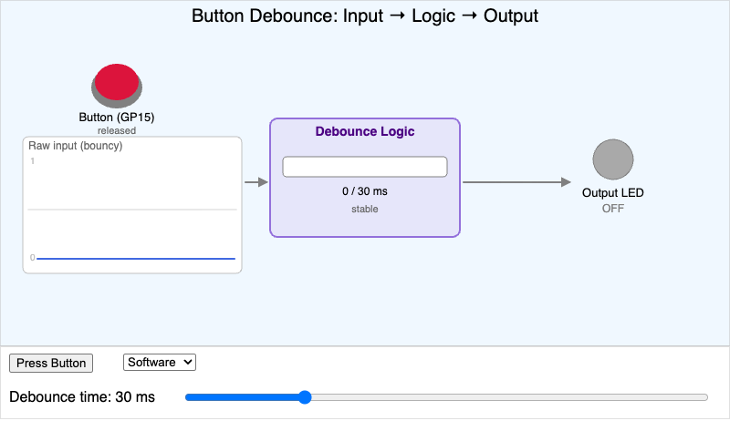Digital I/O Explorer</a>
  <a href="display-technology-comparison/" title="E-Paper vs TFT vs OLED Comparison" style="display:block;border:1px solid #e3e7ec;border-radius:8px;overflow:hidden;text-decoration:none;color:inherit;box-shadow:0 1px 3px rgba(0,0,0,0.08);">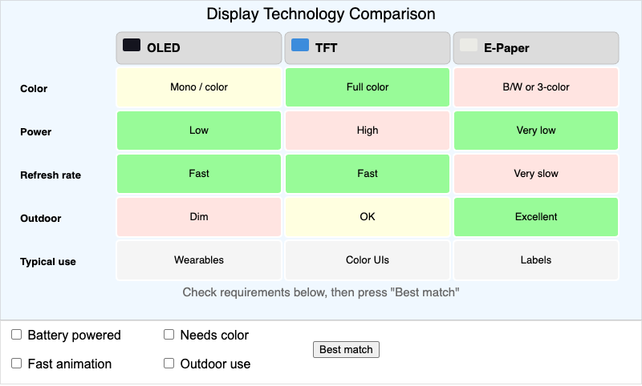E-Paper vs TFT vs OLED Comparison</a>
  <a href="conditional-flowchart/" title="Interactive Conditional Flowchart" style="display:block;border:1px solid #e3e7ec;border-radius:8px;overflow:hidden;text-decoration:none;color:inherit;box-shadow:0 1px 3px rgba(0,0,0,0.08);">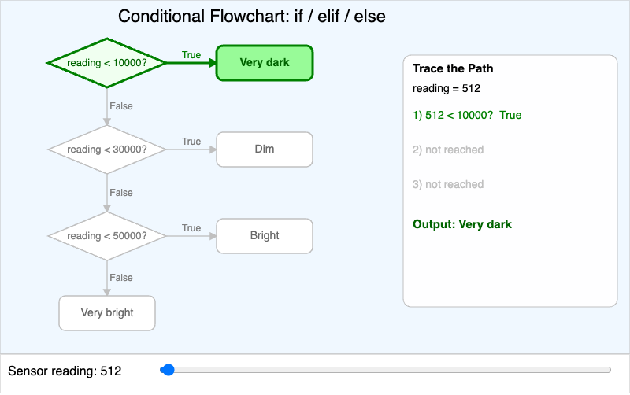Interactive Conditional Flowchart</a>
  <a href="iot-data-flow/" title="IoT Data Flow Explorer" style="display:block;border:1px solid #e3e7ec;border-radius:8px;overflow:hidden;text-decoration:none;color:inherit;box-shadow:0 1px 3px rgba(0,0,0,0.08);">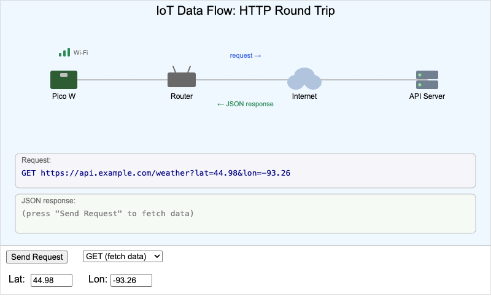IoT Data Flow Explorer</a>
  <a href="graph-viewer/" title="Learning Graph Viewer" style="display:block;border:1px solid #e3e7ec;border-radius:8px;overflow:hidden;text-decoration:none;color:inherit;box-shadow:0 1px 3px rgba(0,0,0,0.08);">no previewLearning Graph Viewer</a>
  <a href="learning-graph/" title="Learning Graphs" style="display:block;border:1px solid #e3e7ec;border-radius:8px;overflow:hidden;text-decoration:none;color:inherit;box-shadow:0 1px 3px rgba(0,0,0,0.08);">no previewLearning Graphs</a>
  <a href="neopixel-color-mixer/" title="NeoPixel Color Mixer" style="display:block;border:1px solid #e3e7ec;border-radius:8px;overflow:hidden;text-decoration:none;color:inherit;box-shadow:0 1px 3px rgba(0,0,0,0.08);">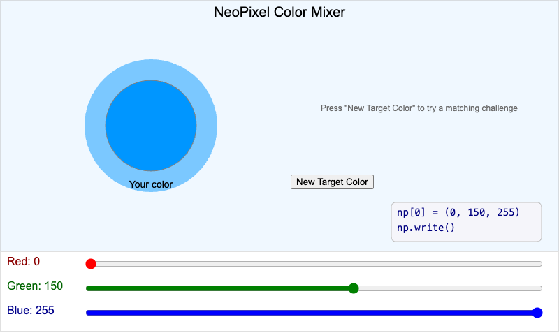NeoPixel Color Mixer</a>
  <a href="ohms-law-calculator/" title="Ohm&#x27;s Law Interactive Calculator" style="display:block;border:1px solid #e3e7ec;border-radius:8px;overflow:hidden;text-decoration:none;color:inherit;box-shadow:0 1px 3px rgba(0,0,0,0.08);">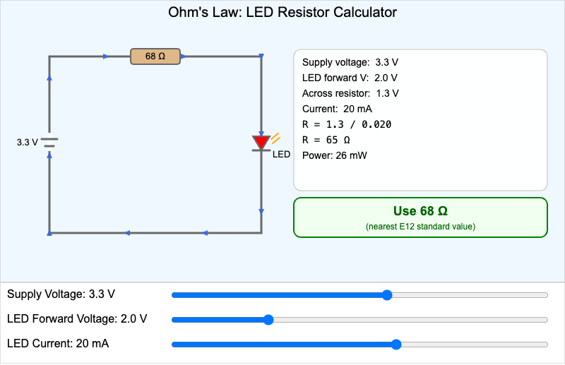Ohm&#x27;s Law Interactive Calculator</a>
  <a href="oled-coordinate-system/" title="OLED Drawing Coordinate System" style="display:block;border:1px solid #e3e7ec;border-radius:8px;overflow:hidden;text-decoration:none;color:inherit;box-shadow:0 1px 3px rgba(0,0,0,0.08);">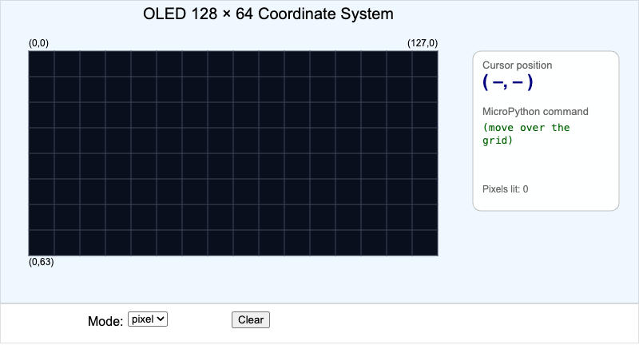OLED Drawing Coordinate System</a>
  <a href="oled-wiring-guide/" title="OLED Wiring Configuration" style="display:block;border:1px solid #e3e7ec;border-radius:8px;overflow:hidden;text-decoration:none;color:inherit;box-shadow:0 1px 3px rgba(0,0,0,0.08);">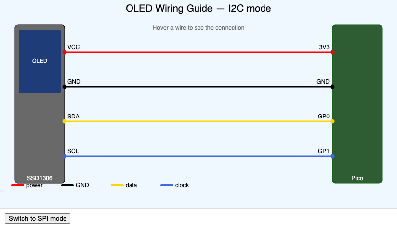OLED Wiring Configuration</a>
  <a href="piano-tone-generator/" title="Piano Keyboard Tone Generator" style="display:block;border:1px solid #e3e7ec;border-radius:8px;overflow:hidden;text-decoration:none;color:inherit;box-shadow:0 1px 3px rgba(0,0,0,0.08);">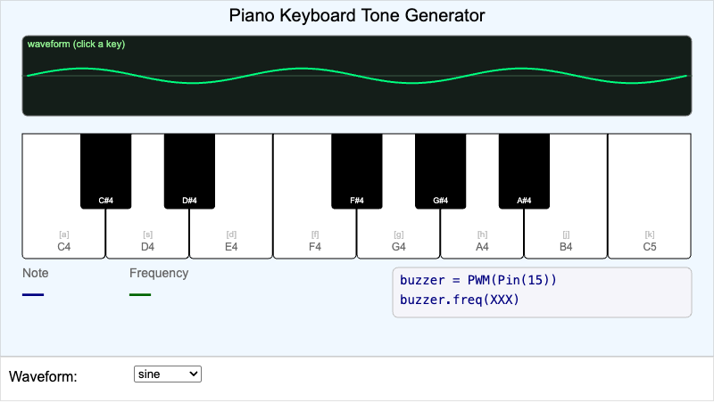Piano Keyboard Tone Generator</a>
  <a href="pico-pinout-explorer/" title="Pico Pinout Explorer" style="display:block;border:1px solid #e3e7ec;border-radius:8px;overflow:hidden;text-decoration:none;color:inherit;box-shadow:0 1px 3px rgba(0,0,0,0.08);">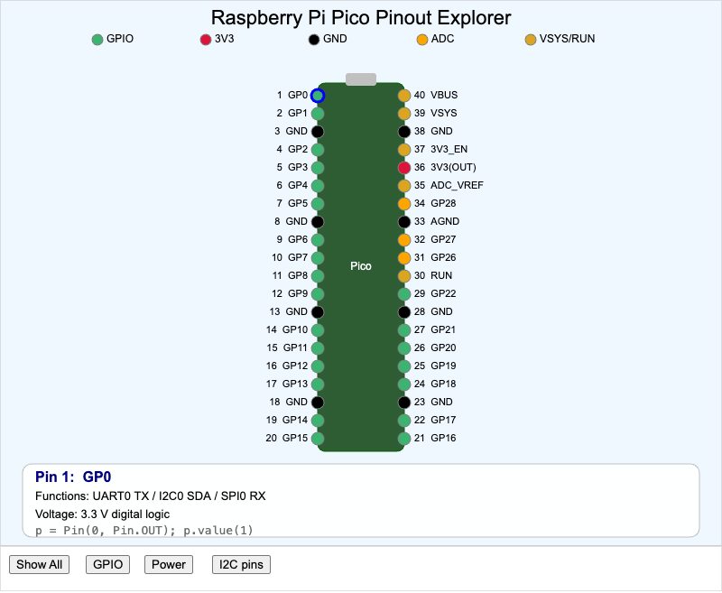Pico Pinout Explorer</a>
  <a href="project-design-process/" title="Project Design Process Flowchart" style="display:block;border:1px solid #e3e7ec;border-radius:8px;overflow:hidden;text-decoration:none;color:inherit;box-shadow:0 1px 3px rgba(0,0,0,0.08);">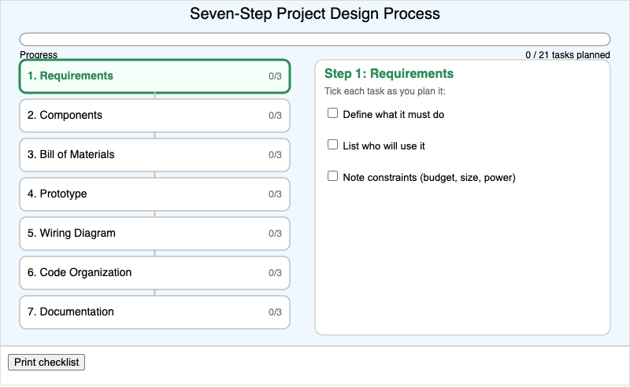Project Design Process Flowchart</a>
  <a href="prompt-engineering-workshop/" title="Prompt Engineering Workshop" style="display:block;border:1px solid #e3e7ec;border-radius:8px;overflow:hidden;text-decoration:none;color:inherit;box-shadow:0 1px 3px rgba(0,0,0,0.08);">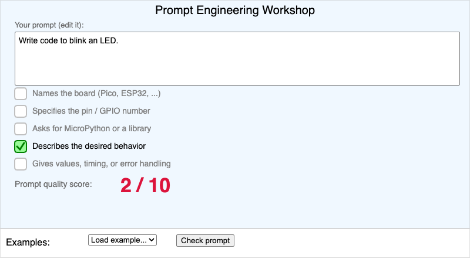Prompt Engineering Workshop</a>
  <a href="protocol-comparison/" title="Protocol Comparison Explorer" style="display:block;border:1px solid #e3e7ec;border-radius:8px;overflow:hidden;text-decoration:none;color:inherit;box-shadow:0 1px 3px rgba(0,0,0,0.08);">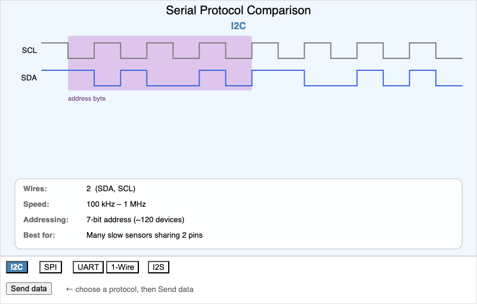Protocol Comparison Explorer</a>
  <a href="python-data-type-explorer/" title="Python Data Type Explorer" style="display:block;border:1px solid #e3e7ec;border-radius:8px;overflow:hidden;text-decoration:none;color:inherit;box-shadow:0 1px 3px rgba(0,0,0,0.08);">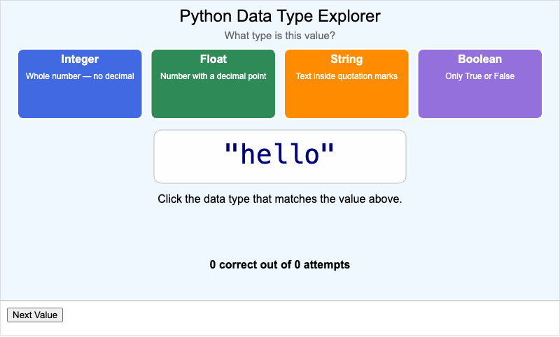Python Data Type Explorer</a>
  <a href="repl-workflow/" title="REPL Workflow Diagram" style="display:block;border:1px solid #e3e7ec;border-radius:8px;overflow:hidden;text-decoration:none;color:inherit;box-shadow:0 1px 3px rgba(0,0,0,0.08);">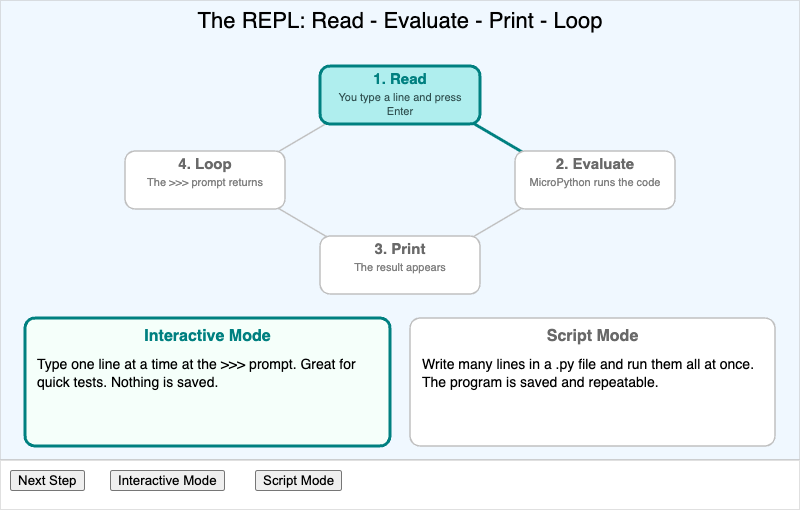REPL Workflow Diagram</a>
  <a href="servo-pwm-explorer/" title="Servo PWM Signal Explorer" style="display:block;border:1px solid #e3e7ec;border-radius:8px;overflow:hidden;text-decoration:none;color:inherit;box-shadow:0 1px 3px rgba(0,0,0,0.08);">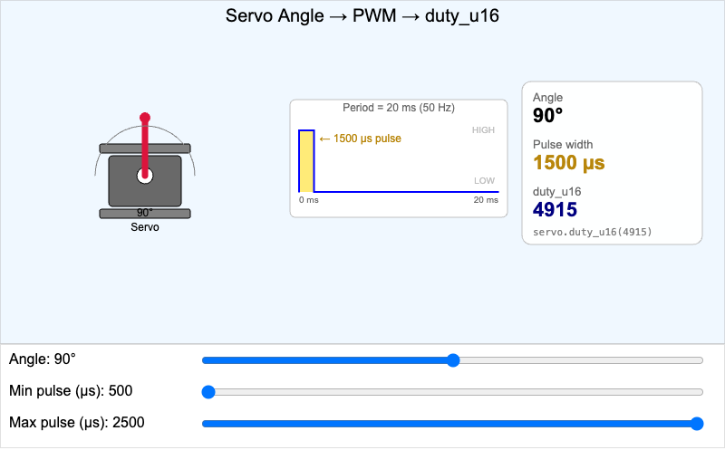Servo PWM Signal Explorer</a>
  <a href="spectrum-analyzer-concept/" title="Spectrum Analyzer Concept" style="display:block;border:1px solid #e3e7ec;border-radius:8px;overflow:hidden;text-decoration:none;color:inherit;box-shadow:0 1px 3px rgba(0,0,0,0.08);">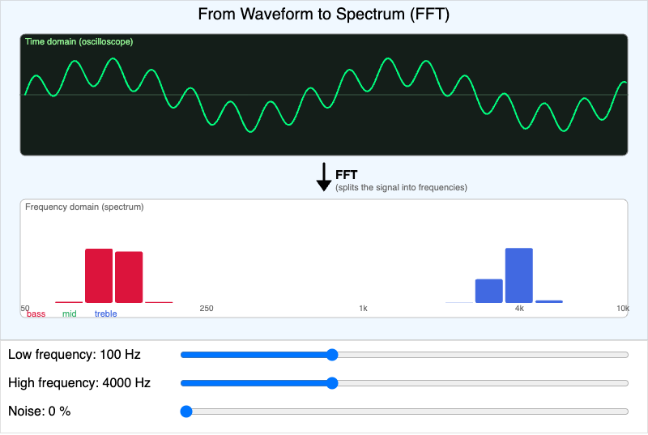Spectrum Analyzer Concept</a>
  <a href="ultrasonic-ranging/" title="Ultrasonic Ranging Explorer" style="display:block;border:1px solid #e3e7ec;border-radius:8px;overflow:hidden;text-decoration:none;color:inherit;box-shadow:0 1px 3px rgba(0,0,0,0.08);">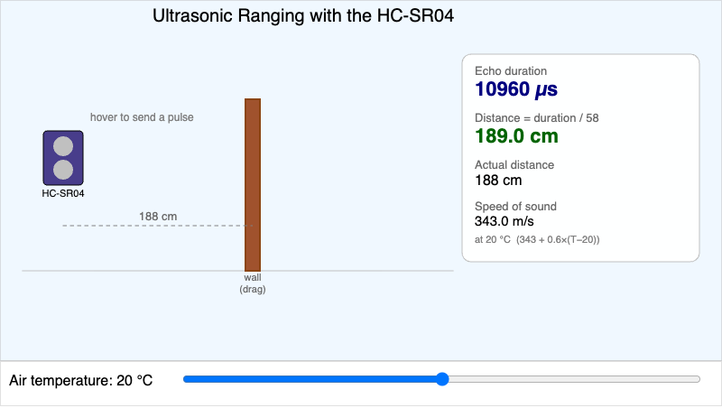Ultrasonic Ranging Explorer</a>

